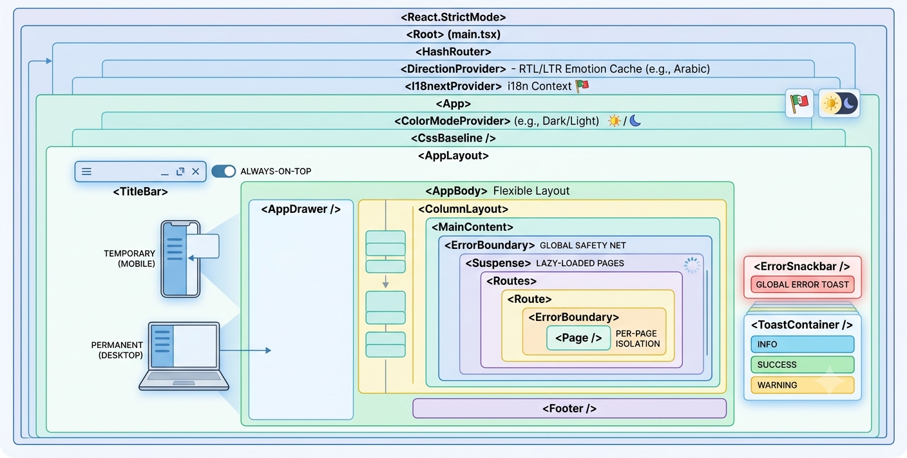

# EncodeX Architecture

This document describes the internal architecture of **EncodeX**, a cross-platform multimedia conversion tool built on FFmpeg, React, TypeScript, and Electron. It is intended for developers who want to understand how the pieces fit together before contributing.

## Table of Contents

- [Overview](#overview)
- [High-Level Architecture](#high-level-architecture)
- [Technology Stack](#technology-stack)
- [Process Model](#process-model)
- [Directory Structure](#directory-structure)
- [Build System](#build-system)
- [Startup Sequence](#startup-sequence)
- [CLI Mode](#cli-mode)
- [Shared Code Layer](#shared-code-layer)
- [IPC Communication](#ipc-communication)
- [Transcoder Abstraction](#transcoder-abstraction)
- [Hardware Acceleration](#hardware-acceleration)
- [Media Probing](#media-probing)
- [Conversion Flow](#conversion-flow)
- [Batch Queue](#batch-queue)
- [Video Player](#video-player)
- [Timeline Media](#timeline-media)
- [Image Processing](#image-processing)
- [Renderer Architecture](#renderer-architecture)
- [State Management](#state-management)
- [Error Handling](#error-handling)
- [Logging](#logging)
- [Internationalization & RTL](#internationalization--rtl)
- [Theming](#theming)
- [Security](#security)
- [Testing Strategy](#testing-strategy)

## Overview

EncodeX is a desktop application that wraps FFmpeg behind a friendly React UI. It provides media conversion, lossless copy/remuxing, image compression, audio extraction, frame-accurate video cutting with a built-in player, a serial batch queue, hardware-accelerated encoding, media probing, and a headless CLI mode.

The design emphasizes:

- **Three-process separation** — main, preload, and renderer, following Electron's security model (`contextIsolation: true`, `nodeIntegration: false`).
- **A single abstraction over media backends** — the `ITranscoder` interface hides whether conversion is driven through `fluent-ffmpeg`, a raw FFmpeg CLI child process, or the BMF framework.
- **IPC as a typed contract** — every channel is a constant in `src/shared/ipc-channels.ts`, and the renderer only ever talks to the main process through the `window.electronAPI` bridge exposed by the preload script.
- **Shared types and constants** — `src/shared/` is imported by all three processes so interfaces stay in sync by construction.
- **Progressive enhancement of the UI** — pages are code-split with `React.lazy`, state lives in Zustand stores, and long-running jobs stream progress back over IPC events.

## High-Level Architecture

```
┌─────────────────────────────────────────────────────────────────────┐
│                         Electron Shell                              │
│                                                                     │
│  ┌───────────────────────┐        ┌──────────────────────────────┐  │
│  │   MAIN PROCESS (Node) │        │     RENDERER PROCESS (React) │  │
│  │                       │        │                              │  │
│  │  index.ts (entry)     │  IPC   │  main.tsx (entry)            │  │
│  │  cli.ts               │◄──────►│  App.tsx (layout + routes)   │  │
│  │  capabilities.ts      │ invoke │  pages/* (9 lazy pages)      │  │
│  │  ipc/                 │  +     │  hooks/*                     │  │
│  │  transcoders/         │  send  │  stores/ (Zustand)           │  │
│  │  player/              │        │  components/                 │  │
│  │  queue/               │        │  i18n/                       │  │
│  │  timeline/            │        │                              │  │
│  │  image-*.ts           │        └───────────┬──────────────────┘  │
│  └──────────┬────────────┘                    │                     │
│             │                                 │                     │
│  ┌──────────▼────────────┐        ┌───────────▼──────────────────┐  │
│  │   PRELOAD (bridge)    │        │   FFmpeg subprocesses        │  │
│  │   contextBridge       │        │   (spawned by main)          │  │
│  │   electronAPI          │        │   ffmpeg / ffprobe / bmf    │  │
│  └───────────────────────┘        └──────────────────────────────┘  │
│                                                                     │
│  ┌───────────────────────────────────────────────────────────────┐  │
│  │   SHARED LAYER (src/shared) — imported by all three processes │  │
│  │   types.ts, errors.ts, ipc-channels.ts, constants.ts,         │  │
│  │   logger.ts, validation.ts, media-options.ts, ...             │  │
│  └───────────────────────────────────────────────────────────────┘  │
└─────────────────────────────────────────────────────────────────────┘
```

The renderer never spawns processes and never touches the filesystem directly. All privileged operations (file dialogs, FFmpeg execution, probing, window control) live in the main process and are reached through IPC.

## Technology Stack

| Layer                    | Technology                                     |
| ------------------------ | ---------------------------------------------- |
| **UI Framework**         | React 19                                       |
| **Component Library**    | MUI v9 (Material-UI)                           |
| **State Management**     | Zustand 5                                      |
| **Routing**              | react-router-dom v7 (HashRouter)               |
| **Internationalization** | i18next 26 + react-i18next + stylis-plugin-rtl |
| **Icons**                | Font Awesome 7 + country-flag-icons            |
| **Desktop Shell**        | Electron 33                                    |
| **Video Processing**     | fluent-ffmpeg + ffmpeg-static + ffprobe-static |
| **Image Metadata**       | exifr                                          |
| **CLI Framework**        | commander                                      |
| **Build Tool**           | Vite 8                                         |
| **Language**             | TypeScript 5.7                                 |
| **Packaging**            | electron-builder 25                            |
| **Testing**              | Vitest + @testing-library/react + jsdom + Playwright |

## Process Model

### Main Process (`src/main/`)

Node.js environment. Owns the application lifecycle and all privileged capabilities:

- Creates the splash and main `BrowserWindow`s and registers IPC handlers (`index.ts`).
- Hosts the CLI entry point (`cli.ts`).
- Resolves the FFmpeg/FFprobe binary path and probes encoder capabilities (`capabilities.ts`, `process-utils.ts`).
- Implements the transcoder cores (`transcoders/`).
- Runs the serial batch queue (`queue/job-queue.ts`).
- Decodes video frames and audio PCM for the built-in player (`player/frame-decoder.ts`).
- Extracts waveforms and thumbnail montages (`timeline/timeline-media.ts`).
- Reads EXIF data, histograms, image dimensions, and previews (`image-*.ts`, `video-preview.ts`).
- Bridges renderer `console` output into the log system (`patchConsole` in `index.ts`).

### Preload Script (`src/preload/index.ts`)

Runs in an isolated context. Uses `contextBridge.exposeInMainWorld('electronAPI', api)` to expose a curated, typed API to the renderer. Every method is a thin wrapper over `ipcRenderer.invoke` (request/response) or `ipcRenderer.send` (fire-and-forget), and every event subscription returns a cleanup function that removes its listener. Nothing else from Electron or Node is leaked to the renderer.

### Renderer Process (`src/renderer/`)

Browser environment served by Vite in development and loaded from `dist/renderer/index.html` in production. Pure React — no Node APIs. Interacts with the main process only through `window.electronAPI` (typed in `electron-api.d.ts`).

### Shared Layer (`src/shared/`)

Pure TypeScript, imported by all three processes. Contains the IPC channel registry, domain types, error system, logger, constants, codec lists, validation helpers, and log message constants. Because `package.json` does not use separate package boundaries, this directory is referenced via relative imports from each process root.

## Directory Structure

```
src/
├── main/                              # Electron main process
│   ├── index.ts                       # Entry: CLI detection, splash + main window, console bridging
│   ├── cli.ts                         # Commander-based CLI entry point
│   ├── capabilities.ts                # Encoder probing (ffmpeg -encoders / -hwaccels)
│   ├── process-utils.ts               # Child-process helpers (spawn, suspend, resume, kill)
│   ├── image-info.ts                  # EXIF extraction + RGB/luma histogram via ffmpeg
│   ├── image-preview.ts               # Downscaled base64 image previews
│   ├── image-file-info.ts             # Image dimensions/size probing
│   ├── video-preview.ts               # Single-frame video thumbnails
│   ├── ipc/                           # IPC handler modules (error-wrapped)
│   │   ├── handlers.ts                # Central registration + sender creation
│   │   ├── dialogs.ts                 # select-file / select-files / select-output
│   │   ├── conversion.ts              # convert / cancel / pause / resume
│   │   ├── queue.ts                   # queue CRUD + cancel-all
│   │   ├── player.ts                  # player open / seek / close / get-frame
│   │   ├── timeline.ts                # extract-waveform / extract-thumbnails
│   │   ├── image.ts                   # image info / preview / file info
│   │   ├── capabilities.ts            # get-capabilities
│   │   ├── window.ts                  # minimize / maximize / close / always-on-top
│   │   └── send.ts                    # Type-safe main→renderer sender factory
│   ├── player/
│   │   └── frame-decoder.ts           # Rawvideo frame + PCM audio pipe decoder
│   ├── queue/
│   │   └── job-queue.ts               # Async serial batch queue with EventEmitter
│   ├── timeline/
│   │   └── timeline-media.ts          # Waveform + thumbnail-montage extraction
│   └── transcoders/
│       ├── interface.ts               # ITranscoder contract
│       ├── factory.ts                 # Transcoder factory (FFMPEG | FFTOOL | BMF)
│       ├── ffmpeg-core.ts             # fluent-ffmpeg API core
│       ├── fftool-core.ts             # Direct CLI invocation via child_process
│       ├── bmf-core.ts                # BMF framework CLI wrapper
│       ├── ffmpeg-utils.ts            # Shared command/flag builders + binary resolution
│       ├── ffprobe-mapper.ts          # ffprobe JSON → MediaInfo normalization
│       └── hwaccel.ts                 # Hardware-acceleration filter/flag resolution
├── preload/
│   └── index.ts                       # contextBridge exposes electronAPI to renderer
├── renderer/                          # React UI (root: src/renderer)
│   ├── main.tsx                       # React entry: HashRouter + DirectionProvider + I18nextProvider
│   ├── App.tsx                        # Root layout: TitleBar, Drawer, routes, snackbar, toasts
│   ├── ColorModeContext.tsx           # Dark/light theme context
│   ├── useLanguageDirection.ts        # RTL/LTR detection hook
│   ├── theme.ts / colors.ts           # MUI theme definitions + shared palette
│   ├── electron-api.d.ts              # Global Window.electronAPI type declaration
│   ├── components/                    # Shared UI components (25+)
│   ├── hooks/                         # useConversion, useErrorHandler, useFormErrors, ...
│   ├── i18n/                          # i18next config, RTL provider, 20 locales
│   ├── pages/                         # 9 code-split page components
│   ├── stores/                        # Zustand stores (7)
│   ├── styles/                        # Extracted MUI style constants per component
│   └── utils/                         # formatters
└── shared/                            # Code shared between processes
    ├── errors.ts                      # ErrorCode enum, AppError, formatError()
    ├── ipc-channels.ts                # All IPC channel name constants
    ├── types.ts                       # Domain interfaces (ConversionOptions, MediaInfo, ...)
    ├── constants.ts                   # Numeric/string constants (timeline, waveform, window, …)
    ├── app-constants.ts               # app/window layout, nav items, storage keys
    ├── transcoder-constants.ts        # FFmpeg flags, defaults, progress patterns
    ├── hwaccel-settings.ts            # Hardware-acceleration modes and encoder types
    ├── codec-containers.ts            # Codec → container compatibility mapping
    ├── codec-classification.ts        # Codec family classification helpers
    ├── media-options.ts               # codec lists, pixel formats, bitrate/scale options
    ├── file-extensions.ts             # input/output file extensions and filters
    ├── log-constants.ts               # Shared log message constants
    ├── logger.ts                      # Timestamped logger (main/renderer)
    └── validation.ts                  # Time/scale/bitrate/range validation helpers

e2e/                                  # Playwright-based end-to-end tests
```

## Build System

Three TypeScript projects plus Vite produce three output folders:

| Script                   | Compiles                    | Output            |
| ------------------------ | --------------------------- | ----------------- |
| `build:renderer`         | `vite build`                | `dist/renderer/`  |
| `build:main`             | `tsc -p tsconfig.main.json` | `dist/main/`      |
| `build:preload`          | `tsc -p tsconfig.preload.json` | `dist/preload/` |

`npm run build` runs all three in sequence. The main process loads the preload from `dist/preload/index.js` and the renderer from `dist/renderer/index.html` (production) or the Vite dev server (development, `--dev` flag or `NODE_ENV=development`).

Electron-builder packages the app for Windows (NSIS), macOS (DMG), and Linux (AppImage), bundling `ffmpeg-static` and `ffprobe-static` as `extraResources` so the binaries travel with the app.

### Binary Resolution

The FFmpeg path is resolved with a consistent fallback chain (see `transcoders/ffmpeg-utils.ts`, mirrored in `frame-decoder.ts` and `timeline-media.ts`):

1. The bundled binary from `ffmpeg-static` / `ffprobe-static` (if the file exists).
2. The system command (`ffmpeg` / `ffprobe`) from `PATH`.

## Startup Sequence

1. `main/index.ts` runs. It inspects `process.argv` in `isCliMode()`.
2. **CLI mode** (explicit `--cli`/`--help`, or ≥2 positional args): registers no windows. On `app.whenReady()`, it calls `runCli()` and exits with `SUCCESS` or `ERROR` codes.
3. **GUI mode**: enables the `autoplay-policy` switch, creates a non-interactive splash window (shown immediately), then the frameless main window (`show: false`).
4. `registerIpcHandlers(mainWindow)` wires up all IPC modules; `patchConsole` replaces `console.*` so main-process logs are forwarded to the renderer over the `log-message` channel.
5. The main window is shown on `ready-to-show`, at which point the splash is closed.
6. In production the renderer is loaded from `dist/renderer/index.html`; in development from `http://localhost:5173` with DevTools open.

## CLI Mode

`src/main/cli.ts` uses **commander**. When `runCli()` executes:

1. It parses positional `[input]`/`[output]` and options such as `--transcoder`, `-v/--video-codec`, `-a/--audio-codec`, `--copy`, `--info`, `--start-time`, etc.
2. For `--info` it calls `transcoder.getInfo(input)` and prints JSON.
3. Otherwise it builds a `ConversionOptions` object and calls `transcoder.convert(input, output, options)`.
4. Progress is printed to `stdout` (with a 300 s watchdog timeout), and the process exits with the app's exit code on completion or failure.

The CLI reuses the exact same transcoder pipeline as the GUI — there is no separate encoding path to maintain.

## Shared Code Layer

The single most important architectural decision is that all cross-process contracts live in `src/shared/`:

- **`types.ts`** — `ConversionOptions`, `MediaInfo`, `MediaStreamInfo`, `QueueJob`, `ConversionProgress`, `PlayerFrame`, `PlayerAudioChunk`, `WaveformData`, `ThumbnailStrip`, `EncoderCapabilities`, `LogEntry`, `FileItem`, `ConversionOperation`.
- **`ipc-channels.ts`** — the `IPC` constant object, the single source of truth for every channel string. Main, preload, and renderer all import from it, so a channel name can never drift between processes.
- **`errors.ts`** — the typed error system (see [Error Handling](#error-handling)).
- **`constants.ts` / `app-constants.ts`** — numeric limits and UI layout values (window sizes, waveform buckets, thumbnail dimensions, error-history cap, etc.).
- **`transcoder-constants.ts` / `hwaccel-settings.ts`** — FFmpeg flags, defaults, progress patterns, and hardware-acceleration settings.
- **`media-options.ts` / `codec-containers.ts` / `codec-classification.ts`** — the curated lists of 51 video codecs, 27 audio codecs, 56 pixel formats, container-compatibility rules, and codec-family helpers.
- **`validation.ts`** — pure functions for time/scale/bitrate/range validation, used by both the renderer forms and the CLI.
- **`logger.ts` / `log-constants.ts`** — a timestamped logger plus ~310 shared log message templates so logs are consistent across processes.

## IPC Communication

### Request/Response (`ipcRenderer.invoke`)

The renderer initiates a job and awaits a result. Handlers are registered with `ipcMain.handle` and grouped by domain in `src/main/ipc/`:

| Module      | Channels                                                                                 |
| ----------- | ---------------------------------------------------------------------------------------- |
| `dialogs`   | `select-file`, `select-files`, `select-output`                                           |
| `capabilities` | `get-capabilities`                                                                   |
| `conversion`| `get-media-info`, `convert-file`, `cancel-conversion`, `pause-conversion`, `resume-conversion` |
| `queue`     | `queue-add`, `queue-remove`, `queue-list`, `queue-cancel-all`                            |
| `player`    | `player-open`, `player-seek`, `player-close`, `player-get-frame`                         |
| `timeline`  | `extract-waveform`, `extract-thumbnails`                                                 |
| `image`     | `get-image-info`, `get-image-preview`, `get-image-file-info`, `get-video-preview`        |
| `window`    | `window-minimize`, `window-maximize-toggle`, `window-close`, `window-set-always-on-top`  |

### Fire-and-forget (`ipcRenderer.send`)

Window control commands that need no reply use `ipcMain.on` (registered in `ipc/window.ts`).

### Main → Renderer events (`win.webContents.send`)

The main process pushes data through a type-safe `IpcSender` factory (`ipc/send.ts`):

```
conversion-progress, queue-added, queue-removed, queue-status-change,
queue-progress, queue-cancelled, player-frame, player-audio, player-error,
window-maximized-changed, log-message
```

### The `electronAPI` bridge

`src/preload/index.ts` is the only surface the renderer can touch. It exposes invocation methods (`selectFile`, `getMediaInfo`, `convertFile`, `queueAdd`, `playerSeek`, …), event subscriptions (`onConversionProgress`, `onQueueAdded`, `onPlayerFrame`, `onLogMessage`, …) that each return a cleanup function, and `getPathForFile` (via Electron's `webUtils`) to resolve a dropped `File` to its absolute path.

## Transcoder Abstraction

All media backends conform to `ITranscoder` (`src/main/transcoders/interface.ts`):

```ts
export interface ITranscoder {
  getInfo(input: string): Promise<MediaInfo>;
  convert(input: string, output: string, options: ConversionOptions): EventEmitter;
  cancel(): void;
  pause(): void;
  resume(): void;
  getType(): string;
}
```

`convert()` returns an `EventEmitter` that emits `start`, `codecData`, `progress`, `end`, and `error`. The factory (`transcoders/factory.ts`) dispatches on the `TranscoderType` (`FFMPEG | FFTOOL | BMF`):

### 1. `FfmpegCore` (default) — `fluent-ffmpeg` API

- Sets bundled FFmpeg/FFprobe paths at module load.
- Builds the command via the fluent-ffmpeg chainable API (codecs, bitrates, qscale, scale with optional aspect-ratio preservation, pixel format, MJPEG color-range fix, `-c copy`, time cut, `-an`).
- Applies hardware-acceleration input options when applicable.
- Emits rich `progress` from `fluent-ffmpeg`'s parsed output, filling gaps (percent, speed, ETA) from timemark math when the library omits them.
- Tracks the child PID and supports pause/resume via OS-level suspend/resume (`process-utils.ts`), and cancellation via `kill('SIGKILL')`.

### 2. `FFToolCore` — direct CLI

- Spawns FFmpeg as a raw `child_process` with arguments built by `buildFfmpegArgs` (`transcoders/ffmpeg-utils.ts`).
- Parses `time=` from stderr and emits a light progress event on a fixed interval (percent stays 0; only `time`/`speed` are meaningful).
- Exit code 0 → `end`; otherwise → `error`. Cancellation is signalled with the `KILL_SIGNAL`.

### 3. `BmfCore` — BMF Framework CLI

- Runs `bmf_ffmpeg` / `bmf_ffprobe` (requires separate BMF installation).
- Same `buildFfmpegArgs` shared flag builder as FFToolCore, so BMF conversions stay feature-consistent.
- Probes via `execSync` with a timeout; on failure surfaces the `BMF not available` message that maps to the `BMF_NOT_AVAILABLE` error code.

### Shared flag building

`ffmpeg-utils.ts` is the single place that translates `ConversionOptions` into raw FFmpeg CLI arguments, so FFTool and BMF cores can never drift from each other. `ffprobe-mapper.ts` normalizes raw ffprobe JSON into the typed `MediaInfo` shape used across the app.

## Hardware Acceleration

`transcoders/hwaccel.ts` resolves FFmpeg `-hwaccel` flags for a chosen codec. It maps encoder suffixes to families:

- `_nvenc` → NVIDIA CUDA (`-hwaccel cuda -hwaccel_output_format cuda`)
- `_qsv` → Intel QSV
- `_amf` / `_mf` → Direct3D 11 (`d3d11va`)
- `_vaapi` → VAAPI with the Linux render device `/dev/dri/renderD128`
- `_videotoolbox` → Apple VideoToolbox

Flags are only produced when acceleration is enabled **and** the mode is `auto`; in `encode` mode the encoder's own hardware path is used without extra flags. Available encoders and hwaccels are discovered at runtime by `capabilities.ts` (spawning `ffmpeg -hide_banner -encoders` and `-hwaccels`, cached after first probe), and the renderer filters the codec pickers to what the bundled binary actually provides.

## Media Probing

`getInfo()` (through any core) shells out to ffprobe and returns a `MediaInfo` object. `ffprobe-mapper.ts` normalizes per-stream data — codec, profile, level, resolution, DAR, pixel format, bit depth, color metadata, frame rate, bitrate, sample rate, sample format, channels/layout, duration, start time, frame count, language, and tags — into the `MediaStreamInfo` interface consumed by the Media Info page and used internally for player resolution and queue logic.

## Conversion Flow

The complete end-to-end path for a GUI conversion:

```
User action (Convert page)
    │
    ▼
electronAPI.convertFile(input, output, options, transcoderType)   ← preload
    │  ipcRenderer.invoke('convert-file', ...)
    ▼
ipc/conversion.ts: ipcMain.handle(CONVERT_FILE)
    │  creates ITranscoder via factory, calls convert()
    ▼
Transcoder core (ffmpeg-core | fftool-core | bmf-core)
    │  fluent-ffmpeg / child_process / BMF CLI (+ hwaccel flags)
    │  emits 'progress' / 'error' / 'end'
    ▼
ipc/conversion.ts forwards progress via send(CONVERSION_PROGRESS, …)
    │  win.webContents.send
    ▼
preload onConversionProgress → renderer hook (useMediaTask)
    │
    ▼
useConversion / page state → ProgressBar UI
```

Notes:

- On error, the handler deletes the partial output file (unless input === output) and rejects with `formatError(err)`.
- `pause`/`resume` map to OS process suspend/resume; `cancel` kills the process and normalizes the error to the `CANCELLED` code.
- Partial-output cleanup and error normalization happen in the IPC layer, keeping the cores focused on process mechanics.

## Batch Queue

`src/main/queue/job-queue.ts` is a serial FIFO processor extending `EventEmitter`:

- `addJob` assigns a `randomUUID`, pushes a `QueueJob` (status `QUEUED`, progress 0), emits `added`, and kicks `processNext()`.
- `processNext()` is guarded by a `running` flag so only one job executes at a time. It flips the job to `RUNNING`, creates a transcoder, wires `progress`/`error`/`end`, and on terminal states resets state and calls `processNext()` to advance the queue.
- `cancelJob` cancels the active job's transcoder (if it is the current job) and removes it; `cancelAll` cancels the current transcoder, clears the queue, and emits `cancelled`.

The IPC layer (`ipc/queue.ts`) simply forwards queue events to the renderer over `queue-added`, `queue-removed`, `queue-status-change`, `queue-progress`, and `queue-cancelled`, and the `queueStore` mirrors them into React state.

## Video Player

The Video Cut page's player is built on `FrameDecoder` (`src/main/player/frame-decoder.ts`), which spawns FFmpeg with two output pipes:

```
FFmpeg: input (with -re realtime and -copyts)
  → video: -map 0:v:0 -f rawvideo -pix_fmt rgb24 -s {w}x{h} -an -sn -dn → pipe:1 (stdout)
  → audio: -map 0:a:0 -f s16le -ac {channels} -ar {sampleRate} → pipe:3 (extra stdio fd)
  → frame timestamps parsed from the -vf showinfo log on stderr (pts_time)
```

- Video frames are reassembled from the rawvideo stream (`width × height × 3` bytes) and matched with `pts_time` values parsed from stderr. If timestamps stall, an emergency flush emits frames with a monotonic PTS estimate so playback never permanently blocks.
- Audio is emitted in fixed-size S16LE chunks (~50 ms at the requested sample rate, default 48 kHz / 2 channels).
- `seek()` kills and respawns the decoder at the new timestamp. A shared `generation` counter is bumped on open/seek; frames carrying a stale generation are discarded by the renderer.
- `ipc/player.ts` runs **two** decoders (video + audio) so backpressure on one stream cannot stall the other, caps the decode resolution, and forwards frames/chunks over `player-frame` / `player-audio`.
- The renderer (`components/MediaPlayer.tsx`) blits frames to an HTML Canvas and feeds float-converted PCM to the Web Audio API with clock-based A/V synchronization, seek coalescing, and stall detection.

## Timeline Media

`timeline/timeline-media.ts` powers the zoomable timeline on the Video Cut page:

- **Waveform** — decodes the selected audio stream at 8 kHz and computes min/max amplitude buckets (40/s, up to 24,000 buckets) over a 30 s window. Extraction is split into parallel FFmpeg segments, gaps between segments are interpolated (`fillWaveformGaps`), and all spawns are throttled through a global `MAX_CONCURRENT_FFMPEG` slot pool.
- **Thumbnail montage** — decodes up to 100 thumbnails (160×90) into a single PNG montage (10 columns), then base64-encodes it into one `data:` URL. PNG encoding is done in-process (`crc32`, `pngChunk`, `encodePng`), so no image libraries are needed.

The renderer (`components/VideoTimeline.tsx`) renders waveform + montage as a zoomable, scrubbable strip with keep/dim shading and drag-to-trim handles.

## Image Processing

`src/main/image-*.ts` handle the Image Compress page:

- `image-info.ts` — extracts EXIF via `exifr` and computes RGB + luma histograms by piping the image through FFmpeg into raw pixel data.
- `image-preview.ts` — produces downscaled base64 previews.
- `image-file-info.ts` — reads dimensions and file size.
- `video-preview.ts` — produces a single-frame thumbnail for video files.

Image *compression itself* is just a conversion: the Image Compress page builds a `ConversionOptions` (codec, qscale, scale) and runs it through the same transcoder pipeline used for video/audio, restricted to image codecs.

## Renderer Architecture

### Render tree



### Pages

All nine pages are code-split with `React.lazy` and loaded under a per-page `ErrorBoundary`:

| Page            | Route          | Purpose                                                        |
| --------------- | -------------- | -------------------------------------------------------------- |
| Dashboard       | `/`            | Quick-action cards                                             |
| Convert         | `/convert`     | Media conversion form (codec, bitrate, scale, hwaccel, …)      |
| MediaInfo       | `/media-info`  | Probe + per-stream detail table                                |
| ImageCompress   | `/image-compress` | Image compression + EXIF + histograms                       |
| AudioExtract    | `/audio-extract` | Extract audio tracks as any of 27 codecs                     |
| VideoCut        | `/video-cut`   | Player + zoomable timeline + trim                              |
| BatchQueue      | `/batch`       | Queue management (add/remove/cancel-all)                       |
| Logs            | `/logs`        | Live log viewer with level filter + download                   |
| Settings        | `/settings`    | Theme, hwaccel, always-on-top                                  |

### Hooks

- `useConversion` — orchestrates a conversion from the Convert page.
- `useMediaTask` — shared lifecycle (subscribe to `onConversionProgress` → run task → `COMPLETED_PROGRESS` or `showError`). A `useRef` gate discards progress events for stale runs.
- `useErrorHandler` — error handling utilities.
- `useFormErrors` — field-level validation errors.
- `useCapabilities` — fetches encoder capabilities and applies encoder-type / hwaccel filters to the codec pickers.

## State Management

Zustand stores in `src/renderer/stores/`:

| Store             | Responsibility                                                      |
| ----------------- | ------------------------------------------------------------------- |
| `conversionStore` | Conversion form state                                               |
| `audioExtractStore` | Audio extraction form state                                       |
| `errorStore`      | `currentError` + `errorHistory` (cap 50), `showError`, `showErrorMessage`, clear actions |
| `queueStore`      | Mirrors batch queue jobs from main-process events                   |
| `settingsStore`   | Settings + `localStorage` persistence (`encodex-theme`, etc.)       |
| `logStore`        | Aggregated log entries (cap 2000), filter state, download           |
| `toastStore`      | Toast queue                                                         |

Stores are the single place UI state changes; components subscribe with `useXStore(selector)`.

## Error Handling

The error system (`src/shared/errors.ts`) defines 14 typed codes — `FILE_NOT_FOUND`, `FFMPEG_NOT_FOUND`, `FFPROBE_NOT_FOUND`, `CONVERSION_FAILED`, `INVALID_FORMAT`, `PROBE_FAILED`, `QUEUE_ERROR`, `PLAYER_ERROR`, `CANCELLED`, `BMF_NOT_AVAILABLE`, `OUTPUT_NOT_SPECIFIED`, `INPUT_NOT_SPECIFIED`, `PERMISSION_DENIED`, `UNKNOWN` — each with a default user-facing message.

The flow is always the same:

```
throw new Error(...)
    │
    ▼
formatError(err)                    ← shared/errors.ts
    │  normalizes to AppError { code, message, detail, timestamp }
    │  infers code from message keywords / system errno (ENOENT, EACCES, …)
    ▼
errorStore.showError()              ← stores in currentError + errorHistory (cap 50)
    │
    ├── ErrorSnackbar               ← global toast, auto-dismiss 6s
    ├── ErrorBanner                 ← inline per-page, closable
    └── ErrorBoundary               ← React crash catch-all (nested per-page + per-component)
```

IPC handlers wrap every operation in `try/catch` and rethrow `formatError(err)`, so error codes survive the process boundary and the renderer always receives a typed `AppError`.

## Logging

A timestamped `Logger` (`src/shared/logger.ts`) is used in all processes. Both the main process (`patchConsole` in `index.ts`) and the renderer (`main.tsx`) patch `console.*` to forward entries into the shared log system:

- Main → renderer via the `log-message` IPC channel.
- Renderer → `logStore` directly.

The Logs page (`pages/Logs.tsx`) aggregates both sources with level filtering (DEBUG/INFO/WARN/ERROR), clearing, and `.txt` download. Every log line is generated from a shared template constant (`log-constants.ts`) so strings stay consistent and searchable.

## Internationalization & RTL

- i18next is initialized in `renderer/i18n/config.ts` with 20 locales across 14 languages.
- `DirectionProvider` (Emotion cache with `stylis-plugin-rtl`) flips the layout to RTL for Arabic locales (`ar-SA`, `ar-AE`).
- `useLanguageDirection` detects the current locale's direction; the app's direction is derived from it and toggles automatically on language switch.
- `localeMeta.ts` holds locale metadata and flags for the `LanguageMenu`.

## Theming

- `ColorModeContext` provides a system-aware dark/light mode with a manual toggle; the preference persists to `localStorage` under the `encodex-theme` key.
- `theme.ts` defines the MUI light/dark themes; `colors.ts` holds the shared palette.
- Styling uses Emotion (MUI's default engine) with per-component style constants extracted into `renderer/styles/`.

## Security

- `contextIsolation: true` and `nodeIntegration: false` on both windows; the main window uses a preload script, and the splash window is fully sandboxed with no preload.
- The renderer only ever sees `window.electronAPI` — a hand-picked, typed API — never raw `ipcRenderer`.
- File dialogs, process spawning, and filesystem access are confined to the main process.
- The custom title bar is the only UI chrome; `Menu.setApplicationMenu(null)` removes the default menu.
- See [SECURITY.md](SECURITY.md) for vulnerability reporting.

## Testing Strategy

The suite is run by Vitest with jsdom (85 test files, 837 tests), plus Playwright e2e.

| Layer                 | What's covered                                                              |
| --------------------- | --------------------------------------------------------------------------- |
| **Shared**            | Error normalization, constants, codec/container mapping, validation, types, logger, IPC channel registry |
| **Main**              | CLI parsing, window lifecycle, encoder probing, queue semantics, process utils, image/video previews |
| **Transcoders**       | All three cores, hwaccel flag building, ffprobe mapping, factory dispatch, interface contract |
| **Main IPC**          | Per-channel handlers, event broadcasting, error wrapping                     |
| **Player / timeline** | Frame decoding, audio pipes, buffering, waveform + montage extraction        |
| **Preload**           | Full `electronAPI` bridge surface, every IPC method                          |
| **Renderer**          | Components, hooks, pages, stores, utils, app shell routing                   |
| **Integration**       | Full Error → `formatError` → store → display → clear pipeline                 |
| **E2E**               | CLI mode (`--help`, `--info`, real conversions via FFMPEG/FFTOOL), app launch |

Tests use `src/test-setup.ts`, which mocks `useTranslation` and `electronAPI` on `globalThis` and registers `jest-dom` matchers. E2E specs in `e2e/` run against a built app and are gated behind the `E2E` env var or CI.

## Key Data Flow Reference

### Conversion (GUI)

```
React page → Zustand store → electronAPI.convertFile → ipcMain.handle(convert-file)
→ factory.createTranscoder(type) → ITranscoder.convert() → FFmpeg process
→ 'progress' events → send(conversion-progress) → onConversionProgress → useMediaTask → ProgressBar
```

### Batch queue

```
QueueJob card → electronAPI.queueAdd → JobQueue.addJob → processNext()
→ transcoder.convert() → 'progress'/'end'/'error' → queue events → IPC events → queueStore → QueueJobCard
```

### Video playback

```
VideoCut page → playerOpen → FrameDecoder.spawnFfmpeg (video pipe:1 + audio pipe:3)
→ 'frame'/'audio' events → send(player-frame / player-audio)
→ onPlayerFrame / onPlayerAudio → MediaPlayer (Canvas + Web Audio, A/V sync)
```

### Timeline

```
VideoCut page → extractWaveform + extractThumbnails
→ timeline-media.ts (parallel FFmpeg segments, throttled)
→ WaveformData / ThumbnailStrip → VideoTimeline.tsx (zoom/trim/scrub)
```
