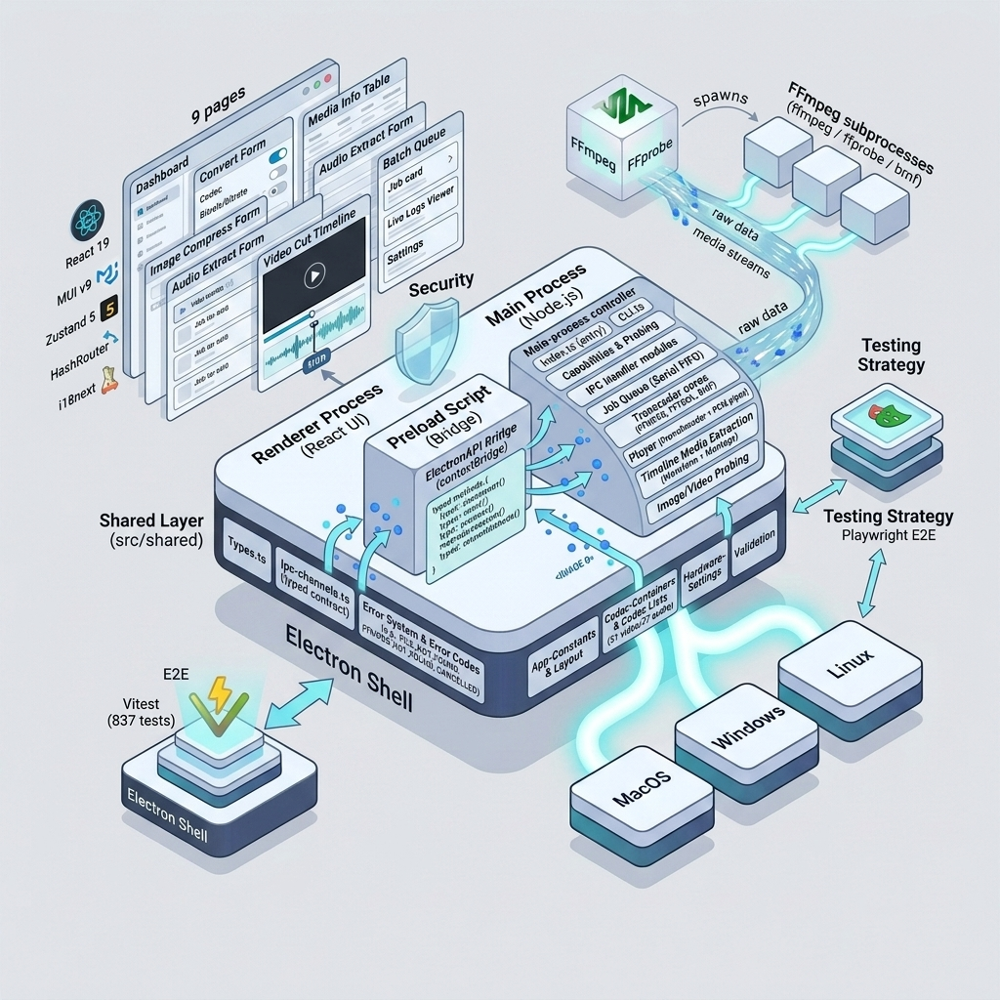

# 🏗️ EncodeX Architecture

This document describes the internal architecture of **EncodeX**, a cross-platform multimedia conversion tool built on FFmpeg, React, TypeScript, and Electron. It is intended for developers who want to understand how the pieces fit together before contributing.

## 🧩 Design Principles

The renderer never spawns processes and never touches the filesystem directly. All privileged operations (file dialogs, FFmpeg execution, probing, window control) live in the main process and are reached through IPC.

- **Three-process separation** — main, preload, and renderer, following Electron's security model (`contextIsolation: true`, `nodeIntegration: false`).
- **A single abstraction over media backends** — the `ITranscoder` interface hides whether conversion is driven through `fluent-ffmpeg`, a raw FFmpeg CLI child process, or the BMF framework.
- **IPC as a typed contract** — every channel is a constant in `src/shared/ipc-channels.ts`, and the renderer only ever talks to the main process through the `window.electronAPI` bridge exposed by the preload script.
- **Shared types and constants** — `src/shared/` is imported by all three processes so interfaces stay in sync by construction.
- **Progressive enhancement of the UI** — pages are code-split with `React.lazy`, state lives in Zustand stores, and long-running jobs stream progress back over IPC events.

## 🔍 Deep Dives

The full architecture is split into focused documents:

| Document | Topics |
| -------- | ------ |
| [Processes, Build System & Startup](ARCHITECTURE_PROCESSES.md) | Process model (main/preload/renderer/shared), build system, binary resolution, startup sequence, CLI mode, shared code layer |
| [Transcoder Abstraction & Conversion](ARCHITECTURE_TRANSCODERS.md) | `ITranscoder` interface, FfmpegCore / FFToolCore / BmfCore, shared flag building, hardware acceleration, media probing, conversion flow |
| [Renderer, State & Subsystems](ARCHITECTURE_RENDERER.md) | Render tree, pages, hooks, Zustand stores, batch queue, video player, timeline media, image processing, error handling, logging, i18n, theming, data flow reference |

## 📚 Additional Documentation

| Document | Topics |
| -------- | ------ |
| [FEATURES.md](FEATURES.md) | Features, supported media formats, codec tables, validation utilities |
| [CLI.md](CLI.md) | CLI usage, subcommands, all option tables |
| [TESTING.md](TESTING.md) | Test suite (122 files, 1573 tests), test setup, E2E specs |
| [IPC.md](IPC.md) | IPC channels (request/send-only/events), electronAPI bridge |
| [PROJECT_STRUCTURE.md](PROJECT_STRUCTURE.md) | Full directory tree with annotations |
| [UPDATE_MANAGER.md](UPDATE_MANAGER.md) | In-app update manager implementation |
| [../README.md](../README.md) | Project overview, install, build, contributing |
