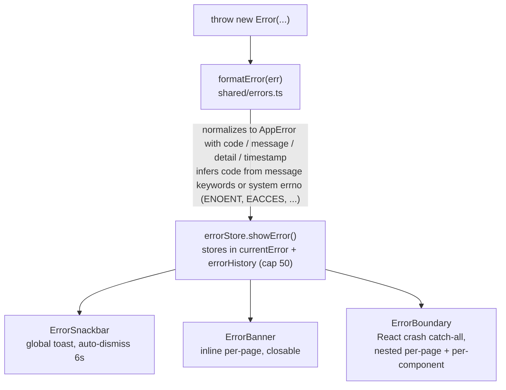
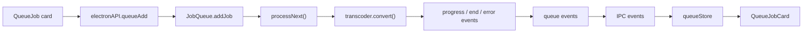
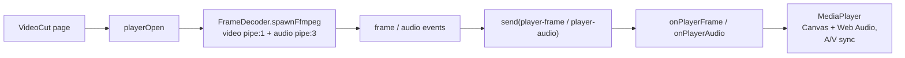
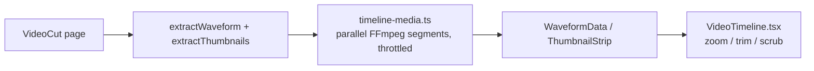

# 🖥️ Renderer, State & Subsystems

## 🌳 Renderer Architecture

### Render tree

All ten pages are code-split with `React.lazy` and loaded under a per-page `ErrorBoundary`:

| Page            | Route          | Purpose                                                        |
| --------------- | -------------- | -------------------------------------------------------------- |
| Dashboard       | `/`            | Quick-action cards                                             |
| Convert         | `/convert`     | Media conversion form (codec, bitrate, scale, hwaccel, ...)    |
| MediaInfo       | `/media-info`  | Probe + per-stream detail table                                |
| ImageCompress   | `/image-compress` | Image compression + EXIF + histograms                       |
| AudioExtract    | `/audio-extract` | Extract audio tracks as any of 27 codecs                     |
| VideoCut        | `/video-cut`   | Player + zoomable timeline + trim                              |
| BatchQueue      | `/batch`       | Queue management (add/remove/cancel-all)                       |
| Logs            | `/logs`        | Live log viewer with level filter + download                   |
| Settings        | `/settings`    | Theme, hwaccel, always-on-top                                  |
| About           | `/about`       | App info, credits, "Check for Updates" button                  |

### Hooks

- `useConversion` — orchestrates a conversion from the Convert page.
- `useMediaTask` — shared lifecycle (subscribe to `onConversionProgress` -> run task -> `COMPLETED_PROGRESS` or `showError`). A `useRef` gate discards progress events for stale runs.
- `useErrorHandler` — error handling utilities.
- `useFormErrors` — field-level validation errors.
- `useCapabilities` — fetches encoder capabilities and applies encoder-type / hwaccel filters to the codec pickers.

## 📦 State Management

Zustand stores in `src/renderer/stores/`:

| Store             | Responsibility                                                      |
| ----------------- | ------------------------------------------------------------------- |
| `conversionStore` | Conversion form state                                               |
| `audioExtractStore` | Audio extraction form state                                       |
| `errorStore`      | `currentError` + `errorHistory` (cap 50), `showError`, `showErrorMessage`, clear actions |
| `queueStore`      | Mirrors batch queue jobs from main-process events                   |
| `settingsStore`   | Settings + `localStorage` persistence (`encodex-theme`, etc.)       |
| `logStore`        | Aggregated log entries (cap 2000), filter state, download           |
| `toastStore`      | Toast queue                                                         |
| `updateStore`     | Update lifecycle state (check, available, downloading, downloaded, error) |

Stores are the single place UI state changes; components subscribe with `useXStore(selector)`.

## 📋 Batch Queue

`src/main/queue/job-queue.ts` is a concurrency-capped FIFO processor extending `EventEmitter`:

- `addJob` assigns a `randomUUID`, pushes a `QueueJob` (status `QUEUED`, progress 0), emits `added`, and kicks `processNext()`.
- `processNext()` is the only place jobs are started: it launches new `QUEUED` jobs while fewer than `concurrency` conversions are in flight (tracked by `activeJobs`), so at most `concurrency` (1–4) jobs run in parallel. Each started job flips to `RUNNING`, gets a transcoder from the factory, and has `progress`/`error`/`end` wired; on terminal states the job's slot is released and `processNext()` refills it. Changing the concurrency cap mid-run refills currently queued slots.
- `cancelJob` cancels a job's transcoder and removes it; `cancelAll` cancels every active transcoder, clears the queue, and emits `cancelled`. The queue also supports pause/resume, move-to reordering, option editing for queued jobs, export/import, clear-completed, when-done power actions, and durable persistence to `queue-state.json` (`src/main/queue/persistence.ts`).

The IPC layer (`ipc/queue.ts`) simply forwards queue events to the renderer over `queue-added`, `queue-removed`, `queue-status-change`, `queue-progress`, and `queue-cancelled`, and the `queueStore` mirrors them into React state.

## 🎬 Video Player

The Video Cut page's player is built on `FrameDecoder` (`src/main/player/frame-decoder.ts`), which spawns FFmpeg with two output pipes:

```
FFmpeg: input (with -re realtime and -copyts)
  -> video: -map 0:v:0 -f rawvideo -pix_fmt rgb24 -s {w}x{h} -an -sn -dn -> pipe:1 (stdout)
  -> audio: -map 0:a:0 -f s16le -ac {channels} -ar {sampleRate} -> pipe:3 (extra stdio fd)
  -> frame timestamps parsed from the -vf showinfo log on stderr (pts_time)
```

- Video frames are reassembled from the rawvideo stream (`width x height x 3` bytes) and matched with `pts_time` values parsed from stderr. If timestamps stall, an emergency flush emits frames with a monotonic PTS estimate so playback never permanently blocks.
- Audio is emitted in fixed-size S16LE chunks (~50 ms at the requested sample rate, default 48 kHz / 2 channels).
- `seek()` kills and respawns the decoder at the new timestamp. A shared `generation` counter is bumped on open/seek; frames carrying a stale generation are discarded by the renderer.
- `ipc/player.ts` runs **two** decoders (video + audio) so backpressure on one stream cannot stall the other, caps the decode resolution, and forwards frames/chunks over `player-frame` / `player-audio`.
- The renderer (`components/MediaPlayer.tsx`) blits frames to an HTML Canvas and feeds float-converted PCM to the Web Audio API with clock-based A/V synchronization, seek coalescing, and stall detection.

## 📈 Timeline Media

`timeline/timeline-media.ts` powers the zoomable timeline on the Video Cut page:

- **Waveform** — decodes the selected audio stream at 8 kHz and computes min/max amplitude buckets (40/s, up to 24,000 buckets) over a 30 s window. Extraction is split into parallel FFmpeg segments, gaps between segments are interpolated (`fillWaveformGaps`), and all spawns are throttled through a global `MAX_CONCURRENT_FFMPEG` slot pool.
- **Thumbnail montage** — decodes up to 100 thumbnails (160x90) into a single PNG montage (10 columns), then base64-encodes it into one `data:` URL. PNG encoding is done in-process (`crc32`, `pngChunk`, `encodePng`), so no image libraries are needed.

The renderer (`components/VideoTimeline.tsx`) renders waveform + montage as a zoomable, scrubbable strip with keep/dim shading and drag-to-trim handles.

## 🖼️ Image Processing

`src/main/image-*.ts` handle the Image Compress page:

- `image-info.ts` — extracts EXIF via `exifr` and computes RGB + luma histograms by piping the image through FFmpeg into raw pixel data.
- `image-preview.ts` — produces downscaled base64 previews.
- `image-file-info.ts` — reads dimensions and file size.
- `video-preview.ts` — produces a single-frame thumbnail for video files.

Image *compression itself* is just a conversion: the Image Compress page builds a `ConversionOptions` (codec, qscale, scale) and runs it through the same transcoder pipeline used for video/audio, restricted to image codecs.

## 🛡️ Error Handling

The error system (`src/shared/errors.ts`) defines 16 typed codes — `FILE_NOT_FOUND`, `FFMPEG_NOT_FOUND`, `FFPROBE_NOT_FOUND`, `CONVERSION_FAILED`, `INVALID_FORMAT`, `PROBE_FAILED`, `QUEUE_ERROR`, `PLAYER_ERROR`, `CANCELLED`, `BMF_NOT_AVAILABLE`, `OUTPUT_NOT_SPECIFIED`, `INPUT_NOT_SPECIFIED`, `OUTPUT_EXISTS`, `INVALID_QUEUE_FILE`, `PERMISSION_DENIED`, `UNKNOWN` — each with a default user-facing message.

The flow is always the same:



IPC handlers wrap every operation in `try/catch` and rethrow `formatError(err)`, so error codes survive the process boundary and the renderer always receives a typed `AppError`.

## 🧾 Logging

A timestamped `Logger` (`src/shared/logger.ts`) is used in all processes. Both the main process (`patchConsole` in `index.ts`) and the renderer (`main.tsx`) patch `console.*` to forward entries into the shared log system:

- Main -> renderer via the `log-message` IPC channel.
- Renderer -> `logStore` directly.

The Logs page (`pages/Logs.tsx`) aggregates both sources with level filtering (DEBUG/INFO/WARN/ERROR), clearing, and `.txt` download. Every log line is generated from a shared template constant (`log-constants.ts`) so strings stay consistent and searchable.

## 🌍 Internationalization & RTL

- i18next is initialized in `renderer/i18n/config.ts` with 56 locales across 35 languages.
- `DirectionProvider` (Emotion cache with `stylis-plugin-rtl`) flips the layout to RTL for Arabic and Hebrew locales (`ar-SA`, `ar-AE`, `ar-JO`, `he-IL`).
- `useLanguageDirection` detects the current locale's direction; the app's direction is derived from it and toggles automatically on language switch.
- `localeMeta.ts` holds locale metadata and flags for the `LanguageMenu`.

## 🌗 Theming

- `ColorModeContext` provides a system-aware dark/light mode with a manual toggle; the preference persists to `localStorage` under the `encodex-theme` key.
- `theme.ts` defines the MUI light/dark themes; `colors.ts` holds the shared palette.
- Styling uses Emotion (MUI's default engine) with per-component style constants extracted into `renderer/styles/`.

## 🔀 Key Data Flow Reference

### Conversion (GUI)

```mermaid
flowchart LR
    A["React page"] --> B["Zustand store"] --> C["electronAPI.convertFile"] --> D3["ipcMain.handle(convert-file)"] --> E["factory.createTranscoder(type)"] --> F["ITranscoder.convert()"] --> G["FFmpeg process"] --> H["progress events"] --> I["send(conversion-progress)"] --> J["onConversionProgress"] --> K["useMediaTask"] --> L["ProgressBar"]
```



### Batch queue



### Video playback



### Timeline



### In-app updates

```mermaid
flowchart LR
    A["About page"] --> B["updateStore.checkForUpdates"] --> C["electronAPI.checkForUpdates"] --> D7["updater.ts fetches GitHub Releases API"] --> E7["compares semver versions"] --> F7["send(update-available / update-not-available)"] --> G7["updateStore"] --> H7["UpdateDialog"] --> I7["downloadUpdate -> installer to temp dir"] --> J7["send(update-progress) -> progress bar"] --> K7["send(update-downloaded) -> Install + Restart button"] --> L7["installUpdate -> shell.openPath(installer) + app.quit()"]
```


