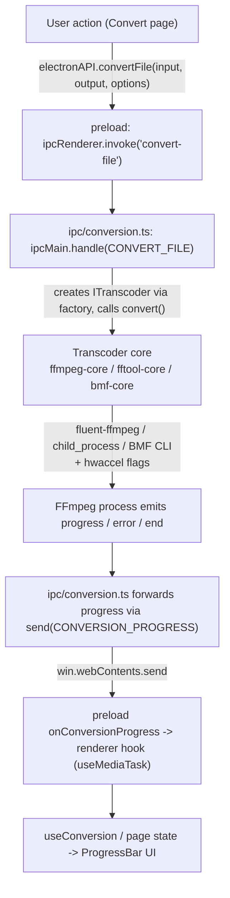

# 🔄 Transcoder Abstraction & Conversion

## 🏭 Transcoder Abstraction

All media backends conform to `ITranscoder` (`src/main/transcoders/interface.ts`):

```ts
export interface ITranscoder {
  getInfo(input: string): Promise<MediaInfo>;
  convert(input: string, output: string, options: ConversionOptions): EventEmitter;
  cancel(): void;
  pause(): void;
  resume(): void;
  getType(): string;
}
```

`convert()` returns an `EventEmitter` that emits `start`, `codecData`, `progress`, `end`, and `error`. The factory (`transcoders/factory.ts`) dispatches on the `TranscoderType` (`FFMPEG | FFTOOL | BMF`):

### 1. `FfmpegCore` (default) — `fluent-ffmpeg` API

- Sets bundled FFmpeg/FFprobe paths at module load.
- Builds the command via the fluent-ffmpeg chainable API (codecs, bitrates, qscale, scale with optional aspect-ratio preservation, pixel format, MJPEG color-range fix, `-c copy`, time cut, `-an`).
- Applies hardware-acceleration input options when applicable.
- Emits rich `progress` from `fluent-ffmpeg`'s parsed output, filling gaps (percent, speed, ETA) from timemark math when the library omits them.
- Tracks the child PID and supports pause/resume via OS-level suspend/resume (`process-utils.ts`), and cancellation via `kill('SIGKILL')`.

### 2. `FFToolCore` — direct CLI

- Spawns FFmpeg as a raw `child_process` with arguments built by `buildFfmpegArgs` (`transcoders/ffmpeg-utils.ts`).
- Parses `time=` from stderr and emits a light progress event on a fixed interval (percent stays 0; only `time`/`speed` are meaningful).
- Exit code 0 -> `end`; otherwise -> `error`. Cancellation is signalled with the `KILL_SIGNAL`.

### 3. `BmfCore` — BMF Framework CLI

- Runs `bmf_ffmpeg` / `bmf_ffprobe` (requires separate BMF installation).
- Same `buildFfmpegArgs` shared flag builder as FFToolCore, so BMF conversions stay feature-consistent.
- Probes via `execSync` with a timeout; on failure surfaces the `BMF not available` message that maps to the `BMF_NOT_AVAILABLE` error code.

### Shared flag building

`ffmpeg-utils.ts` is the single place that translates `ConversionOptions` into raw FFmpeg CLI arguments, so FFTool and BMF cores can never drift from each other. `ffprobe-mapper.ts` normalizes raw ffprobe JSON into the typed `MediaInfo` shape used across the app.

### Video filters (single `-vf` chain)

`ConversionOptions.videoFilters: string[]` carries user filter expressions through every surface (GUI stores for Convert/Remux/Demux, batch queue, CLI `convert --filters`/`--preset`, `remux --filters`, `demux --video-filters`, MCP `convert_media`/`batch_convert`/`remux_media`/`demux_media`). Both builders — `FfmpegCore` (fluent-ffmpeg's `.videoFilters()`) and `buildFfmpegArgs` (FFTool/BMF `-vf`) — call the shared `buildFilterChain` (`src/shared/video-filters.ts`), which merges **scale → rotation/mirror (`transpose`/`hflip`/`vflip`) → user expressions** into a **single `-vf` argument** (FFmpeg rejects multiple `-vf` flags). Merge order is fixed so the same chain yields identical pixels on every backend.

Textual chains (CLI `--filters`) are split and normalized by `normalizeFilterChain` before validation, and MCP array fields are normalized one entry at a time by `expandFilterShorthand` (called from its `validatedVideoFilters` helper). Both routes expand the same optional `preset.value` shorthand — a dot-separated catalog name plus a value applied to the preset's first parameter — and both leave anything that already looks like a full expression untouched. Normalization is deliberately conservative so a canonical expression round-trips byte-for-byte.

Validation and copy-mode policy:

- `validateVideoFilters` enforces at most 8 entries, ≤200 chars per entry, balanced `()`/`[]`, matched single quotes, and a blocklist of shell metacharacters (`; & | \` $`) — a command-injection guard since chains become CLI arguments.
- **Copy mode** (`copy: true`) can never combine with filters (filters require re-encoding). The cores log `LOG_FILTERS_IGNORED_COPY` and drop the chain; per-entry invalid expressions log `LOG_FILTER_INVALID` and are dropped individually, while still-valid entries, scale, and rotation are emitted.
- The CLI and MCP surfaces reject up front before any conversion starts: the CLI throws a usage `CliExitError`, the MCP builder throws `FILTERS_REQUIRE_RE_ENCODE` / `INVALID_VIDEO_FILTERS` AppErrors.

The batch queue plans filters only for `transcode` jobs; `extract_audio`/`compress_image` jobs omit `videoFilters` entirely.

### Copy-mode negotiation in the planners

The transcoder cores are the **last** line of defence. Remux and demux are copy-first, so each shared planner decides up front whether a filter chain is legal, and surfaces the answer as a structured warning rather than letting the request fail silently at the FFmpeg layer:

| Plan                                | Non-empty chain + copy target                                    | Behaviour                                                                        |
| ----------------------------------- | ----------------------------------------------------------------- | -------------------------------------------------------------------------------- |
| `buildRemuxPlan` (shared)           | n/a — remux has no copy flag                                     | Sets `copy: false`, carries the chain, warns `filters_force_reencode`.           |
| `buildDemuxTargets` (shared)        | Video target is a stream copy                                     | Drops the chain from that target, warns `filtersIgnoredCopy` (shared, non-pure). |
| `demux` CLI                         | No selected video target re-encodes                               | Throws `CliExitError(..., CLI_EXIT_USAGE)` with `FILTERS_REQUIRE_RE_ENCODE`.    |
| `demux` MCP                         | Video target is a stream copy                                     | Queues the copy and returns `filtersIgnoredCopy` in `warnings` (cannot ask).    |
| `useConversion` / both FFmpeg cores | Any `copy: true` with filters                                     | Logs `LOG_FILTERS_IGNORED_COPY` and drops the chain.                            |

The shared functions stay pure so the same plan feeds the GUI store, both CLI subcommands, and both MCP tools. Policy that needs I/O or user consent (the CLI's hard rejection, the transcoder's log line) lives in the surface layer, which is why the CLI and MCP disagree deliberately about whether `demux` + copy-target + filters is an error or a warning.

**Demux filters are video-only.** A chain requires a decoder, so `buildDemuxTargets` attaches it exclusively to a re-encoding `kind: 'video'` target; audio and subtitle targets never receive `videoFilters`. The Remux page shows a `filters_force_reencode` alert whenever the chain is non-empty, and the Demux page renders the Filters section only when `targets.some(t => t.kind === 'video' && !t.copy)`.

## 📦 Stream Composition (Remux) & Extraction (Demux)

Remux and demux are **not** new transcoder cores. Both are expressed as `ConversionOptions` extensions and travel the exact `convertFile` → `CONVERT_FILE` → `ITranscoder.convert()` path, so every backend (FfmpegCore, FFToolCore, BmfCore) and every surface (GUI, CLI, MCP, batch queue) inherits them for free.

### Option surface

| Field                       | Purpose                                                                                                                                        |
| --------------------------- | ---------------------------------------------------------------------------------------------------------------------------------------------- |
| `map?: string[]`            | Explicit `-map` specs for the **primary** input (index `0`). Presence switches FFmpeg out of its implicit best-stream selection.                    |
| `additionalInputs?: RemuxInput[]` | Extra `-i` inputs appended after the primary, each with its own `-map` specs, optional `-c:<kind>` override, cover disposition, or sync shift. |
| `chaptersFile?: string`     | FFMETADATA chapters file added as the **last** `-i` and selected with `-map_chapters <index>`.                                                   |
| `copyChapters?: boolean`    | `true`/absent → `-map_chapters 0` (keep the source's chapters); `false` → no flag (drop them). Defaults to true for remux-style work.           |
| `audioSyncSeconds?: number` | Signed shift for the primary file's own audio (see the re-read trick below). Positive = audio plays later.                                       |

`RemuxInput` (see `src/shared/types.ts`) carries `path`, `map`, optional `codec`, optional `disposition`, optional `syncOffsetSeconds`, and `attachment`.

### Input-index contract

The **primary input is always index `0`**; each `additionalInputs` entry consumes the next index (`1..N`) in array order; a `chaptersFile`, when present, consumes index `N+1`. `buildRemuxPlan` (`src/shared/remux-utils.ts`) owns this ordering: user-added inputs are emitted first (subtitles → audio → cover), and the audio-sync entry is deliberately appended **last** so its own index stays deterministic regardless of how many tracks the user added.

### Multi-input flag building

Both builders implement the same sequence, so behaviour cannot drift between the fluent-ffmpeg core and the CLI-based cores:

1. `-i <primary>`, then every non-attachment `additionalInputs` entry as `-i <path>`, each optionally preceded by `-itsoffset <s>`, then the chapters file as the final `-i`.
2. `-map` for every primary spec, then `-map` for each additional input's specs (attachments are skipped — they are not mapped streams).
3. `-c copy` for the stream-copy path, then per-entry `-c:<kind> <codec>` overrides for added tracks that must be converted (e.g. an `.ass` file muxed as `mov_text`).
4. Cover art, chosen per container: MKV/WebM use `-attach <path> -metadata:s:t mimetype=image/jpeg`; MP4/MOV map the image as a video stream and set `-disposition:v:<n> attached_pic` on the **output** stream index (`outputVideoIndexForInput`) so the flag is keyed to the right stream.
5. `-map_chapters <index>` — the chapters input's index when importing, `0` when copying source chapters, absent when dropping them.

Copy mode stays authoritative: `copy: true` forces `-c copy` first, so added-track codec overrides and the metadata-rotation path are the only per-stream exceptions, and video filters remain rejected (`FILTERS_REQUIRE_RE_ENCODE`).

### The primary audio re-read trick

FFmpeg cannot shift the audio of an input it is already reading without re-encoding it, so `audioSyncSeconds` is applied by reading the primary file a **second** time: an extra `RemuxInput` whose `path` equals the primary path, whose `map` contains only the shifted audio specs, and whose `syncOffsetSeconds` becomes `-itsoffset <s>` on that input. The original primary audio `-map` specs are pulled out of `map` and re-emitted against the new input, so only one audio copy ends up in the output. Added tracks use the same `-itsoffset` mechanism on their own inputs, with no re-read needed. Both are pure timestamp shifts with stream copy — bitstreams are untouched.

### Remux flow

1. Probe the source (`getMediaInfo`) and list its streams.
2. Build the plan: `buildPrimaryStreamMaps(streams)` → primary `-map` specs, plus the user's added inputs and cover/chapters entries.
3. Validate with `buildAndValidateRemuxPlan(plan, probedStreams)`: missing assets → `AUXILIARY_INPUT_NOT_FOUND`; a source video codec or selected added stream the container cannot store → `INCOMPATIBLE_CONTAINER`; unprobeable/absent selection → `INVALID_FORMAT`. Softer container limitations (no chapter metadata, no cover support, unknown subtitle codec) come back as **warnings** that the UI renders live and that do not block the run.
4. Enqueue one `CONVERT_FILE` job with `copy: true` and the built options.

### Demux flow

Demux is the inverse: `buildDemuxTargets` (`src/shared/codec-containers.ts`) expands the checked streams into one target per stream, each with its own output path (source name + stream index + extension) and a per-kind target (`copy`, a video container, an audio codec, or a subtitle format). `attached_pic` streams are never treated as video. Bitmap subtitles (PGS/DVDSUB) have no plain-text encoder path without OCR, so they are forced to `copy` into `.mks` and reported with an explanatory warning. The GUI previews the resulting plan — one row per output file with its Copy/Convert action — before enqueuing; the CLI and MCP enqueue one job per target, creating the output directory up front and rejecting the whole request if any single target is invalid.

### Backend coverage

- **FfmpegCore** (fluent-ffmpeg): maps are emitted as `outputOptions('-map', spec)`, added inputs as chained `input()` calls with `-itsoffset` in `inputOptions`, cover art as `outputOptions('-attach', …)`, disposition as `outputOptions('-disposition:v:<n>', …)`, chapters as `outputOptions('-map_chapters', index)`.
- **FFToolCore / BmfCore**: identical flags via the shared `buildFfmpegArgs`, so the CLI (`encodex remux`, `encodex demux`) and the MCP tools (`remux_media`, `demux_media`) produce the same command as the GUI. BMF has no separate remux/demux code path — availability of its binaries remains the only BMF-specific failure mode (`BMF_NOT_AVAILABLE`).


## ⚡ Hardware Acceleration

`transcoders/hwaccel.ts` resolves FFmpeg `-hwaccel` flags for a chosen codec. It maps encoder suffixes to families:

- `_nvenc` -> NVIDIA CUDA (`-hwaccel cuda -hwaccel_output_format cuda`)
- `_qsv` -> Intel QSV
- `_amf` / `_mf` -> Direct3D 11 (`d3d11va`)
- `_vaapi` -> VAAPI with the Linux render device `/dev/dri/renderD128`
- `_videotoolbox` -> Apple VideoToolbox

Flags are only produced when acceleration is enabled **and** the mode is `auto`; in `encode` mode the encoder's own hardware path is used without extra flags. Available encoders and hwaccels are discovered at runtime by `capabilities.ts` (spawning `ffmpeg -hide_banner -encoders` and `-hwaccels`, cached after first probe), and the renderer filters the codec pickers to what the bundled binary actually provides.

## 🔍 Media Probing

`getInfo()` (through any core) shells out to ffprobe and returns a `MediaInfo` object. `ffprobe-mapper.ts` normalizes per-stream data — codec, profile, level, resolution, DAR, pixel format, bit depth, color metadata, frame rate, bitrate, sample rate, sample format, channels/layout, duration, start time, frame count, language, and tags — into the `MediaStreamInfo` interface consumed by the Media Info page and used internally for player resolution and queue logic.

## 🔄 Conversion Flow

The complete end-to-end path for a GUI conversion:



Notes:

- On error, the handler deletes the partial output file (unless input === output) and rejects with `formatError(err)`.
- `pause`/`resume` map to OS process suspend/resume; `cancel` kills the process and normalizes the error to the `CANCELLED` code.
- Partial-output cleanup and error normalization happen in the IPC layer, keeping the cores focused on process mechanics.
