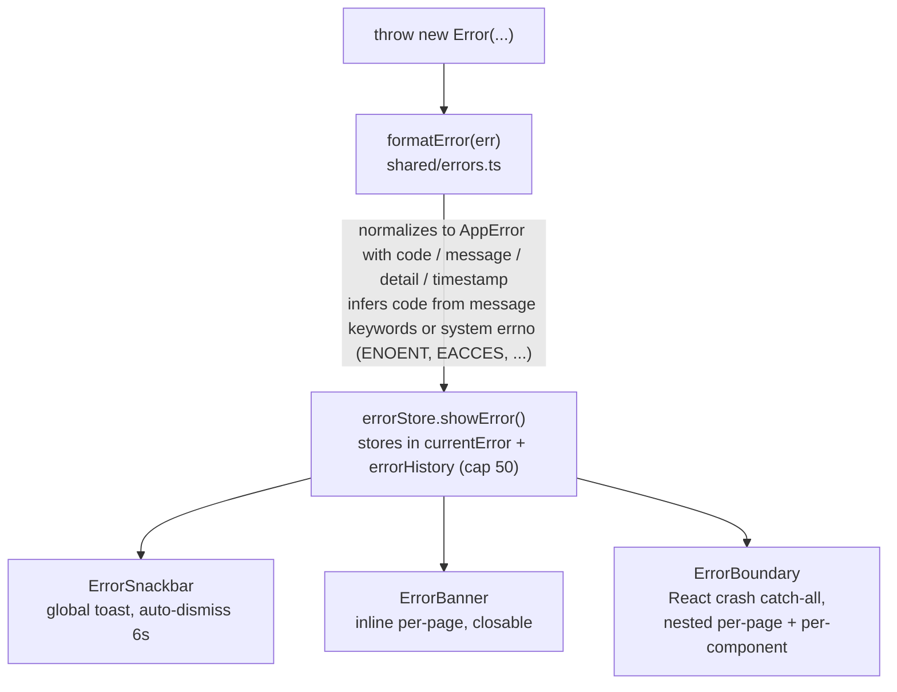
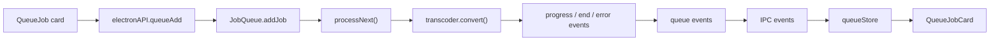
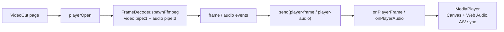
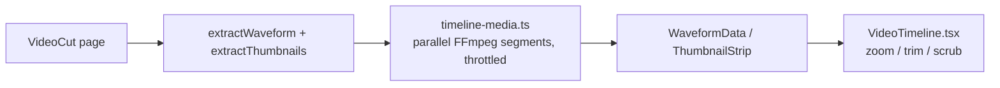

# Renderer, Zustand & Subsysteme

## Renderer-Architektur

### Render-Baum

Alle zehn Seiten sind mit `React.lazy` code-gesplittet und laden unter einer pro-Seite-`ErrorBoundary`:

| Seite           | Route          | Zweck                                                          |
| --------------- | -------------- | -------------------------------------------------------------- |
| Dashboard       | `/`            | Schnellaktions-Karten                                          |
| Convert         | `/convert`     | Medienkonvertierungs-Formular (Codec, Bitrate, Skalierung, hwaccel, ...) |
| MediaInfo       | `/media-info`  | Analyse + Detailtabelle pro Stream                             |
| ImageCompress   | `/image-compress` | Bildkomprimierung + EXIF + Histogramme                      |
| AudioExtract    | `/audio-extract` | Audiospuren als einen von 27 Codecs extrahieren              |
| VideoCut        | `/video-cut`   | Player + zoombare Timeline + Trimmen                           |
| BatchQueue      | `/batch`       | Warteschlangenverwaltung (Hinzufügen/Entfernen/Alles abbrechen) |
| Logs            | `/logs`        | Live-Log-Viewer mit Levelfilter + Download                     |
| Settings        | `/settings`    | Thema, hwaccel, immer im Vordergrund                           |
| About           | `/about`       | App-Infos, Credits, Button „Nach Updates suchen"               |

### Hooks

- `useConversion` — orchestriert eine Konvertierung von der Convert-Seite.
- `useMediaTask` — geteilter Lebenszyklus (auf `onConversionProgress` abonnieren -> Task ausführen -> `COMPLETED_PROGRESS` oder `showError`). Ein `useRef`-Gate verwirft Progress-Events veralteter Läufe.
- `useErrorHandler` — Utilities zur Fehlerbehandlung.
- `useFormErrors` — Validierungsfehler auf Feldebene.
- `useCapabilities` — lädt Encoder-Fähigkeiten und wendet Encoder-Typ-/hwaccel-Filter auf die Codec-Auswahllisten an.

## Zustandsverwaltung

Zustand-Stores in `src/renderer/stores/`:

| Store             | Verantwortlichkeit                                                  |
| ----------------- | ------------------------------------------------------------------- |
| `conversionStore` | Zustand des Konvertierungsformulars                                  |
| `audioExtractStore` | Zustand des Audioextraktions-Formulars                             |
| `errorStore`      | `currentError` + `errorHistory` (Limit 50), `showError`, `showErrorMessage`, Clear-Aktionen |
| `queueStore`      | Spiegelt Batch-Warteschlangen-Jobs aus Hauptprozess-Ereignissen       |
| `settingsStore`   | Einstellungen + `localStorage`-Persistenz (`encodex-theme` usw.)    |
| `logStore`        | Aggregierte Log-Einträge (Limit 2000), Filterzustand, Download       |
| `toastStore`      | Toast-Warteschlange                                                 |
| `updateStore`     | Update-Lebenszyklus (check, available, downloading, downloaded, error) |

Stores sind der einzige Ort, an dem sich der UI-Zustand ändert; Komponenten abonnieren mit `useXStore(selector)`.

## Batch-Warteschlange

`src/main/queue/job-queue.ts` ist ein FIFO-Prozessor mit Konkurrenzlimit, der `EventEmitter` erweitert:

- `addJob` weist eine `randomUUID` zu, schiebt einen `QueueJob` (Status `QUEUED`, Fortschritt 0), emittiert `added` und stößt `processNext()` an.
- `processNext()` ist der einzige Ort, an dem Jobs gestartet werden: Es startet neue `QUEUED`-Jobs, solange weniger als `concurrency` Konvertierungen in der Luft sind (getrackt über `activeJobs`), sodass höchstens `concurrency` (1–4) Jobs parallel laufen. Jeder gestartete Job wechselt zu `RUNNING`, erhält einen Transcoder aus der Fabrik und bekommt `progress`/`error`/`end` verdrahtet; bei Endzuständen wird der Slot des Jobs freigegeben und von `processNext()` wieder aufgefüllt. Eine Änderung des Konkurrenzlimits während des Laufs füllt derzeit wartende Slots auf.
- `cancelJob` bricht den Transcoder eines Jobs ab und entfernt ihn; `cancelAll` bricht jeden aktiven Transcoder ab, leert die Warteschlange und emittiert `cancelled`. Die Warteschlange unterstützt außerdem Pause/Resume, Move-to-Umsortierung, Optionsbearbeitung für wartende Jobs, Export/Import, Fertige-löschen, When-done-Power-Aktionen und dauerhafte Persistenz in `queue-state.json` (`src/main/queue/persistence.ts`).

Die IPC-Schicht (`ipc/queue.ts`) leitet Warteschlangen-Ereignisse einfach über `queue-added`, `queue-removed`, `queue-status-change`, `queue-progress` und `queue-cancelled` an den Renderer weiter, und der `queueStore` spiegelt sie in den React-Zustand.

## Video-Player

Der Player der Video-Cut-Seite basiert auf `FrameDecoder` (`src/main/player/frame-decoder.ts`), der FFmpeg mit zwei Ausgabe-Pipes startet:

```
FFmpeg: input (with -re realtime and -copyts)
  -> video: -map 0:v:0 -f rawvideo -pix_fmt rgb24 -s {w}x{h} -an -sn -dn -> pipe:1 (stdout)
  -> audio: -map 0:a:0 -f s16le -ac {channels} -ar {sampleRate} -> pipe:3 (extra stdio fd)
  -> frame timestamps parsed from the -vf showinfo log on stderr (pts_time)
```

- Videoframes werden aus dem rawvideo-Stream (`Breite x Höhe x 3` Bytes) reassembliert und mit den aus stderr geparsten `pts_time`-Werten zusammengeführt. Wenn Zeitstempel stocken, emittiert ein Notfall-Flush Frames mit einer monotonen PTS-Schätzung, damit die Wiedergabe nie dauerhaft blockiert.
- Audio wird in S16LE-Chunks fester Größe ausgegeben (~50 ms bei der angeforderten Rate, Standard 48 kHz / 2 Kanäle).
- `seek()` tötet und startet den Decoder am neuen Zeitstempel neu. Ein gemeinsamer `generation`-Zähler wird bei open/seek erhöht; Frames mit veralteter Generation werden vom Renderer verworfen.
- `ipc/player.ts` betreibt **zwei** Decoder (Video + Audio), damit Backpressure auf einem Stream den anderen nicht blockieren kann, begrenzt die Decode-Auflösung und leitet Frames/Chunks über `player-frame` / `player-audio` weiter.
- Der Renderer (`components/MediaPlayer.tsx`) blittet Frames auf ein HTML-Canvas und speist float-konvertiertes PCM in die Web Audio API mit clock-basierter A/V-Synchronisation, Seek-Koaleszenz und Stall-Erkennung.

## Timeline-Media

`timeline/timeline-media.ts` versorgt die zoombare Timeline der Video-Cut-Seite:

- **Wellenform** — dekodiert den gewählten Audiostream mit 8 kHz und berechnet Min/Max-Amplituden-Buckets (40/s, bis zu 24.000 Buckets) über ein 30-s-Fenster. Die Extraktion ist in parallele FFmpeg-Segmente aufgeteilt, Lücken zwischen Segmenten werden interpoliert (`fillWaveformGaps`), und alle Starts werden durch einen globalen `MAX_CONCURRENT_FFMPEG`-Slot-Pool gedrosselt.
- **Thumbnail-Montage** — dekodiert bis zu 100 Thumbnails (160x90) in eine einzige PNG-Montage (10 Spalten) und kodiert sie base64 in eine einzige `data:`-URL. Die PNG-Kodierung erfolgt im Prozess (`crc32`, `pngChunk`, `encodePng`), daher sind keine Bildbibliotheken nötig.

Der Renderer (`components/VideoTimeline.tsx`) rendert Wellenform + Montage als zoom-, scrub-baren Streifen mit Behalten/Abdimmen-Schattierung und Drag-to-Trim-Griffen.

## Bildverarbeitung

Die Module `src/main/image-*.ts` bedienen die Image-Compress-Seite:

- `image-info.ts` — extrahiert EXIF via `exifr` und berechnet RGB- + Luma-Histogramme, indem das Bild durch FFmpeg in rohe Pixeldaten gepiped wird.
- `image-preview.ts` — erzeugt verkleinerte Base64-Vorschauen.
- `image-file-info.ts` — liest Abmessungen und Dateigröße.
- `video-preview.ts` — erzeugt ein Einzelbild-Thumbnail für Videodateien.

Die *Bildkomprimierung selbst* ist nur eine Konvertierung: Die Image-Compress-Seite baut ein `ConversionOptions` (Codec, qscale, Scale) und führt es durch dieselbe Transcoder-Pipeline wie Video/Audio, beschränkt auf Bildcodecs.

## Fehlerbehandlung

Das Fehlersystem (`src/shared/errors.ts`) definiert 16 typisierte Codes — `FILE_NOT_FOUND`, `FFMPEG_NOT_FOUND`, `FFPROBE_NOT_FOUND`, `CONVERSION_FAILED`, `INVALID_FORMAT`, `PROBE_FAILED`, `QUEUE_ERROR`, `PLAYER_ERROR`, `CANCELLED`, `BMF_NOT_AVAILABLE`, `OUTPUT_NOT_SPECIFIED`, `INPUT_NOT_SPECIFIED`, `OUTPUT_EXISTS`, `INVALID_QUEUE_FILE`, `PERMISSION_DENIED`, `UNKNOWN` — jeweils mit einer Standard-Benutzermeldung.

Der Fluss ist immer derselbe:



IPC-Handler wickeln jede Operation in `try/catch` und werfen `formatError(err)` erneut, sodass Fehlercodes die Prozessgrenze überleben und der Renderer stets eine typisierte `AppError` erhält.

## Logging

Ein zeitgestempelter `Logger` (`src/shared/logger.ts`) wird in allen Prozessen genutzt. Sowohl der Hauptprozess (`patchConsole` in `index.ts`) als auch der Renderer (`main.tsx`) patchen `console.*`, um Einträge in das geteilte Log-System weiterzuleiten:

- Main -> Renderer über den IPC-Kanal `log-message`.
- Renderer -> direkt in den `logStore`.

Die Logs-Seite (`pages/Logs.tsx`) aggregiert beide Quellen mit Levelfilterung (DEBUG/INFO/WARN/ERROR), Leeren und `.txt`-Download. Jede Log-Zeile wird aus einer geteilten Vorlagenkonstante generiert (`log-constants.ts`), damit Strings konsistent und durchsuchbar bleiben.

## Internationalisierung & RTL

- i18next wird in `renderer/i18n/config.ts` mit 56 Locales in 35 Sprachen initialisiert.
- `DirectionProvider` (Emotion-Cache mit `stylis-plugin-rtl`) kippt das Layout für arabische und hebräische Locales in RTL (`ar-SA`, `ar-AE`, `ar-JO`, `he-IL`).
- `useLanguageDirection` erkennt die Richtung der aktuellen Locale; die App-Richtung leitet sich daraus ab und schaltet beim Sprachwechsel automatisch um.
- `localeMeta.ts` hält Locale-Metadaten und Flags für das `LanguageMenu`.

## Theming

- `ColorModeContext` bietet einen systembewussten Dark/Light-Modus mit manueller Umschaltung; die Präferenz persistiert unter dem Schlüssel `encodex-theme` im `localStorage`.
- `theme.ts` definiert die MUI-Light/Dark-Themes; `colors.ts` enthält die geteilte Palette.
- Styling nutzt Emotion (MUIs Standard-Engine) mit pro Komponente extrahierten Style-Konstanten in `renderer/styles/`.

## Referenz wichtiger Datenflüsse

### Konvertierung (GUI)


### Batch-Warteschlange



### Videowiedergabe



### Timeline



### Integrierte Updates


