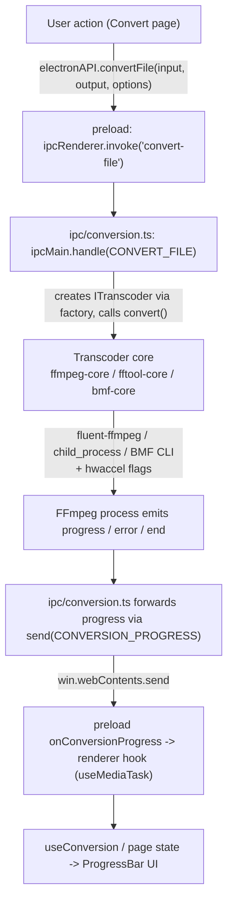

# Transcoder-Abstraktion & Konvertierung

## Transcoder-Abstraktion

Alle Medien-Backends folgen `ITranscoder` (`src/main/transcoders/interface.ts`):

```ts
export interface ITranscoder {
  getInfo(input: string): Promise<MediaInfo>;
  convert(input: string, output: string, options: ConversionOptions): EventEmitter;
  cancel(): void;
  pause(): void;
  resume(): void;
  getType(): string;
}
```

`convert()` gibt einen `EventEmitter` zurück, der `start`, `codecData`, `progress`, `end` und `error` emittiert. Die Fabrik (`transcoders/factory.ts`) dispatcht auf den `TranscoderType` (`FFMPEG | FFTOOL | BMF`):

### 1. `FfmpegCore` (Standard) — `fluent-ffmpeg`-API

- Setzt die gebündelten FFmpeg/FFprobe-Pfade beim Modul-Laden.
- Baut den Befehl über die chainable API von fluent-ffmpeg (Codecs, Bitrates, qscale, Scale mit optionaler Seitenverhältnis-Erhaltung, Pixelformat, MJPEG-Color-Range-Fix, `-c copy`, Zeitschnitt, `-an`).
- Wendet Hardwarebeschleunigungs-Eingabeoptionen an, wenn zutreffend.
- Emittiert reichhaltige `progress`-Events aus der geparsten Ausgabe von fluent-ffmpeg und füllt Lücken (Prozent, Speed, ETA) aus Timemark-Berechnungen, wenn die Bibliothek sie weglässt.
- Verfolgt die Kind-PID und unterstützt Pause/Resume über OS-level Suspend/Resume (`process-utils.ts`) sowie Abbruch via `kill('SIGKILL')`.

### 2. `FFToolCore` — direkte CLI

- Startet FFmpeg als rohen `child_process` mit Argumenten, die `buildFfmpegArgs` baut (`transcoders/ffmpeg-utils.ts`).
- Parst `time=` aus stderr und emittiert in festen Abständen ein leichtes Progress-Event (Prozent bleibt 0; nur `time`/`speed` sind aussagekräftig).
- Exit-Code 0 -> `end`; sonst -> `error`. Abbruch wird mit dem `KILL_SIGNAL` signalisiert.

### 3. `BmfCore` — BMF-Framework-CLI

- Führt `bmf_ffmpeg` / `bmf_ffprobe` aus (erfordert separate BMF-Installation).
- Nutzt denselben geteilten Flag-Builder `buildFfmpegArgs` wie FFToolCore, sodass BMF-Konvertierungen funktional konsistent bleiben.
- Analysiert via `execSync` mit Timeout; bei Fehler erscheint die Meldung `BMF not available`, die auf den Fehlercode `BMF_NOT_AVAILABLE` abgebildet wird.

### Geteilter Flag-Aufbau

`ffmpeg-utils.ts` ist der einzige Ort, der `ConversionOptions` in rohe FFmpeg-CLI-Argumente übersetzt, damit sich die FFTool- und BMF-Kerne nie auseinanderleben können. `ffprobe-mapper.ts` normalisiert das rohe ffprobe-JSON in die typisierte `MediaInfo`-Form, die app-weit genutzt wird.

## Hardwarebeschleunigung

`transcoders/hwaccel.ts` löst FFmpeg-`-hwaccel`-Flags für einen gewählten Codec auf. Es mappt Encoder-Suffixe auf Familien:

- `_nvenc` -> NVIDIA CUDA (`-hwaccel cuda -hwaccel_output_format cuda`)
- `_qsv` -> Intel QSV
- `_amf` / `_mf` -> Direct3D 11 (`d3d11va`)
- `_vaapi` -> VAAPI mit dem Linux-Renderdevice `/dev/dri/renderD128`
- `_videotoolbox` -> Apple VideoToolbox

Flags werden nur erzeugt, wenn Beschleunigung aktiviert ist **und** der Modus `auto` ist; im Modus `encode` wird der eigene Hardware-Pfad des Encoders ohne zusätzliche Flags genutzt. Verfügbare Encoder und Hwaccels werden zur Laufzeit von `capabilities.ts` erkannt (Start von `ffmpeg -hide_banner -encoders` und `-hwaccels`, nach erster Erkennung gecacht), und der Renderer filtert die Codec-Auswahllisten auf das, was der gebündelte Binary tatsächlich bietet.

## Medien-Analyse

`getInfo()` (über jeden Kern) ruft ffprobe auf und gibt ein `MediaInfo`-Objekt zurück. `ffprobe-mapper.ts` normalisiert die Daten pro Stream — Codec, Profil, Level, Auflösung, DAR, Pixelformat, Bittiefe, Farb-Metadaten, Bildrate, Bitrate, Samplerate, Sampleformat, Kanäle/Layout, Dauer, Startzeit, Frame-Anzahl, Sprache und Tags — in das Interface `MediaStreamInfo`, das von der Media-Info-Seite konsumiert und intern für Player-Auflösung und Warteschlangen-Logik genutzt wird.

## Konvertierungsfluss

Der vollständige End-to-End-Pfad einer GUI-Konvertierung:



Hinweise:

- Bei Fehler löscht der Handler die partielle Ausgabedatei (außer input === output) und lehnt mit `formatError(err)` ab.
- `pause`/`resume` entsprechen OS-Prozess-Suspend/Resume; `cancel` tötet den Prozess und normalisiert den Fehler auf den Code `CANCELLED`.
- Bereinigung partieller Ausgaben und Fehler-Normalisierung geschehen in der IPC-Schicht, sodass die Kerne sich auf Prozessmechanik konzentrieren.
