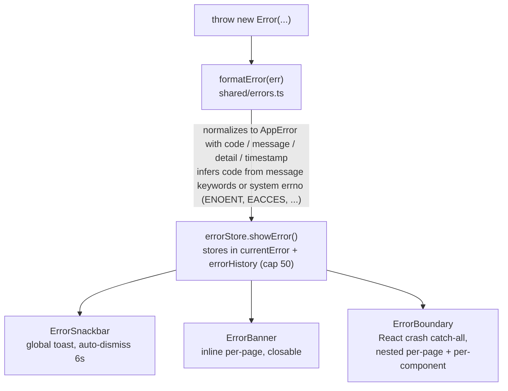
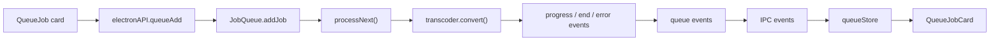
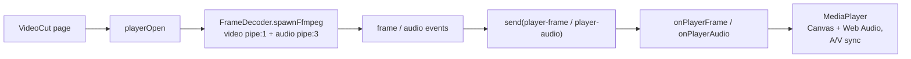
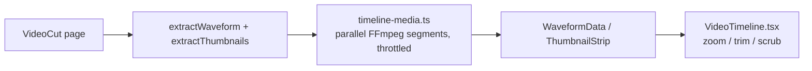

# Renderer, estado y subsistemas

## Arquitectura del renderer

### Árbol de renderizado

Las diez páginas se dividen con `React.lazy` y se cargan bajo un `ErrorBoundary` por página:

| Página          | Ruta            | Propósito                                                        |
| --------------- | -------------- | -------------------------------------------------------------- |
| Dashboard       | `/`            | Tarjetas de acciones rápidas                                             |
| Convert         | `/convert`     | Formulario de conversión multimedia (códec, bitrate, escala, hwaccel, ...)    |
| MediaInfo       | `/media-info`  | Sondeo + tabla de detalle por stream                                |
| ImageCompress   | `/image-compress` | Compresión de imágenes + EXIF + histogramas                       |
| AudioExtract    | `/audio-extract` | Extracción de pistas de audio con cualquiera de 27 códecs                     |
| VideoCut        | `/video-cut`   | Reproductor + línea de tiempo ampliable + recorte                              |
| BatchQueue      | `/batch`       | Gestión de la cola (añadir/quitar/cancelar todo)                       |
| Logs            | `/logs`        | Visor de logs en vivo con filtro por nivel + descarga                   |
| Settings        | `/settings`    | Tema, hwaccel, siempre visible                                  |
| About           | `/about`       | Información de la app, créditos, botón "Buscar actualizaciones"                  |

### Hooks

- `useConversion` — orquesta una conversión desde la página Convert.
- `useMediaTask` — ciclo de vida compartido (suscribirse a `onConversionProgress` -> ejecutar tarea -> `COMPLETED_PROGRESS` o `showError`). Un gate con `useRef` descarta eventos de progreso de ejecuciones obsoletas.
- `useErrorHandler` — utilidades de manejo de errores.
- `useFormErrors` — errores de validación a nivel de campo.
- `useCapabilities` — obtiene las capacidades de los codificadores y aplica filtros por tipo de codificador / hwaccel a los selectores de códecs.

## Gestión de estado

Stores de Zustand en `src/renderer/stores/`:

| Store             | Responsabilidad                                                      |
| ----------------- | ------------------------------------------------------------------- |
| `conversionStore` | Estado del formulario de conversión                                               |
| `audioExtractStore` | Estado del formulario de extracción de audio                                       |
| `errorStore`      | `currentError` + `errorHistory` (tope 50), `showError`, `showErrorMessage`, acciones de limpieza |
| `queueStore`      | Refleja los trabajos de la cola por lotes a partir de eventos del proceso principal                   |
| `settingsStore`   | Ajustes + persistencia en `localStorage` (`encodex-theme`, etc.)       |
| `logStore`        | Entradas de log agregadas (tope 2000), estado del filtro, descarga           |
| `toastStore`      | Cola de toasts                                                         |
| `updateStore`     | Estado del ciclo de vida de actualizaciones (check, available, downloading, downloaded, error) |

Los stores son el único lugar donde cambia el estado de la UI; los componentes se suscriben con `useXStore(selector)`.

## Cola por lotes

`src/main/queue/job-queue.ts` es un procesador FIFO con concurrencia limitada que extiende `EventEmitter`:

- `addJob` asigna un `randomUUID`, añade un `QueueJob` (estado `QUEUED`, progreso 0), emite `added` y arranca `processNext()`.
- `processNext()` es el único lugar donde se inician trabajos: lanza nuevos trabajos `QUEUED` mientras haya menos de `concurrency` conversiones en vuelo (rastreadas por `activeJobs`), de modo que como máximo `concurrency` (1–4) trabajos corren en paralelo. Cada trabajo iniciado pasa a `RUNNING`, recibe un transcoder de la fábrica y conecta `progress`/`error`/`end`; al llegar a estados terminales se libera su hueco y `processNext()` lo rellena. Cambiar el tope de concurrencia en plena ejecución rellena los huecos en cola actuales.
- `cancelJob` cancela el transcoder de un trabajo y lo elimina; `cancelAll` cancela todos los transcoders activos, vacía la cola y emite `cancelled`. La cola además soporta pausa/reanudación, reordenamiento move-to, edición de opciones para trabajos en cola, exportar/importar, limpiar completados, acciones de energía al terminar y persistencia duradera en `queue-state.json` (`src/main/queue/persistence.ts`).

La capa IPC (`ipc/queue.ts`) simplemente reenvía los eventos de la cola al renderer a través de `queue-added`, `queue-removed`, `queue-status-change`, `queue-progress` y `queue-cancelled`, y el `queueStore` los refleja en estado de React.

## Reproductor de vídeo

El reproductor de la página Video Cut está construido sobre `FrameDecoder` (`src/main/player/frame-decoder.ts`), que lanza FFmpeg con dos pipes de salida:

```
FFmpeg: input (with -re realtime and -copyts)
  -> video: -map 0:v:0 -f rawvideo -pix_fmt rgb24 -s {w}x{h} -an -sn -dn -> pipe:1 (stdout)
  -> audio: -map 0:a:0 -f s16le -ac {channels} -ar {sampleRate} -> pipe:3 (extra stdio fd)
  -> frame timestamps parsed from the -vf showinfo log on stderr (pts_time)
```

- Los fotogramas de vídeo se reensamblan desde el stream rawvideo (`width x height x 3` bytes) y se emparejan con valores `pts_time` parseados de stderr. Si las marcas de tiempo se detienen, un flush de emergencia emite fotogramas con una estimación monotónica de PTS para que la reproducción nunca se bloquee permanentemente.
- El audio se emite en chunks S16LE de tamaño fijo (~50 ms a la tasa de muestreo solicitada, por defecto 48 kHz / 2 canales).
- `seek()` mata y relanza el decodificador en la nueva marca de tiempo. Un contador `generation` compartido aumenta en cada open/seek; los fotogramas con generación obsoleta son descartados por el renderer.
- `ipc/player.ts` ejecuta **dos** decodificadores (vídeo + audio) para que la contrapresión en un stream no pueda bloquear al otro, limita la resolución de decodificación y reenvía frames/chunks por `player-frame` / `player-audio`.
- El renderer (`components/MediaPlayer.tsx`) vuelca los fotogramas en un Canvas HTML e inyecta el PCM convertido a float en la Web Audio API con sincronización A/V basada en reloj, coalescencia de seeks y detección de paradas.

## Medios de la línea de tiempo

`timeline/timeline-media.ts` alimenta la línea de tiempo ampliable de la página Video Cut:

- **Forma de onda** — decodifica el stream de audio seleccionado a 8 kHz y calcula buckets min/max de amplitud (40/s, hasta 24,000 buckets) sobre una ventana de 30 s. La extracción se divide en segmentos FFmpeg en paralelo, los huecos entre segmentos se interpolan (`fillWaveformGaps`) y todos los procesos lanzados pasan por un pool global de slots `MAX_CONCURRENT_FFMPEG`.
- **Montaje de miniaturas** — decodifica hasta 100 miniaturas (160x90) en un único montaje PNG (10 columnas) y luego lo codifica en base64 como una sola URL `data:`. La codificación PNG se hace en proceso (`crc32`, `pngChunk`, `encodePng`), sin necesidad de librerías de imagen.

El renderer (`components/VideoTimeline.tsx`) dibuja forma de onda + montaje como una tira ampliable y navegable con sombreado keep/dim y tiradores de arrastre para recortar.

## Procesamiento de imágenes

Los archivos `src/main/image-*.ts` atienden la página Image Compress:

- `image-info.ts` — extrae EXIF mediante `exifr` y calcula histogramas RGB + luma pasando la imagen por FFmpeg hacia datos crudos de píxeles.
- `image-preview.ts` — produce vistas previas base64 reducidas.
- `image-file-info.ts` — lee dimensiones y tamaño de archivo.
- `video-preview.ts` — produce una miniatura de un solo fotograma para archivos de vídeo.

La *compresión de imágenes en sí* es solo una conversión: la página Image Compress construye unas `ConversionOptions` (códec, qscale, escala) y las ejecuta por el mismo pipeline de transcoders usado para vídeo/audio, restringido a códecs de imagen.

## Manejo de errores

El sistema de errores (`src/shared/errors.ts`) define 16 códigos tipados — `FILE_NOT_FOUND`, `FFMPEG_NOT_FOUND`, `FFPROBE_NOT_FOUND`, `CONVERSION_FAILED`, `INVALID_FORMAT`, `PROBE_FAILED`, `QUEUE_ERROR`, `PLAYER_ERROR`, `CANCELLED`, `BMF_NOT_AVAILABLE`, `OUTPUT_NOT_SPECIFIED`, `INPUT_NOT_SPECIFIED`, `OUTPUT_EXISTS`, `INVALID_QUEUE_FILE`, `PERMISSION_DENIED`, `UNKNOWN` — cada uno con un mensaje predeterminado orientado al usuario.

El flujo es siempre el mismo:



Los manejadores IPC envuelven cada operación en `try/catch` y relanzan `formatError(err)`, así los códigos de error sobreviven al límite entre procesos y el renderer siempre recibe un `AppError` tipado.

## Logging

Un `Logger` con marcas de tiempo (`src/shared/logger.ts`) se usa en todos los procesos. Tanto el proceso principal (`patchConsole` en `index.ts`) como el renderer (`main.tsx`) parchean `console.*` para reenviar las entradas al sistema de logs compartido:

- Main -> renderer vía el canal IPC `log-message`.
- Renderer -> directamente a `logStore`.

La página Logs (`pages/Logs.tsx`) agrega ambas fuentes con filtrado por nivel (DEBUG/INFO/WARN/ERROR), limpieza y descarga `.txt`. Cada línea de log se genera a partir de una constante de plantilla compartida (`log-constants.ts`) para que los textos sean consistentes y buscables.

## Internacionalización y RTL

- i18next se inicializa en `renderer/i18n/config.ts` con 56 locales en 35 idiomas.
- `DirectionProvider` (caché Emotion con `stylis-plugin-rtl`) voltea el layout a RTL para los locales árabes y hebreos (`ar-SA`, `ar-AE`, `ar-JO`, `he-IL`).
- `useLanguageDirection` detecta la dirección del locale actual; la dirección de la app se deriva de ella y cambia automáticamente al alternar idiomas.
- `localeMeta.ts` guarda metadatos de locales y banderas para el `LanguageMenu`.

## Temas

- `ColorModeContext` ofrece modo oscuro/claro consciente del sistema con toggle manual; la preferencia persiste en `localStorage` bajo la clave `encodex-theme`.
- `theme.ts` define los temas claro/oscuro de MUI; `colors.ts` contiene la paleta compartida.
- El estilo usa Emotion (motor por defecto de MUI) con constantes de estilo por componente extraídas a `renderer/styles/`.

## Referencia de flujos de datos clave

### Conversión (GUI)

```mermaid
flowchart LR
    A["React page"] --> B["Zustand store"] --> C["electronAPI.convertFile"] --> D3["ipcMain.handle(convert-file)"] --> E["factory.createTranscoder(type)"] --> F["ITranscoder.convert()"] --> G["FFmpeg process"] --> H["progress events"] --> I["send(conversion-progress)"] --> J["onConversionProgress"] --> K["useMediaTask"] --> L["ProgressBar"]
```



### Cola por lotes



### Reproducción de vídeo



### Línea de tiempo



### Actualizaciones integradas


