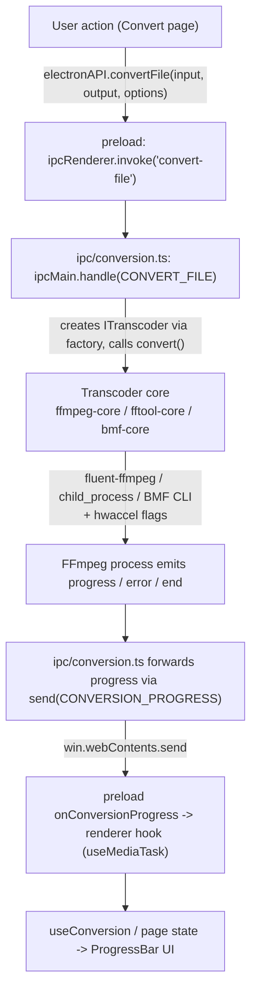

# Abstracción de transcoders y conversión

## Abstracción de transcoders

Todos los backends de medios se ajustan a `ITranscoder` (`src/main/transcoders/interface.ts`):

```ts
export interface ITranscoder {
  getInfo(input: string): Promise<MediaInfo>;
  convert(input: string, output: string, options: ConversionOptions): EventEmitter;
  cancel(): void;
  pause(): void;
  resume(): void;
  getType(): string;
}
```

`convert()` devuelve un `EventEmitter` que emite `start`, `codecData`, `progress`, `end` y `error`. La fábrica (`transcoders/factory.ts`) despacha según el `TranscoderType` (`FFMPEG | FFTOOL | BMF`):

### 1. `FfmpegCore` (predeterminado) — API de `fluent-ffmpeg`

- Establece las rutas de FFmpeg/FFprobe incluidos al cargar el módulo.
- Construye el comando mediante la API encadenable de fluent-ffmpeg (códecs, bitrates, qscale, escala con conservación opcional de relación de aspecto, formato de píxel, corrección de color-range para MJPEG, `-c copy`, corte de tiempo, `-an`).
- Aplica las opciones de entrada de aceleración por hardware cuando corresponde.
- Emite `progress` enriquecido a partir de la salida parseada de `fluent-ffmpeg`, rellenando huecos (porcentaje, velocidad, ETA) con cálculos de timemark cuando la librería los omite.
- Rastrea el PID del proceso hijo y soporta pausa/reanudación vía suspend/resume del sistema operativo (`process-utils.ts`), además de cancelación mediante `kill('SIGKILL')`.

### 2. `FFToolCore` — CLI directa

- Lanza FFmpeg como un `child_process` crudo con argumentos construidos por `buildFfmpegArgs` (`transcoders/ffmpeg-utils.ts`).
- Parsea `time=` desde stderr y emite un evento de progreso ligero a intervalos fijos (el porcentaje se queda en 0; solo `time`/`speed` son significativos).
- Código de salida 0 -> `end`; si no -> `error`. La cancelación se señala con `KILL_SIGNAL`.

### 3. `BmfCore` — CLI del framework BMF

- Ejecuta `bmf_ffmpeg` / `bmf_ffprobe` (requiere una instalación separada de BMF).
- Usa el mismo constructor compartido de flags `buildFfmpegArgs` que FFToolCore, así las conversiones BMF mantienen paridad de características.
- Sondea mediante `execSync` con timeout; si falla muestra el mensaje `BMF not available`, que mapea al código de error `BMF_NOT_AVAILABLE`.

### Construcción compartida de flags

`ffmpeg-utils.ts` es el único lugar que traduce `ConversionOptions` a argumentos crudos de la CLI de FFmpeg, así los núcleos FFTool y BMF nunca pueden divergir entre sí. `ffprobe-mapper.ts` normaliza el JSON crudo de ffprobe a la forma tipada `MediaInfo` usada en toda la app.

## Aceleración por hardware

`transcoders/hwaccel.ts` resuelve los flags `-hwaccel` de FFmpeg para un códec elegido. Mapea sufijos de codificadores a familias:

- `_nvenc` -> NVIDIA CUDA (`-hwaccel cuda -hwaccel_output_format cuda`)
- `_qsv` -> Intel QSV
- `_amf` / `_mf` -> Direct3D 11 (`d3d11va`)
- `_vaapi` -> VAAPI con el dispositivo de renderizado de Linux `/dev/dri/renderD128`
- `_videotoolbox` -> Apple VideoToolbox

Los flags solo se generan cuando la aceleración está habilitada **y** el modo es `auto`; en modo `encode` se usa la ruta de hardware propia del codificador sin flags extra. Los codificadores y hwaccels disponibles se descubren en tiempo de ejecución mediante `capabilities.ts` (lanzando `ffmpeg -hide_banner -encoders` y `-hwaccels`, con caché tras el primer sondeo), y el renderer filtra los selectores de códecs a lo que el binario incluido ofrece realmente.

## Sondeo de medios

`getInfo()` (a través de cualquier núcleo) invoca ffprobe y devuelve un objeto `MediaInfo`. `ffprobe-mapper.ts` normaliza los datos por stream — códec, perfil, nivel, resolución, DAR, formato de píxel, profundidad de bits, metadatos de color, tasa de fotogramas, bitrate, tasa de muestreo, formato de muestra, canales/layout, duración, tiempo de inicio, número de fotogramas, idioma y tags — a la interfaz `MediaStreamInfo` que consume la página Media Info y que se usa internamente para la resolución del reproductor y la lógica de la cola.

## Flujo de conversión

La ruta completa de extremo a extremo para una conversión desde la GUI:



Notas:

- Ante un error, el manejador borra el archivo de salida parcial (salvo input === output) y rechaza con `formatError(err)`.
- `pause`/`resume` se traducen a suspend/resume del proceso por parte del SO; `cancel` mata el proceso y normaliza el error al código `CANCELLED`.
- La limpieza de salidas parciales y la normalización de errores ocurren en la capa IPC, manteniendo los núcleos enfocados en la mecánica de procesos.
