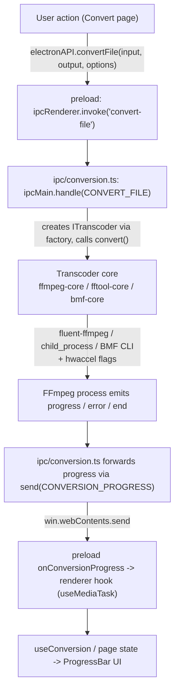

# Abstraction transcoder & conversion

## Abstraction transcoder

Tous les backends média se conforment à `ITranscoder` (`src/main/transcoders/interface.ts`) :

```ts
export interface ITranscoder {
  getInfo(input: string): Promise<MediaInfo>;
  convert(input: string, output: string, options: ConversionOptions): EventEmitter;
  cancel(): void;
  pause(): void;
  resume(): void;
  getType(): string;
}
```

`convert()` renvoie un `EventEmitter` qui émet `start`, `codecData`, `progress`, `end` et `error`. La fabrique (`transcoders/factory.ts`) dispatche sur le `TranscoderType` (`FFMPEG | FFTOOL | BMF`) :

### 1. `FfmpegCore` (par défaut) — API `fluent-ffmpeg`

- Définit les chemins FFmpeg/FFprobe embarqués au chargement du module.
- Construit la commande via l'API chaînable de fluent-ffmpeg (codecs, bitrates, qscale, scale avec préservation facultative du ratio, format de pixels, correctif de color-range MJPEG, `-c copy`, découpe temporelle, `-an`).
- Applique les options d'entrée d'accélération matérielle le cas échéant.
- Émet des événements `progress` riches depuis la sortie analysée de fluent-ffmpeg, comblant les lacunes (pourcentage, vitesse, ETA) par calcul de timemark quand la bibliothèque les omet.
- Suit le PID de l'enfant et prend en charge pause/reprise via suspend/resume au niveau OS (`process-utils.ts`), et l'annulation via `kill('SIGKILL')`.

### 2. `FFToolCore` — CLI direct

- Lance FFmpeg comme un `child_process` brut avec des arguments construits par `buildFfmpegArgs` (`transcoders/ffmpeg-utils.ts`).
- Analyse `time=` depuis stderr et émet un événement de progression léger à intervalle fixe (le pourcentage reste à 0 ; seuls `time`/`speed` sont significatifs).
- Code de sortie 0 -> `end` ; sinon -> `error`. L'annulation est signalée avec le `KILL_SIGNAL`.

### 3. `BmfCore` — CLI du framework BMF

- Exécute `bmf_ffmpeg` / `bmf_ffprobe` (nécessite une installation BMF séparée).
- Utilise le même constructeur de flags partagé `buildFfmpegArgs` que FFToolCore, afin que les conversions BMF restent cohérentes en fonctionnalités.
- Sonde via `execSync` avec un timeout ; en cas d'échec, remonte le message `BMF not available` qui correspond au code d'erreur `BMF_NOT_AVAILABLE`.

### Construction partagée des flags

`ffmpeg-utils.ts` est l'unique endroit qui traduit `ConversionOptions` en arguments bruts du CLI FFmpeg, de sorte que les cœurs FFTool et BMF ne puissent jamais diverger. `ffprobe-mapper.ts` normalise le JSON brut de ffprobe vers la forme typée `MediaInfo` utilisée dans toute l'app.

## Accélération matérielle

`transcoders/hwaccel.ts` résout les flags FFmpeg `-hwaccel` pour un codec donné. Il mappe les suffixes d'encodeurs vers des familles :

- `_nvenc` -> NVIDIA CUDA (`-hwaccel cuda -hwaccel_output_format cuda`)
- `_qsv` -> Intel QSV
- `_amf` / `_mf` -> Direct3D 11 (`d3d11va`)
- `_vaapi` -> VAAPI avec le périphérique de rendu Linux `/dev/dri/renderD128`
- `_videotoolbox` -> Apple VideoToolbox

Les flags ne sont produits que lorsque l'accélération est activée **et** que le mode est `auto` ; en mode `encode`, c'est le chemin matériel propre à l'encodeur qui est utilisé sans flags supplémentaires. Les encodeurs et hwaccels disponibles sont détectés à l'exécution par `capabilities.ts` (en lançant `ffmpeg -hide_banner -encoders` et `-hwaccels`, mis en cache après la première détection), et le renderer filtre les sélecteurs de codecs selon ce que le binaire embarqué fournit réellement.

## Analyse média

`getInfo()` (via n'importe quel cœur) invoque ffprobe et renvoie un objet `MediaInfo`. `ffprobe-mapper.ts` normalise les données par flux — codec, profil, niveau, résolution, DAR, format de pixels, profondeur de bits, métadonnées couleur, fréquence d'images, bitrate, fréquence d'échantillonnage, format d'échantillon, canaux/disposition, durée, temps de début, nombre d'images, langue et tags — dans l'interface `MediaStreamInfo` consommée par la page Media Info et utilisée en interne pour la résolution du lecteur et la logique de file d'attente.

## Flux de conversion

Le chemin complet de bout en bout pour une conversion GUI :



Remarques :

- En cas d'erreur, le gestionnaire supprime le fichier de sortie partiel (sauf si input === output) et rejette avec `formatError(err)`.
- `pause`/`resume` correspondent à suspend/resume du processus OS ; `cancel` tue le processus et normalise l'erreur vers le code `CANCELLED`.
- Le nettoyage des sorties partielles et la normalisation des erreurs ont lieu dans la couche IPC, gardant les cœurs concentrés sur la mécanique des processus.
