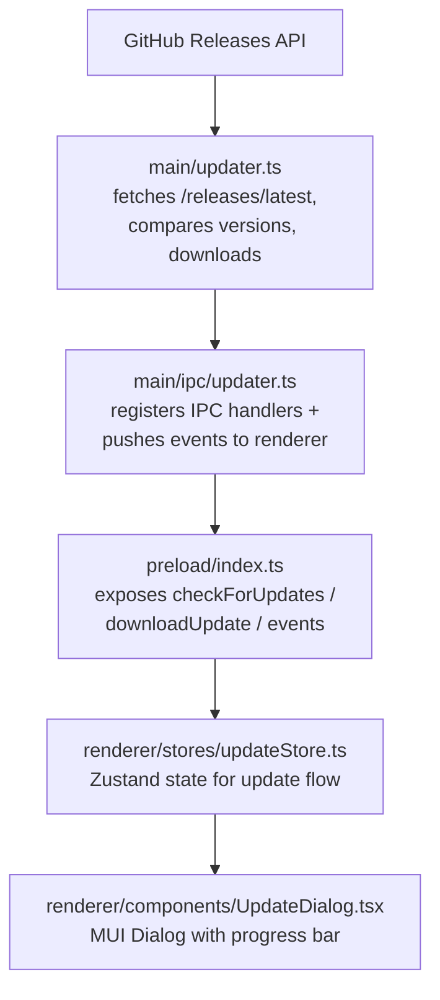

# Gestionnaire de mises à jour

## Aperçu

Implémente un gestionnaire de mises à jour intégré personnalisé (Option C) qui consulte GitHub Releases pour de nouvelles versions, notifie l'utilisateur, télécharge l'installateur spécifique à la plateforme dans l'app avec report de progression, et lance l'installateur une fois terminé.

## Architecture

## Fichiers à créer

| Fichier | Objectif |
|------|---------|
| `src/main/updater.ts` | Logique centrale de mise à jour : comparaison de versions, récupération des releases, sélection des assets, téléchargement avec progression, lancement de l'installateur |
| `src/main/ipc/updater.ts` | Enregistrement des gestionnaires IPC pour les canaux de mise à jour |
| `src/renderer/stores/updateStore.ts` | Store Zustand pour l'état de mise à jour (checking, available, downloading, progress, downloaded, error) |
| `src/renderer/components/UpdateDialog.tsx` | Dialogue modal affichant le statut de mise à jour, la progression du téléchargement et le bouton d'installation |
| `src/renderer/styles/UpdateDialog.styles.ts` | Composants stylés pour le dialogue de mise à jour |

## Fichiers à modifier

| Fichier | Changement |
|------|--------|
| `src/shared/types.ts` | Ajouter les interfaces `UpdateInfo`, `UpdateAsset`, `UpdateProgress` |
| `src/shared/ipc-channels.ts` | Ajouter les constantes des canaux IPC de mise à jour |
| `src/shared/log-constants.ts` | Ajouter les constantes des messages de log de mise à jour |
| `src/main/ipc/handlers.ts` | Enregistrer les gestionnaires de l'updater |
| `src/preload/index.ts` | Exposer les méthodes du pont de mise à jour et les abonnements aux événements |
| `src/renderer/electron-api.d.ts` | Déclarer les types de l'API de mise à jour sur `ElectronAPI` |
| `src/renderer/pages/About.tsx` | Ajouter le bouton « Rechercher des mises à jour » |
| `src/renderer/App.tsx` | Monter `UpdateDialog` globalement |
| `src/test-setup.ts` | Ajouter les mocks de l'API de mise à jour au stub global electronAPI |
| `e2e/mocks/preload.js` | Ajouter les méthodes de l'API de mise à jour au preload mock |
| `e2e/mocks/main-store.js` | Aucun changement nécessaire (l'état de mise à jour est éphémère) |

## Canaux IPC

| Channel | Direction | Objectif |
|---------|-----------|---------|
| `check-for-updates` | renderer -> main | Déclencher la recherche de mises à jour |
| `download-update` | renderer -> main | Démarrer le téléchargement de l'asset correspondant |
| `install-update` | renderer -> main | Lancer l'installateur téléchargé |
| `cancel-download` | renderer -> main | Annuler le téléchargement en cours |
| `open-release-notes` | renderer -> main | Ouvrir la page du release dans le navigateur |
| `update-available` | main -> renderer | Notifier qu'une nouvelle version est disponible |
| `update-not-available` | main -> renderer | Notifier que l'app est à jour |
| `update-progress` | main -> renderer | Pousser la progression du téléchargement |
| `update-downloaded` | main -> renderer | Notifier que le téléchargement est terminé |
| `update-error` | main -> renderer | Pousser une erreur de mise à jour |

## Comparaison de versions

- Comparaison semver simple : découpage sur `.`, comparaison numérique.
- Supprime les suffixes pre-release (ex. `-beta.0`) pour la comparaison.
- Renvoie true si la version distante est strictement supérieure à la locale.

## Logique de sélection des assets

1. Filtrer les assets du release par extension de plateforme :
   - `win32` -> `.exe`
   - `darwin` -> `.dmg`
   - `linux` -> `.AppImage`
2. Au sein de la plateforme, faire correspondre l'architecture :
   - `x64` -> le nom de fichier contient `x64`
   - `arm64` -> le nom de fichier contient `arm64`
   - `ia32` -> le nom de fichier contient `ia32`
3. Revenir au premier asset correspondant à la plateforme si aucune architecture ne correspond.

## Flux de téléchargement

1. Le renderer appelle l'IPC `download-update`.
2. Le processus principal télécharge vers `app.getPath('temp')/EncodeX-updater/`.
3. La progression est poussée via `update-progress` toutes les ~300ms.
4. Une fois terminé, `update-downloaded` est envoyé avec le chemin de l'installateur.
5. Le renderer affiche le bouton « Installer et redémarrer ».
6. Au clic, le processus principal lance l'installateur via `shell.openPath()` + `app.quit()`.

## États de l'UI

| État      | Ce que montre le dialogue |
|-------|-------------|
| `idle` | (dialogue masqué) |
| `checking` | Spinner + « Recherche de mises à jour... » |
| `available` | Infos de version, lien vers les notes de release, bouton Télécharger |
| `not-available` | Message « Vous êtes à jour », bouton Fermer |
| `downloading` | Barre de progression avec pourcentage + vitesse |
| `downloaded` | « Mise à jour prête à installer » + bouton Installer et redémarrer |
| `error` | Message d'erreur + boutons Réessayer / Fermer |

## Stratégie de test

- Unitaires : fonction de comparaison de versions, fonction de sélection des assets.
- Manuels : publier un tag/release de test supérieur à `1.0.0-beta.0` et vérifier
  le flux complet recherche -> téléchargement -> installation sur la plateforme cible.
