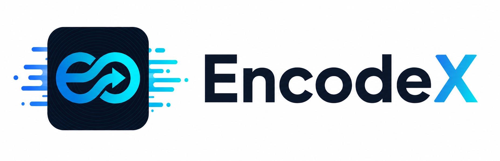
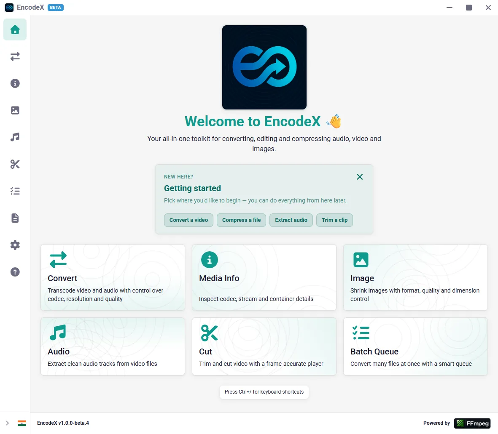
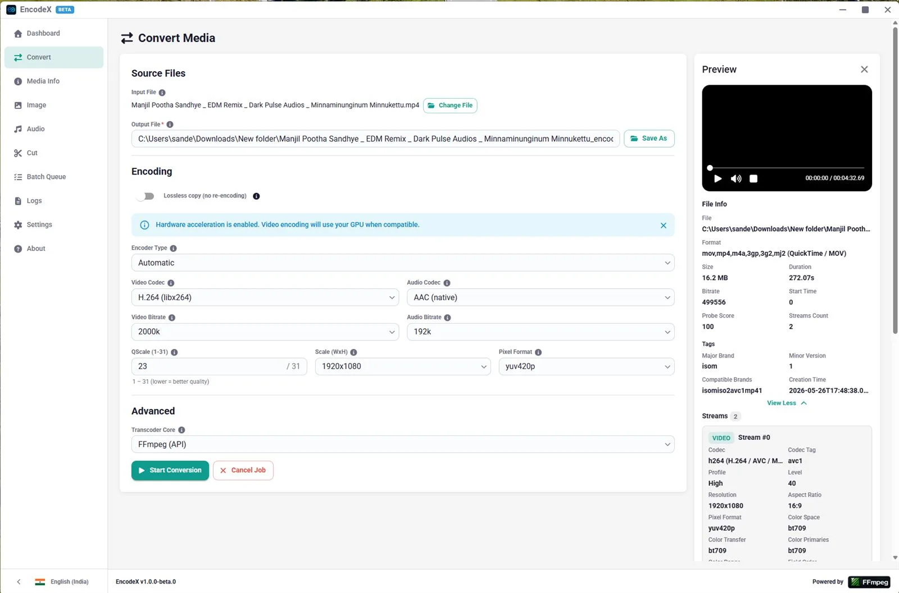
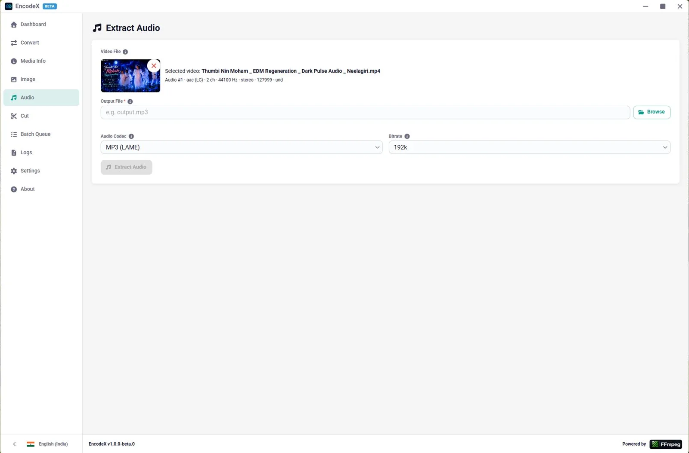
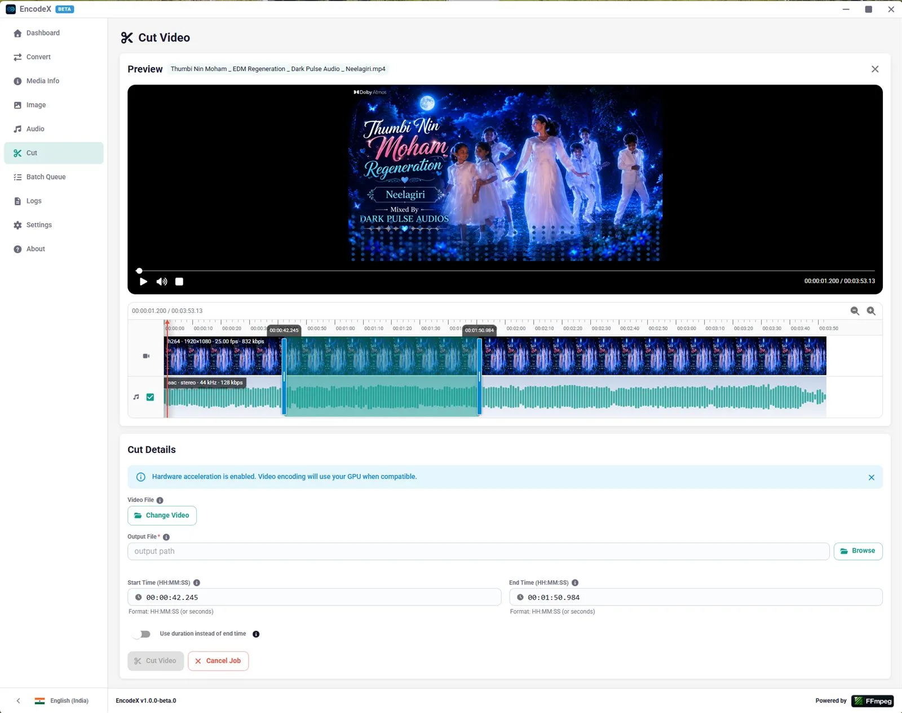
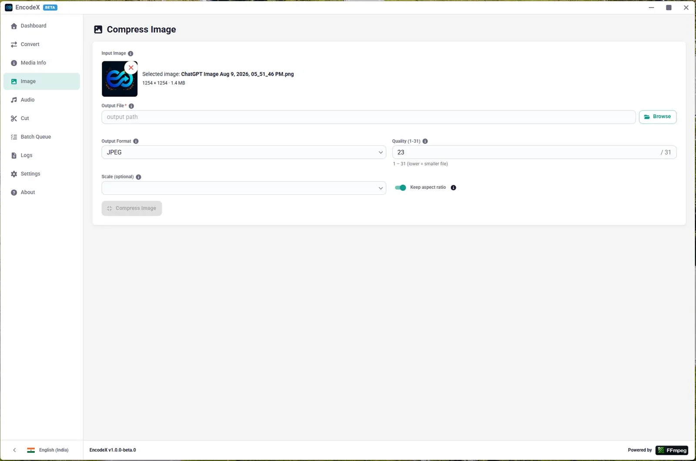
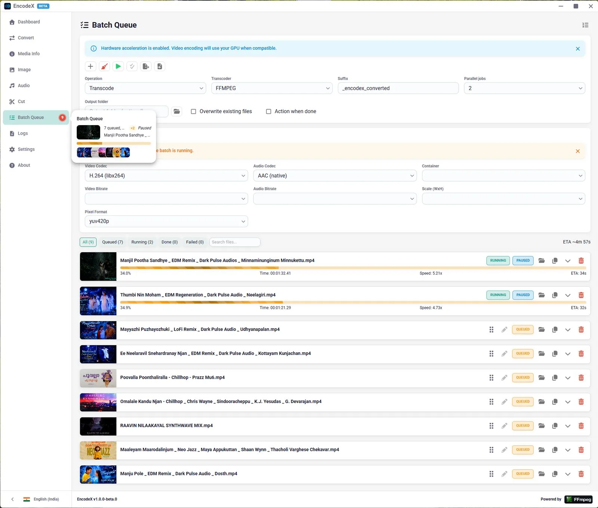
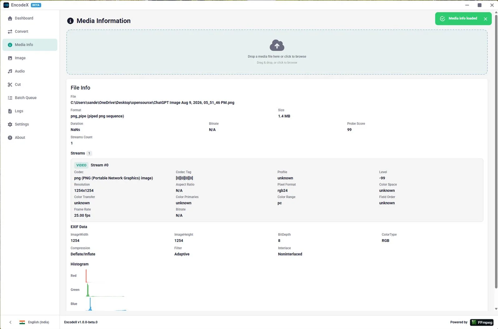
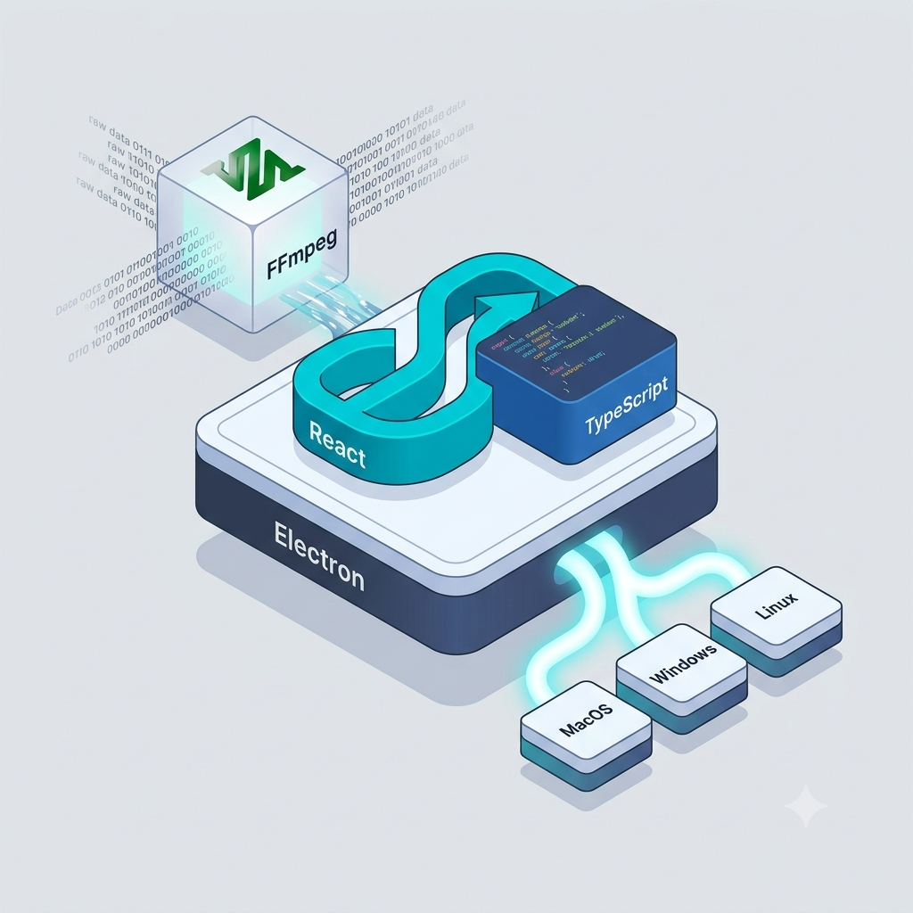

<div align="center">
  
  <h3>FFmpeg, React, TypeScript और Electron पर निर्मित एक क्रॉस-प्लेटफ़ॉर्म मल्टीमीडिया रूपांतरण उपकरण।</h3>
</div>

<div align="center">

[](https://deepwiki.com/Sandeepv68/EncodeX)


</div>

<div align="center">

[English](../../README.md) | [Deutsch](../de/README.md) | [Español](../es/README.md) | [Français](../fr/README.md) | [हिन्दी](./README.md) | [Português](../pt/README.md) | [简体中文](../zh/README.md)

</div>

## 👋 परिचय

EncodeX एक क्रॉस-प्लेटफ़ॉर्म मल्टीमीडिया रूपांतरण उपकरण है जो FFmpeg की शक्ति को एक आधुनिक, सहज desktop interface में लाता है। Electron, React, और TypeScript के साथ निर्मित, यह आपको मीडिया को formats के बीच convert करने, audio extract करने, videos cut करने, और images compress करने देता है — सब कुछ एक clean, responsive UI के माध्यम से, batch queue, hardware acceleration, CLI mode, और पूर्ण internationalization के साथ।

## ✨ विशेषताएँ

- **🔄 मीडिया रूपांतरण** — 51 video codecs, 27 audio codecs, 56 pixel formats जिनमें codec/bitrate/scale/quality नियंत्रण हैं
- **🎛️ रूपांतरण प्रोफ़ाइल** — 8 श्रेणियों (YouTube, Instagram, TikTok, Apple, Android, ProRes, HLS आदि) में 140+ पूर्व-कॉन्फ़िगर किए गए प्रीसेट, कस्टम प्रोफ़ाइल निर्माण और हाल ही में उपयोग की गई प्रोफ़ाइलों की ट्रैकिंग के साथ
- **⚡ हार्डवेयर त्वरण** — NVIDIA NVENC, Intel QSV, AMD AMF, VAAPI, Apple VideoToolbox, Media Foundation
- **✂️ वीडियो कटिंग** — एक built-in player (rawvideo + PCM pipes, Canvas + Web Audio) के साथ frame-accurate trimming और zoomable timeline (waveform + thumbnail montage)
- **📋 बैच क्यू** — real-time progress, per-job errors, pause/resume, drag-and-drop reordering, job option editing, status filters, JSON export/import, और when-done power actions (shutdown/sleep/hibernate) के साथ समानांतर प्रोसेसिंग (अधिकतम 4 समवर्ती jobs)
- **🖼️ इमेज कम्प्रेशन** — JPEG/PNG/WebP/BMP/GIF/TIFF जिनमें quality/scale, EXIF viewer, RGB/luma histograms हैं
- **🎵 ऑडियो एक्सट्रैक्शन** — किसी भी video file से 27 audio codecs में से कोई भी
- **ℹ️ मीडिया जानकारी** — प्रत्येक stream का पूर्ण per-stream probe: codec, profile, resolution, color metadata, frame rate, आदि
- **⌨️ CLI मोड** — subcommands (`convert`, `info`, `capabilities`, `compress`, `extract-audio`, `batch`) के साथ headless scripting
- **⚙️ 3 ट्रांसकोडर कोर** — FFmpeg API (fluent-ffmpeg), FFmpeg CLI (child_process), BMF Framework
- **🌍 56 लोकेल** — RTL समर्थन (Arabic, Hebrew) के साथ 35 भाषाएँ
- **⌨️ कीबोर्ड शॉर्टकट** — एक in-app help dialog (`Ctrl+/`) के साथ हर पेज पर 60+ शॉर्टकट
- **🔔 गतिविधि संकेत** — hover popovers के साथ live nav indicators जो एक नज़र में प्रति-job प्रगति दिखाते हैं
- **🛡️ बंद करने की पुष्टि** — jobs चलते समय window बंद करने से पहले चेतावनी देता है
- **🎉 ईस्टर एग्स** — विशेष तिथियों पर holiday-themed app logos
- **🔄 ऐप के भीतर अपडेट** — GitHub Releases की जाँच करता है, platform installer डाउनलोड करता है, real-time progress
- **🛡️ एरर हैंडलिंग** — 16 typed error codes, global snackbar, inline banners, React error boundaries
- **🌗 डार्क/लाइट थीम** — manual toggle के साथ system-aware, persistent preferences

पूरी फ़ीचर सूची, समर्थित formats और codec सूचियों के लिए [फ़ीचर्स](features-reference.md) देखें।

## 📸 स्क्रीनशॉट

<div align="center">
  
  <p><strong>🏠 होम डैशबोर्ड</strong></p>
</div>

<table>
  <tr>
    <td align="center" width="50%">
      <br />
      <strong>🔄 मीडिया रूपांतरण</strong>
    </td>
    <td align="center" width="50%">
      <br />
      <strong>🎵 ऑडियो एक्सट्रैक्शन</strong>
    </td>
  </tr>
  <tr>
    <td align="center">
      <br />
      <strong>✂️ वीडियो कटिंग</strong>
    </td>
    <td align="center">
      <br />
      <strong>🖼️ इमेज कम्प्रेशन</strong>
    </td>
  </tr>
  <tr>
    <td align="center">
      <br />
      <strong>📋 बैच क्यू</strong>
    </td>
    <td align="center">
      <br />
      <strong>ℹ️ मीडिया जानकारी</strong>
    </td>
  </tr>
</table>

## 📌 आवश्यकताएँ

- [Node.js](https://nodejs.org/) 22+
- [FFmpeg](https://ffmpeg.org/) — `ffmpeg-static` के माध्यम से शामिल; यदि bundled binary उपलब्ध न हो तो सिस्टम `ffmpeg` पर वापस आता है

## 📥 डाउनलोड

पहले से निर्मित installers [रिलीज़](https://github.com/Sandeepv68/EncodeX/releases) पेज पर उपलब्ध हैं।

### macOS

> EncodeX code-signed नहीं है (कोई Apple Developer खाता नहीं)। macOS Gatekeeper पहली बार खोलने पर ऐप को ब्लॉक कर देगा।

**विकल्प 1 — Right-click करके खोलें:**

1. EncodeX ऐप पर Right-click (या Control-click) करें और **Open** चुनें
2. पुष्टि डायलॉग में **Open** पर क्लिक करें

**विकल्प 2 — Terminal के माध्यम से quarantine हटाएँ:**

```bash
xattr -cr /Applications/EncodeX.app
```

### Windows / Linux

[रिलीज़](https://github.com/Sandeepv68/EncodeX/releases) पेज से `.exe` (Windows) या `.AppImage` (Linux) installer डाउनलोड करें और उसे चलाएँ।

## 🚀 इंस्टॉल (स्रोत से)

```bash
npm install
```

## 🧑‍💻 विकास

```bash
# Vite dev server + tsc watch शुरू करें (बिना Electron window के)
npm run dev

# Electron window के साथ पूर्ण dev environment
npm run electron:dev

# त्वरित शुरुआत (build फिर launch)
npm run dev:start
```

`npm run dev` दो प्रोसेस को समवर्ती रूप से शुरू करता है:

1. **Vite** — React renderer को `http://localhost:5173` पर HMR के साथ serve करता है
2. **tsc** — main process TypeScript को `dist/main/` में watch करके compile करता है

`npm run electron:dev` Vite के तैयार होने की प्रतीक्षा करता है, main और preload दोनों को compile करता है, फिर Vite dev server URL की ओर `--dev` flag के साथ Electron launch करता है। DevTools स्वतः खुलते हैं।

## 🔨 बिल्ड

```bash
# प्रोडक्शन बिल्ड (renderer + main + preload)
npm run build

# वर्तमान प्लेटफ़ॉर्म के लिए पैकेज (बिना installer के)
npm run pack

# वितरण योग्य installer बनाएँ
npm run dist
```

| स्क्रिप्ट                   | विवरण                                                 |
| ------------------------ | ----------------------------------------------------------- |
| `npm run dev:renderer`   | सिर्फ़ Vite dev server                                        |
| `npm run dev:main`       | `tsc -p tsconfig.main.json --watch`                         |
| `npm run build:renderer` | Vite प्रोडक्शन बिल्ड — `dist/renderer/` में आउटपुट         |
| `npm run build:main`     | `tsc -p tsconfig.main.json` — `dist/main/` में आउटपुट       |
| `npm run build:preload`  | `tsc -p tsconfig.preload.json` — `dist/preload/` में आउटपुट |
| `npm run build`          | तीनों क्रम में                                               |
| `npm run start`          | `electron .` के माध्यम से `dist/` से compiled app launch करें           |
| `npm run electron:dev`   | Vite + Electron dev environment                             |
| `npm run dev:start`      | Build फिर launch                                           |
| `npm run format`         | सभी `src` TypeScript/JSON पर `prettier --write`             |
| `npm run format:check`   | सभी `src` TypeScript/JSON पर `prettier --check`             |
| `npm run pack`           | Build + electron-builder `--dir`                            |
| `npm run dist`           | Build + electron-builder (NSIS/DMG/AppImage)                |

## 💻 CLI उपयोग

पहले build करें, फिर `encodex` के माध्यम से invoke करें:

```bash
encodex convert input.mp4 output.avi --video-codec libx265 --audio-codec aac
encodex info input.mp4 --json
encodex compress photo.png -f jpg -q 30
encodex extract-audio input.mp4
encodex batch 'videos/**/*.mov' --concurrency 2 --output-dir converted
```

सभी subcommands, options और examples के लिए [CLI उपयोग](cli.md) देखें।

## 🧪 टेस्टिंग

```bash
npm test           # सभी 123 test files / 1603 tests चलाएँ
npm run test:watch
npm run test:coverage
npm run test:unit
npm run test:integration
npm run test:e2e   # build आवश्यक है
```

पूर्ण टेस्ट सुइट विवरण, test setup और E2E specs के लिए [टेस्टिंग](testing.md) देखें।

## 📚 दस्तावेज़

| दस्तावेज़ | विवरण |
| -------- | ----------- |
| [फ़ीचर्स](features-reference.md) | Features, समर्थित media formats, codec tables, validation utilities |
| [CLI उपयोग](cli.md) | CLI usage, subcommands, सभी option tables, exit codes |
| [टेस्टिंग](testing.md) | Test suite, test setup, E2E specs |
| [IPC चैनल](ipc.md) | IPC channels, electronAPI bridge, सभी methods और events |
| [प्रोजेक्ट संरचना](project-structure.md) | annotations के साथ पूर्ण directory tree |
| [आर्किटेक्चर](architecture.md) | आंतरिक आर्किटेक्चर overview और deep dives के लिंक |
| [प्रोसेस, बिल्ड सिस्टम और स्टार्टअप](architecture-processes.md) | Process model, build system, startup sequence, CLI mode |
| [Transcoder एब्स्ट्रैक्शन और रूपांतरण](architecture-transcoders.md) | Transcoder abstraction, FFmpeg/BMF cores, hardware acceleration |
| [Renderer, state और सबसिस्टम](architecture-renderer.md) | Render tree, pages, stores, queue, player, i18n, theming |
| [अपडेट मैनेजर](update-manager.md) | In-app update manager के implementation details |
| [Wiki](https://github.com/Sandeepv68/EncodeX/wiki) | सामुदायिक wiki (docs को browsable रूप में दर्शाता है) |
| [दस्तावेज़ साइट](https://encodex.in/hi/) | features tour, guides और release blog के साथ VitePress site |
| [योगदान दिशानिर्देश](CONTRIBUTING.md) | Contribution guidelines |
| [सुरक्षा](../../SECURITY.md) | सुरक्षा भेद्यताओं की रिपोर्टिंग |
| [आचार संहिता](../../CODE_OF_CONDUCT.md) | आचार संहिता |

## 🧰 तकनीकी स्टैक

<p align="center"></p>

## 🤝 योगदान

दिशानिर्देशों के लिए [योगदान दिशानिर्देश](CONTRIBUTING.md) देखें। सभी योगदानों का स्वागत है — महत्वपूर्ण बदलावों के लिए कृपया पहले एक issue खोलें।

इस प्रोजेक्ट द्वारा एक [आचार संहिता](../../CODE_OF_CONDUCT.md) लागू होती है।

## 🔒 सुरक्षा

सुरक्षा भेद्यताओं की रिपोर्ट सुरक्षा सलाह (security advisory) प्रक्रिया के माध्यम से प्रोजेक्ट के रखरखावकर्ताओं को करें। [सुरक्षा](../../SECURITY.md) देखें।

## 📄 लाइसेंस

MIT
