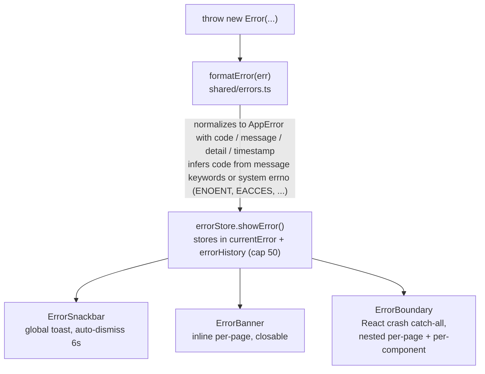
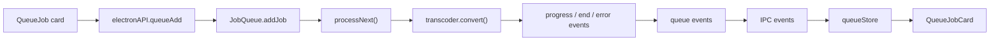
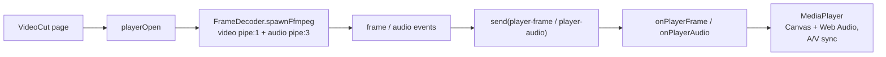
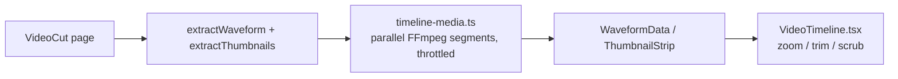

# Renderer, state और सबसिस्टम

## Renderer आर्किटेक्चर

### रेंडर ट्री

सभी दस पेज `React.lazy` से code-split हैं और प्रति-पेज `ErrorBoundary` के अंतर्गत load होते हैं:

| पेज             | Route          | उद्देश्य                                                       |
| --------------- | -------------- | -------------------------------------------------------------- |
| Dashboard       | `/`            | क्विक-एक्शन कार्ड                                              |
| Convert         | `/convert`     | मीडिया रूपांतरण फ़ॉर्म (codec, bitrate, scale, hwaccel, ...)    |
| MediaInfo       | `/media-info`  | प्रोब + प्रति-stream detail table                              |
| ImageCompress   | `/image-compress` | इमेज कंप्रेशन + EXIF + histograms                           |
| AudioExtract    | `/audio-extract` | ऑडियो tracks 27 codecs में से किसी एक के रूप में निकालें      |
| VideoCut        | `/video-cut`   | प्लेयर + zoomable timeline + trim                              |
| BatchQueue      | `/batch`       | क्यू प्रबंधन (add/remove/cancel-all)                            |
| Logs            | `/logs`        | level filter + download के साथ live log viewer                 |
| Settings        | `/settings`    | theme, hwaccel, always-on-top                                  |
| About           | `/about`       | ऐप info, credits, "अपडेट के लिए जाँचें" button                  |

### Hooks

- `useConversion` — Convert page से रूपांतरण orchestrate करता है।
- `useMediaTask` — shared lifecycle (`onConversionProgress` subscribe -> task run -> `COMPLETED_PROGRESS` या `showError`)। एक `useRef` gate stale runs के progress events discard करता है।
- `useErrorHandler` — error handling utilities।
- `useFormErrors` — field-level validation errors।
- `useCapabilities` — encoder capabilities fetch करता है और codec pickers पर encoder-type / hwaccel filters apply करता है।

## State प्रबंधन

Zustand stores `src/renderer/stores/` में:

| Store             | ज़िम्मेदारी                                                         |
| ----------------- | ------------------------------------------------------------------- |
| `conversionStore` | रूपांतरण form state                                                 |
| `audioExtractStore` | ऑडियो extraction form state                                       |
| `errorStore`      | `currentError` + `errorHistory` (cap 50), `showError`, `showErrorMessage`, clear actions |
| `queueStore`      | main-process events से batch queue jobs mirror करता है               |
| `settingsStore`   | सेटिंग्स + `localStorage` persistence (`encodex-theme`, आदि)         |
| `logStore`        | aggregated log entries (cap 2000), filter state, download           |
| `toastStore`      | Toast queue                                                         |
| `updateStore`     | Update lifecycle state (check, available, downloading, downloaded, error) |

Stores UI state बदलने का अद्वितीय स्थान हैं; components `useXStore(selector)` से subscribe करते हैं।

## बैच क्यू

`src/main/queue/job-queue.ts` एक concurrency-capped FIFO processor है जो `EventEmitter` extend करता है:

- `addJob` एक `randomUUID` assign करता है, एक `QueueJob` push करता है (status `QUEUED`, progress 0), `added` emit करता है, और `processNext()` kick करता है।
- `processNext()` jobs start करने का अद्वितीय स्थान है: यह नए `QUEUED` jobs launch करता है जब तक `concurrency` conversions से कम in flight हैं (`activeJobs` द्वारा track), इसलिए अधिकतम `concurrency` (1–4) jobs parallel चलते हैं। प्रत्येक started job `RUNNING` में flip होता है, factory से transcoder लेता है, और `progress`/`error`/`end` wired होते हैं; terminal states पर job का slot release होता है और `processNext()` उसे refill करता है। Run के दौरान concurrency cap बदलने पर currently queued slots refill होते हैं।
- `cancelJob` एक job का transcoder cancel करता है और उसे remove करता है; `cancelAll` प्रत्येक active transcoder cancel करता है, queue clear करता है, और `cancelled` emit करता है। Queue pause/resume, move-to reordering, queued jobs के लिए option editing, export/import, clear-completed, when-done power actions, और `queue-state.json` में durable persistence भी support करती है (`src/main/queue/persistence.ts`)।

IPC layer (`ipc/queue.ts`) केवल queue events को renderer तक `queue-added`, `queue-removed`, `queue-status-change`, `queue-progress`, और `queue-cancelled` पर forward करती है, और `queueStore` उन्हें React state में mirror करता है।

## वीडियो प्लेयर

Video Cut page का player `FrameDecoder` (`src/main/player/frame-decoder.ts`) पर बना है, जो FFmpeg को दो output pipes के साथ spawn करता है:

```
FFmpeg: input (with -re realtime and -copyts)
  -> video: -map 0:v:0 -f rawvideo -pix_fmt rgb24 -s {w}x{h} -an -sn -dn -> pipe:1 (stdout)
  -> audio: -map 0:a:0 -f s16le -ac {channels} -ar {sampleRate} -> pipe:3 (extra stdio fd)
  -> frame timestamps parsed from the -vf showinfo log on stderr (pts_time)
```

- Video frames rawvideo stream (`width x height x 3` bytes) से reassemble होते हैं और stderr से parsed `pts_time` values के साथ match किए जाते हैं। यदि timestamps stall होते हैं, तो एक emergency flush monotonic PTS estimate के साथ frames emit करता है ताकि playback कभी permanently block न हो।
- Audio fixed-size S16LE chunks (~50 ms requested sample rate पर, default 48 kHz / 2 channels) में emit होता है।
- `seek()` decoder kill करके नए timestamp पर respawn करता है। एक shared `generation` counter open/seek पर bump होता है; stale generation वाले frames renderer द्वारा discard किए जाते हैं।
- `ipc/player.ts` **दो** decoders run करता है (video + audio) ताकि एक stream पर backpressure दूसरे को stall न कर सके, decode resolution cap करता है, और frames/chunks को `player-frame` / `player-audio` पर forward करता है।
- Renderer (`components/MediaPlayer.tsx`) frames HTML Canvas पर blit करता है और float-converted PCM Web Audio API को clock-based A/V synchronization, seek coalescing, और stall detection के साथ feed करता है।

## Timeline media

`timeline/timeline-media.ts` Video Cut page की zoomable timeline को power करता है:

- **Waveform** — selected audio stream 8 kHz पर decode करता है और min/max amplitude buckets compute करता है (40/s, 24,000 buckets तक) 30 s window पर। Extraction parallel FFmpeg segments में split होती है, segments के बीच gaps interpolate किए जाते हैं (`fillWaveformGaps`), और सभी spawns global `MAX_CONCURRENT_FFMPEG` slot pool से throttle होते हैं।
- **Thumbnail montage** — 100 thumbnails (160x90) तक single PNG montage (10 columns) में decode करता है, फिर एक `data:` URL में base64-encode करता है। PNG encoding in-process होती है (`crc32`, `pngChunk`, `encodePng`), इसलिए image libraries की आवश्यकता नहीं।

Renderer (`components/VideoTimeline.tsx`) waveform + montage को zoomable, scrubbable strip के रूप में render करता है keep/dim shading और drag-to-trim handles के साथ।

## इमेज प्रोसेसिंग

`src/main/image-*.ts` modules Image Compress page serve करते हैं:

- `image-info.ts` — `exifr` द्वारा EXIF extract करता है और image को FFmpeg से raw pixel data में pipe करके RGB + luma histograms compute करता है।
- `image-preview.ts` — downscaled base64 previews produce करता है।
- `image-file-info.ts` — dimensions और file size पढ़ता है।
- `video-preview.ts` — video files के लिए single-frame thumbnail produce करता है।

Image *compression स्वयं* बस एक conversion है: Image Compress page एक `ConversionOptions` build करता है (codec, qscale, scale) और इसे video/audio के लिए उपयोग की गई same transcoder pipeline से run करता है, image codecs तक restricted।

## एरर हैंडलिंग

Error system (`src/shared/errors.ts`) 16 typed codes define करता है — `FILE_NOT_FOUND`, `FFMPEG_NOT_FOUND`, `FFPROBE_NOT_FOUND`, `CONVERSION_FAILED`, `INVALID_FORMAT`, `PROBE_FAILED`, `QUEUE_ERROR`, `PLAYER_ERROR`, `CANCELLED`, `BMF_NOT_AVAILABLE`, `OUTPUT_NOT_SPECIFIED`, `INPUT_NOT_SPECIFIED`, `OUTPUT_EXISTS`, `INVALID_QUEUE_FILE`, `PERMISSION_DENIED`, `UNKNOWN` — प्रत्येक default user-facing message के साथ।

फ़्लो हमेशा same रहता है:



IPC handlers प्रत्येक operation को `try/catch` में wrap करते हैं और `formatError(err)` rethrow करते हैं, इसलिए error codes process boundary survive करते हैं और renderer को हमेशा typed `AppError` मिलती है।

## Logging

Timestamped `Logger` (`src/shared/logger.ts`) सभी processes में उपयोग होता है। main process (`index.ts` में `patchConsole`) और renderer (`main.tsx`) दोनों `console.*` patch करते हैं entries को shared log system में forward करने के लिए:

- Main -> renderer `log-message` IPC channel के माध्यम से।
- Renderer -> सीधे `logStore`।

Logs page (`pages/Logs.tsx`) दोनों sources aggregate करता है level filtering (DEBUG/INFO/WARN/ERROR), clearing, और `.txt` download के साथ। हर log line shared template constant (`log-constants.ts`) से generate होती है ताकि strings consistent और searchable रहें।

## Internationalization & RTL

- i18next `renderer/i18n/config.ts` में 35 भाषाओं में 56 locales के साथ initialize होता है।
- `DirectionProvider` (`stylis-plugin-rtl` के साथ Emotion cache) Arabic और Hebrew locales (`ar-SA`, `ar-AE`, `ar-JO`, `he-IL`) के लिए layout RTL में flip करता है।
- `useLanguageDirection` current locale की direction detect करता है; app की direction इससे derive होती है और language switch पर automatically toggle होती है।
- `localeMeta.ts` `LanguageMenu` के लिए locale metadata और flags hold करता है।

## Theming

- `ColorModeContext` manual toggle के साथ system-aware dark/light mode provide करता है; preference `localStorage` में `encodex-theme` key के under persist होती है।
- `theme.ts` MUI light/dark themes define करता है; `colors.ts` shared palette hold करता है।
- Styling Emotion (MUI का default engine) उपयोग करती है per-component style constants `renderer/styles/` में extract होकर।

## Key data flow reference

### Conversion (GUI)

```mermaid
flowchart LR
    A["React page"] --> B["Zustand store"] --> C["electronAPI.convertFile"] --> D3["ipcMain.handle(convert-file)"] --> E["factory.createTranscoder(type)"] --> F["ITranscoder.convert()"] --> G["FFmpeg process"] --> H["progress events"] --> I["send(conversion-progress)"] --> J["onConversionProgress"] --> K["useMediaTask"] --> L["ProgressBar"]
```



### Batch queue



### Video playback



### Timeline



### In-app updates

```mermaid
flowchart LR
    A["About page"] --> B["updateStore.checkForUpdates"] --> C["electronAPI.checkForUpdates"] --> D7["updater.ts fetches GitHub Releases API"] --> E7["compares semver versions"] --> F7["send(update-available / update-not-available)"] --> G7["updateStore"] --> H7["UpdateDialog"] --> I7["downloadUpdate -> installer to temp dir"] --> J7["send(update-progress) -> progress bar"] --> K7["send(update-downloaded) -> Install + Restart button"] --> L7["installUpdate -> shell.openPath(installer) + app.quit()"]
```


