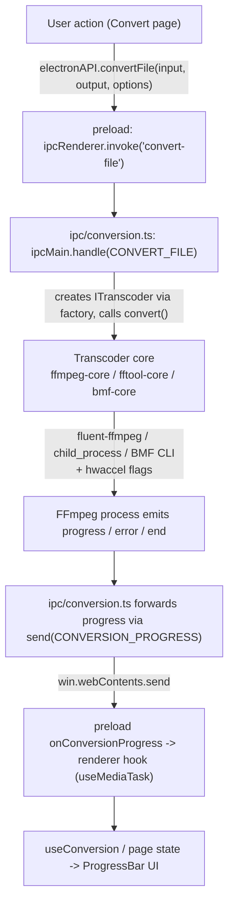

# Transcoder एब्स्ट्रैक्शन और रूपांतरण

## Transcoder एब्स्ट्रैक्शन

सभी मीडिया बैकएंड `ITranscoder` (`src/main/transcoders/interface.ts`) का पालन करते हैं:

```ts
export interface ITranscoder {
  getInfo(input: string): Promise<MediaInfo>;
  convert(input: string, output: string, options: ConversionOptions): EventEmitter;
  cancel(): void;
  pause(): void;
  resume(): void;
  getType(): string;
}
```

`convert()` एक `EventEmitter` लौटाता है जो `start`, `codecData`, `progress`, `end`, और `error` emit करता है। फ़ैक्टरी (`transcoders/factory.ts`) `TranscoderType` (`FFMPEG | FFTOOL | BMF`) पर dispatch करती है:

### 1. `FfmpegCore` (डिफ़ॉल्ट) — `fluent-ffmpeg` API

- मॉड्यूल लोड पर बंडल किए गए FFmpeg/FFprobe पथ सेट करता है।
- fluent-ffmpeg के chainable API के माध्यम से कमांड बनाता है (codecs, bitrates, qscale, aspect-ratio संरक्षण के साथ scale, पिक्सेल फ़ॉर्मेट, MJPEG color-range fix, `-c copy`, time cut, `-an`)।
- लागू होने पर हार्डवेयर एक्सेलेरेशन इनपुट विकल्प लागू करता है।
- fluent-ffmpeg के parse किए गए आउटपुट से rich `progress` emit करता है, जब लाइब्रेरी छोड़ देती है तो timemark गणित से अंतराल भरता है (percent, speed, ETA)।
- चाइल्ड PID को ट्रैक करता है और OS-level suspend/resume (`process-utils.ts`) के माध्यम से pause/resume का समर्थन करता है, और `kill('SIGKILL')` के माध्यम से cancellation का।

### 2. `FFToolCore` — direct CLI

- FFmpeg को raw `child_process` के रूप में स्पॉन करता है, args `buildFfmpegArgs` द्वारा बनाए जाते हैं (`transcoders/ffmpeg-utils.ts`)।
- stderr से `time=` parse करता है और निश्चित अंतराल पर एक light progress event emit करता है (percent 0 रहता है; केवल `time`/`speed` उपयोगी)।
- Exit code 0 -> `end`; अन्यथा -> `error`। Cancellation `KILL_SIGNAL` के साथ संकेत दिया जाता है।

### 3. `BmfCore` — BMF फ्रेमवर्क CLI

- `bmf_ffmpeg` / `bmf_ffprobe` चलाता है (अलग BMF इंस्टॉलेशन आवश्यक)।
- FFToolCore के समान shared flag builder `buildFfmpegArgs`, इसलिए BMF रूपांतरण feature-consistent रहते हैं।
- timeout के साथ `execSync` द्वारा प्रोब; विफलता पर `BMF not available` संदेश सामने आता है जो `BMF_NOT_AVAILABLE` error code पर map होता है।

### Shared flag building

`ffmpeg-utils.ts` `ConversionOptions` को raw FFmpeg CLI args में translate करने का अद्वितीय स्थान है, ताकि FFTool और BMF cores कभी भी एक-दूसरे से नहीं हटें। `ffprobe-mapper.ts` raw ffprobe JSON को app-wide उपयोग की गई टाइप की गई `MediaInfo` shape में normalize करता है।

## हार्डवेयर एक्सेलेरेशन

`transcoders/hwaccel.ts` चुने गए codec के लिए FFmpeg `-hwaccel` flags रिज़ॉल्व करता है। यह encoder suffixes को families में map करता है:

- `_nvenc` -> NVIDIA CUDA (`-hwaccel cuda -hwaccel_output_format cuda`)
- `_qsv` -> Intel QSV
- `_amf` / `_mf` -> Direct3D 11 (`d3d11va`)
- `_vaapi` -> VAAPI Linux render device `/dev/dri/renderD128` के साथ
- `_videotoolbox` -> Apple VideoToolbox

Flags केवल तभी बनाए जाते हैं जब acceleration सक्षम **हो** और mode `auto` हो; `encode` mode में encoder का अपना hardware path बिना अतिरिक्त flags के उपयोग होता है। उपलब्ध encoders और hwaccels runtime पर `capabilities.ts` द्वारा discover किए जाते हैं (`ffmpeg -hide_banner -encoders` और `-hwaccels` स्पॉन करके, पहले probe के बाद cache), और renderer codec pickers को bundled binary वास्तव में क्या प्रदान करता है उसके अनुसार filter करता है।

## मीडिया प्रोबिंग

`getInfo()` (किसी भी core के माध्यम से) ffprobe shell out करता है और `MediaInfo` ऑब्जेक्ट लौटाता है। `ffprobe-mapper.ts` प्रति stream data — codec, profile, level, resolution, DAR, pixel format, bit depth, color metadata, frame rate, bitrate, sample rate, sample format, channels/layout, duration, start time, frame count, language और tags — को Media Info page द्वारा उपभोग किए गए `MediaStreamInfo` इंटरफ़ेस में normalize करता है और player resolution और queue logic के लिए आंतरिक रूप से उपयोग किया जाता है।

## रूपांतरण फ़्लो

GUI रूपांतरण के लिए complete end-to-end path:



टिप्पणियाँ:

- Error पर handler आंशिक output file delete करता है (जब तक input === output न हो) और `formatError(err)` के साथ reject करता है।
- `pause`/`resume` OS process suspend/resume पर map होते हैं; `cancel` process kill करता है और error को `CANCELLED` code पर normalize करता है।
- Partial-output cleanup और error normalization IPC layer में होते हैं, cores को process mechanics पर केंद्रित रखते हुए।
