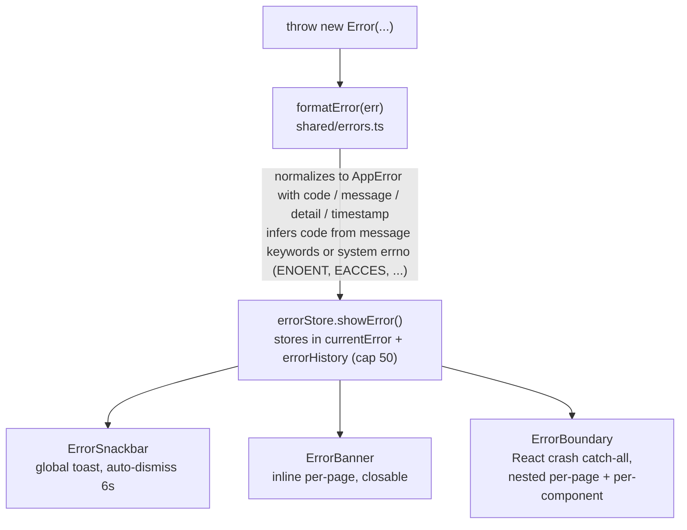
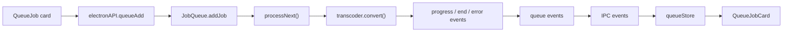
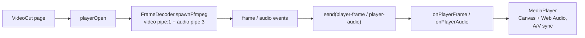
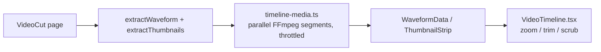

# Renderer, estado & subsistemas

## Arquitetura do renderer

### Árvore de renderização

As dez páginas são divididas com `React.lazy` e carregadas sob uma `ErrorBoundary` por página:

| Página          | Rota           | Objetivo                                                       |
| --------------- | -------------- | -------------------------------------------------------------- |
| Dashboard       | `/`            | Cartões de ações rápidas                                       |
| Convert         | `/convert`     | Formulário de conversão de mídia (codec, bitrate, escala, hwaccel, ...) |
| MediaInfo       | `/media-info`  | Análise + tabela de detalhes por stream                        |
| ImageCompress   | `/image-compress` | Compressão de imagens + EXIF + histogramas                  |
| AudioExtract    | `/audio-extract` | Extração de faixas de áudio para qualquer um dos 27 codecs   |
| VideoCut        | `/video-cut`   | Player + timeline com zoom + corte                             |
| BatchQueue      | `/batch`       | Gestão da fila (adicionar/remover/cancelar tudo)               |
| Logs            | `/logs`        | Visualizador de logs em tempo real com filtro por nível + download |
| Settings        | `/settings`    | Tema, hwaccel, sempre no topo                                  |
| About           | `/about`       | Informações do app, créditos, botão "Verificar atualizações"   |

### Hooks

- `useConversion` — orquestra uma conversão a partir da página Convert.
- `useMediaTask` — ciclo de vida compartilhado (inscrever-se em `onConversionProgress` -> executar tarefa -> `COMPLETED_PROGRESS` ou `showError`). Um gate com `useRef` descarta eventos de progresso de execuções obsoletas.
- `useErrorHandler` — utilitários de tratamento de erros.
- `useFormErrors` — erros de validação por campo.
- `useCapabilities` — busca as capacidades dos encoders e aplica filtros de tipo de encoder / hwaccel aos seletores de codecs.

## Gerenciamento de estado

Stores Zustand em `src/renderer/stores/`:

| Store             | Responsabilidade                                                    |
| ----------------- | ------------------------------------------------------------------- |
| `conversionStore` | Estado do formulário de conversão                                   |
| `audioExtractStore` | Estado do formulário de extração de áudio                          |
| `errorStore`      | `currentError` + `errorHistory` (limite 50), `showError`, `showErrorMessage`, ações de limpeza |
| `queueStore`      | Espelha os jobs da fila de lotes a partir dos eventos do processo principal |
| `settingsStore`   | Configurações + persistência em `localStorage` (`encodex-theme`, etc.) |
| `logStore`        | Entradas de log agregadas (limite 2000), estado do filtro, download  |
| `toastStore`      | Fila de toasts                                                      |
| `updateStore`     | Estado do ciclo de vida das atualizações (check, available, downloading, downloaded, error) |

Os stores são o único lugar onde o estado da UI muda; os componentes assinam com `useXStore(selector)`.

## Fila de lotes

O `src/main/queue/job-queue.ts` é um processador FIFO com concorrência limitada que estende `EventEmitter`:

- `addJob` atribui um `randomUUID`, adiciona um `QueueJob` (status `QUEUED`, progresso 0), emite `added` e dispara `processNext()`.
- `processNext()` é o único lugar onde jobs são iniciados: ele lança novos jobs `QUEUED` enquanto houver menos de `concurrency` conversões em andamento (rastreadas por `activeJobs`), de modo que no máximo `concurrency` (1–4) jobs rodem em paralelo. Cada job iniciado passa para `RUNNING`, recebe um transcoder da fábrica e tem `progress`/`error`/`end` conectados; em estados terminais, o slot do job é liberado e `processNext()` o preenche novamente. Alterar o limite de concorrência durante a execução reabastece os slots na fila.
- `cancelJob` cancela o transcoder de um job e o remove; `cancelAll` cancela todos os transcoders ativos, esvazia a fila e emite `cancelled`. A fila também suporta pause/resume, reordenação move-to, edição de opções de jobs na fila, export/import, limpar concluídos, ações de energia ao terminar e persistência durável em `queue-state.json` (`src/main/queue/persistence.ts`).

A camada IPC (`ipc/queue.ts`) simplesmente repassa os eventos da fila ao renderer por `queue-added`, `queue-removed`, `queue-status-change`, `queue-progress` e `queue-cancelled`, e o `queueStore` os espelha no estado React.

## Player de vídeo

O player da página Video Cut é construído sobre o `FrameDecoder` (`src/main/player/frame-decoder.ts`), que cria um processo FFmpeg com dois pipes de saída:

```
FFmpeg: input (with -re realtime and -copyts)
  -> video: -map 0:v:0 -f rawvideo -pix_fmt rgb24 -s {w}x{h} -an -sn -dn -> pipe:1 (stdout)
  -> audio: -map 0:a:0 -f s16le -ac {channels} -ar {sampleRate} -> pipe:3 (extra stdio fd)
  -> frame timestamps parsed from the -vf showinfo log on stderr (pts_time)
```

- Os frames de vídeo são remontados a partir do stream rawvideo (`largura x altura x 3` bytes) e casados com os valores `pts_time` analisados do stderr. Se os timestamps travarem, um flush de emergência emite frames com uma estimativa monotônica de PTS para que a reprodução nunca fique permanentemente bloqueada.
- O áudio é emitido em chunks S16LE de tamanho fixo (~50 ms na taxa solicitada, padrão 48 kHz / 2 canais).
- `seek()` mata e recria o decodificador no novo timestamp. Um contador `generation` compartilhado é incrementado a cada open/seek; frames com generation obsoleta são descartados pelo renderer.
- O `ipc/player.ts` roda **dois** decodificadores (vídeo + áudio) para que backpressure em um stream não trave o outro, limita a resolução de decodificação e repassa frames/chunks por `player-frame` / `player-audio`.
- O renderer (`components/MediaPlayer.tsx`) desenha os frames em um Canvas HTML e alimenta a Web Audio API com PCM convertido para float, sincronização A/V baseada em relógio, coalescência de seeks e detecção de stalls.

## Timeline de mídia

O `timeline/timeline-media.ts` alimenta a timeline com zoom da página Video Cut:

- **Forma de onda** — decodifica o stream de áudio selecionado a 8 kHz e calcula buckets de amplitude min/max (40/s, até 24.000 buckets) numa janela de 30 s. A extração é dividida em segmentos FFmpeg paralelos, lacunas entre segmentos são interpoladas (`fillWaveformGaps`) e todas as execuções passam por um pool global de slots `MAX_CONCURRENT_FFMPEG`.
- **Montagem de miniaturas** — decodifica até 100 miniaturas (160x90) em uma única montagem PNG (10 colunas), então a codifica em base64 em uma única URL `data:`. A codificação PNG é feita no próprio processo (`crc32`, `pngChunk`, `encodePng`), sem necessidade de bibliotecas de imagem.

O renderer (`components/VideoTimeline.tsx`) renderiza forma de onda + montagem como uma faixa com zoom e scrub, sombreamento manter/esmaecer e alças de corte arrastáveis.

## Processamento de imagens

Os módulos `src/main/image-*.ts` atendem à página Image Compress:

- `image-info.ts` — extrai EXIF via `exifr` e calcula histogramas RGB + luma passando a imagem pelo FFmpeg para dados brutos de pixel.
- `image-preview.ts` — produz previews base64 reduzidos.
- `image-file-info.ts` — lê dimensões e tamanho do arquivo.
- `video-preview.ts` — produz uma miniatura de quadro único para arquivos de vídeo.

A *compressão de imagens em si* é apenas uma conversão: a página Image Compress constrói um `ConversionOptions` (codec, qscale, scale) e o executa pelo mesmo pipeline de transcoder usado para vídeo/áudio, restrito a codecs de imagem.

## Tratamento de erros

O sistema de erros (`src/shared/errors.ts`) define 16 códigos tipados — `FILE_NOT_FOUND`, `FFMPEG_NOT_FOUND`, `FFPROBE_NOT_FOUND`, `CONVERSION_FAILED`, `INVALID_FORMAT`, `PROBE_FAILED`, `QUEUE_ERROR`, `PLAYER_ERROR`, `CANCELLED`, `BMF_NOT_AVAILABLE`, `OUTPUT_NOT_SPECIFIED`, `INPUT_NOT_SPECIFIED`, `OUTPUT_EXISTS`, `INVALID_QUEUE_FILE`, `PERMISSION_DENIED`, `UNKNOWN` — cada um com uma mensagem padrão voltada ao usuário.

O fluxo é sempre o mesmo:



Os handlers IPC envolvem cada operação em `try/catch` e relançam `formatError(err)`, de modo que os códigos de erro sobrevivem à fronteira entre processos e o renderer sempre recebe uma `AppError` tipada.

## Logging

Um `Logger` com timestamp (`src/shared/logger.ts`) é usado em todos os processos. Tanto o processo principal (`patchConsole` em `index.ts`) quanto o renderer (`main.tsx`) fazem patch de `console.*` para repassar entradas ao sistema de logs compartilhado:

- Principal -> renderer via canal IPC `log-message`.
- Renderer -> direto ao `logStore`.

A página Logs (`pages/Logs.tsx`) agrega ambas as fontes com filtragem por nível (DEBUG/INFO/WARN/ERROR), limpeza e download `.txt`. Cada linha de log é gerada a partir de uma constante de template compartilhada (`log-constants.ts`) para que as strings permaneçam consistentes e pesquisáveis.

## Internacionalização & RTL

- i18next é inicializado em `renderer/i18n/config.ts` com 56 locales em 35 idiomas.
- `DirectionProvider` (cache Emotion com `stylis-plugin-rtl`) alterna o layout para RTL nas locales árabe e hebraica (`ar-SA`, `ar-AE`, `ar-JO`, `he-IL`).
- `useLanguageDirection` detecta a direção da locale atual; a direção do app deriva dela e troca automaticamente na mudança de idioma.
- `localeMeta.ts` guarda metadados de locales e bandeiras para o `LanguageMenu`.

## Temas

- `ColorModeContext` fornece modo claro/escuro consciente do sistema com alternância manual; a preferência persiste no `localStorage` sob a chave `encodex-theme`.
- `theme.ts` define os temas claro/escuro do MUI; `colors.ts` contém a paleta compartilhada.
- O estilo usa Emotion (engine padrão do MUI) com constantes de estilo por componente extraídas para `renderer/styles/`.

## Referência dos fluxos principais de dados

### Conversão (GUI)


### Fila de lotes



### Reprodução de vídeo



### Timeline



### Atualizações integradas


