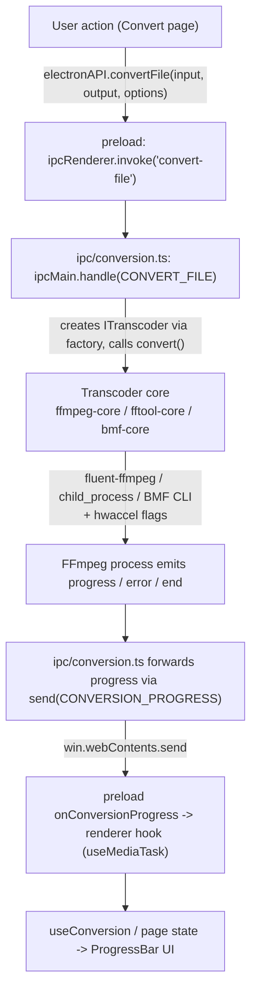

# Abstração de transcoder & conversão

## Abstração de transcoder

Todos os backends de mídia aderem a `ITranscoder` (`src/main/transcoders/interface.ts`):

```ts
export interface ITranscoder {
  getInfo(input: string): Promise<MediaInfo>;
  convert(input: string, output: string, options: ConversionOptions): EventEmitter;
  cancel(): void;
  pause(): void;
  resume(): void;
  getType(): string;
}
```

`convert()` retorna um `EventEmitter` que emite `start`, `codecData`, `progress`, `end` e `error`. A fábrica (`transcoders/factory.ts`) faz o dispatch pelo `TranscoderType` (`FFMPEG | FFTOOL | BMF`):

### 1. `FfmpegCore` (padrão) — API `fluent-ffmpeg`

- Define os caminhos FFmpeg/FFprobe embutidos no carregamento do módulo.
- Constrói o comando via API encadeável do fluent-ffmpeg (codecs, bitrates, qscale, scale com preservação opcional do aspect ratio, formato de pixel, correção de color-range MJPEG, `-c copy`, corte por tempo, `-an`).
- Aplica opções de entrada de aceleração por hardware quando aplicável.
- Emite eventos `progress` ricos a partir da saída analisada do fluent-ffmpeg, preenchendo lacunas (percentual, velocidade, ETA) via cálculo de timemark quando a biblioteca os omite.
- Rastreia o PID do filho e suporta pause/resume via suspend/resume no nível do SO (`process-utils.ts`) e cancelamento via `kill('SIGKILL')`.

### 2. `FFToolCore` — CLI direto

- Cria um processo FFmpeg como um `child_process` puro com argumentos construídos por `buildFfmpegArgs` (`transcoders/ffmpeg-utils.ts`).
- Faz parse de `time=` do stderr e emite um evento de progresso leve em intervalos fixos (o percentual fica em 0; apenas `time`/`speed` são significativos).
- Código de saída 0 -> `end`; caso contrário -> `error`. O cancelamento é sinalizado com o `KILL_SIGNAL`.

### 3. `BmfCore` — CLI do framework BMF

- Executa `bmf_ffmpeg` / `bmf_ffprobe` (requer instalação separada do BMF).
- Usa o mesmo construtor compartilhado de flags `buildFfmpegArgs` que o FFToolCore, então as conversões BMF permanecem consistentes em recursos.
- Analisa via `execSync` com timeout; ao falhar, expõe a mensagem `BMF not available`, mapeada para o código de erro `BMF_NOT_AVAILABLE`.

### Construção compartilhada de flags

O `ffmpeg-utils.ts` é o único lugar que traduz `ConversionOptions` em argumentos brutos do CLI FFmpeg, de forma que os núcleos FFTool e BMF nunca divergem entre si. O `ffprobe-mapper.ts` normaliza o JSON bruto do ffprobe na forma tipada `MediaInfo` usada em todo o app.

## Aceleração por hardware

O `transcoders/hwaccel.ts` resolve as flags `-hwaccel` do FFmpeg para um codec escolhido. Ele mapeia sufixos de encoders para famílias:

- `_nvenc` -> NVIDIA CUDA (`-hwaccel cuda -hwaccel_output_format cuda`)
- `_qsv` -> Intel QSV
- `_amf` / `_mf` -> Direct3D 11 (`d3d11va`)
- `_vaapi` -> VAAPI com o dispositivo de renderização Linux `/dev/dri/renderD128`
- `_videotoolbox` -> Apple VideoToolbox

As flags só são produzidas quando a aceleração está habilitada **e** o modo é `auto`; no modo `encode`, usa-se o caminho de hardware próprio do encoder sem flags extras. Os encoders e hwaccels disponíveis são descobertos em runtime por `capabilities.ts` (executando `ffmpeg -hide_banner -encoders` e `-hwaccels`, com cache após a primeira análise), e o renderer filtra os seletores de codecs conforme o que o binário embutido realmente oferece.

## Análise de mídia

O `getInfo()` (por qualquer núcleo) invoca o ffprobe e retorna um objeto `MediaInfo`. O `ffprobe-mapper.ts` normaliza os dados por stream — codec, profile, level, resolução, DAR, formato de pixel, profundidade de bits, metadados de cor, frame rate, bitrate, sample rate, sample format, canais/layout, duração, tempo inicial, contagem de frames, idioma e tags — na interface `MediaStreamInfo` consumida pela página Media Info e usada internamente para a resolução do player e lógica da fila.

## Fluxo de conversão

O caminho completo de ponta a ponta para uma conversão pela GUI:



Observações:

- Em erro, o handler apaga o arquivo de saída parcial (a menos que input === output) e rejeita com `formatError(err)`.
- `pause`/`resume` mapeiam para suspend/resume do processo no SO; `cancel` mata o processo e normaliza o erro para o código `CANCELLED`.
- A limpeza de saídas parciais e a normalização de erros acontecem na camada IPC, mantendo os núcleos focados na mecânica de processos.
