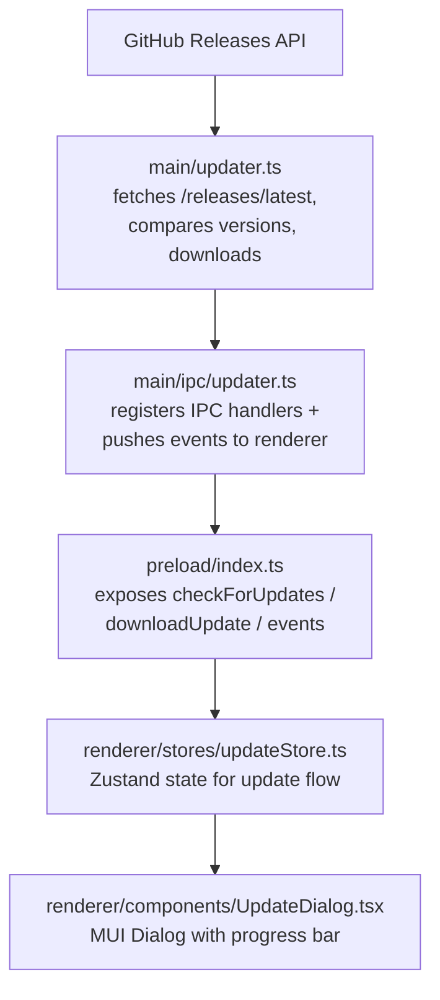

# 更新管理器

## 概述

实现自定义的应用内更新管理器（方案 C），检查 GitHub Releases 获取新版本、通知用户、在应用内下载平台对应的安装程序并实时报告进度，完成后启动安装程序。

## 架构

## 需创建的文件

| 文件 | 用途 |
|------|---------|
| `src/main/updater.ts` | 核心更新逻辑：版本比较、release 获取、资产选择、带进度的下载、启动安装程序 |
| `src/main/ipc/updater.ts` | 更新通道的 IPC 处理器注册 |
| `src/renderer/stores/updateStore.ts` | 更新状态的 Zustand store（checking, available, downloading, progress, downloaded, error） |
| `src/renderer/components/UpdateDialog.tsx` | 显示更新状态、下载进度和安装按钮的模态对话框 |
| `src/renderer/styles/UpdateDialog.styles.ts` | 更新对话框的样式组件 |

## 需修改的文件

| 文件 | 变更 |
|------|--------|
| `src/shared/types.ts` | 添加 `UpdateInfo`、`UpdateAsset`、`UpdateProgress` 接口 |
| `src/shared/ipc-channels.ts` | 添加更新 IPC 通道常量 |
| `src/shared/log-constants.ts` | 添加更新日志消息常量 |
| `src/main/ipc/handlers.ts` | 注册 updater 处理器 |
| `src/preload/index.ts` | 暴露更新桥接方法和事件订阅 |
| `src/renderer/electron-api.d.ts` | 在 `ElectronAPI` 上声明更新 API 类型 |
| `src/renderer/pages/About.tsx` | 添加"检查更新"按钮 |
| `src/renderer/App.tsx` | 全局挂载 `UpdateDialog` |
| `src/test-setup.ts` | 向全局 electronAPI stub 添加更新 API mock |
| `e2e/mocks/preload.js` | 向 mock preload 添加更新 API 方法 |
| `e2e/mocks/main-store.js` | 无需更改（更新状态是临时的） |

## IPC 通道

| Channel | 方向 | 用途 |
|---------|-----------|---------|
| `check-for-updates` | renderer -> main | 触发更新检查 |
| `download-update` | renderer -> main | 开始下载匹配的资产 |
| `install-update` | renderer -> main | 启动已下载的安装程序 |
| `cancel-download` | renderer -> main | 取消进行中的下载 |
| `open-release-notes` | renderer -> main | 在浏览器中打开 release 页面 |
| `update-available` | main -> renderer | 通知有新版本可用 |
| `update-not-available` | main -> renderer | 通知应用已是最新 |
| `update-progress` | main -> renderer | 推送下载进度 |
| `update-downloaded` | main -> renderer | 通知下载完成 |
| `update-error` | main -> renderer | 推送更新错误 |

## 版本比较

- 简单 semver 比较：按 `.` 分割，数值比较。
- 比较时剥离 pre-release 后缀（如 `-beta.0`）。
- 远程版本严格大于本地时返回 true。

## 资产选择逻辑

1. 按平台扩展名过滤 release 资产：
   - `win32` -> `.exe`
   - `darwin` -> `.dmg`
   - `linux` -> `.AppImage`
2. 在平台内匹配架构：
   - `x64` -> 文件名包含 `x64`
   - `arm64` -> 文件名包含 `arm64`
   - `ia32` -> 文件名包含 `ia32`
3. 若无架构匹配，回退到第一个匹配平台的资产。

## 下载流程

1. renderer 调用 `download-update` IPC。
2. 主进程下载到 `app.getPath('temp')/EncodeX-updater/`。
3. 每 ~300ms 通过 `update-progress` 推送进度。
4. 完成后发送带安装程序路径的 `update-downloaded`。
5. renderer 显示"安装并重启"按钮。
6. 点击后，主进程通过 `shell.openPath()` 启动安装程序并执行 `app.quit()`。

## UI 状态

| 状态       | 对话框显示内容 |
|-------|-------------|
| `idle` | （对话框隐藏） |
| `checking` | 加载指示器 + "正在检查更新..." |
| `available` | 版本信息、release 说明链接、下载按钮 |
| `not-available` | "已是最新版本"消息、关闭按钮 |
| `downloading` | 带百分比和速度的进度条 |
| `downloaded` | "更新已就绪可安装" + 安装并重启按钮 |
| `error` | 错误消息 + 重试/关闭按钮 |

## 测试策略

- 单元测试：版本比较函数、资产选择函数。
- 手动测试：发布高于 `1.0.0-beta.0` 的测试 tag/release，并在目标平台上验证完整的检查 -> 下载 -> 安装流程。
