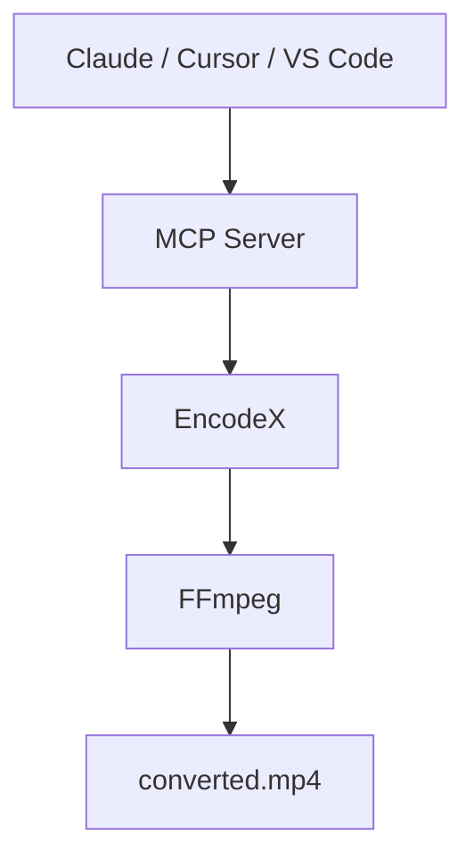

# Lassen Sie KI die schwere Arbeit übernehmen

Bitten Sie Claude, Cursor oder einen beliebigen MCP-kompatiblen Assistenten, ein Video zu konvertieren, den Ton zu extrahieren, einen Ordner mit Fotos zu verkleinern oder einen Stapeljob zu prüfen. Der Assistent steuert **EncodeX** — die Arbeit findet auf Ihrem Computer statt und Ihre Dateien verlassen nie Ihr Gerät.



## Was ist der MCP-Server?

[MCP](https://modelcontextprotocol.io) — das Model Context Protocol — ist der offene Standard, der KI-Assistenten die Nutzung Ihrer Apps ermöglicht. EncodeX enthält einen **integrierten MCP-Server**, sodass Werkzeuge wie Claude Desktop, Claude Code, Cursor, VS Code oder eigene Agenten über EncodeX konvertieren, komprimieren, schneiden, extrahieren und Stapeljobs verwalten können — nur mit einer Anfrage in normaler Sprache.

Sie bleiben in Ihrer Lieblings-KI-App. EncodeX übernimmt die schwere Arbeit im Hintergrund.

## Was kann ein Assistent über MCP tun?

Der MCP-Server stellt **19 Werkzeuge, 3 Ressourcen und 4 Prompts** bereit:

- **Konvertieren** von Video und Audio zwischen Formaten
- **Extrahieren** von Audio aus Videodateien
- **Komprimieren** von Videos und Bildern auf kleinere Größen
- **Schneiden** und Trimmen von Clips
- **Ausführen und Verfolgen von asynchronen Stapeljobs** — Arbeit einreihen, Status prüfen, Ergebnisse abrufen

Den vollständigen Werkzeugkatalog finden Sie in der [Funktionsreferenz](/docs/features-reference#mcp-server).

## Zwei Verbindungswege

### 1. Eigenständiger Server (`encodex --mcp`)

Führen Sie EncodeX als Headless-MCP-Prozess aus — so starten Desktop-KI-Apps einen Server bei Bedarf:

```bash
encodex --mcp
```

stdout transportiert das MCP-Protokoll; alle Logs gehen nach stderr, sodass nichts die Konversation zwischen Ihrem Assistenten und EncodeX stört.

### 2. Eingebetteter Server (Einstellungen → MCP-Server)

EncodeX bereits geöffnet? Aktivieren Sie **Einstellungen → MCP-Server** und richten Sie Ihren Client auf:

```
http://127.0.0.1:8765/mcp
```

Dieser Modus fügt Live-**Warteschlangen**-, **Vorschau**-, **Timeline**-, **System**- und **Update**-Werkzeuge auf Basis desselben Kerns hinzu.

## Privat von Grund auf

- **Alle Verarbeitung ist lokal** — Dateien werden nie hochgeladen, nichts geht in die Cloud
- **Nur Loopback** — der eingebettete Server bindet an `127.0.0.1` und validiert den `Origin`-Header
- **Optionaler Zugriffstoken** — schützen Sie den Endpunkt mit einem Bearer-Token (in konstanter Zeit verglichen)
- **Kein Konto nötig** — MCP funktioniert vollständig offline

## Erste Schritte

1. Laden Sie [EncodeX](/de/download) herunter und installieren Sie es (Windows, macOS oder Linux).
2. Führen Sie `encodex --mcp` aus oder aktivieren Sie in der App **Einstellungen → MCP-Server**.
3. Verbinden Sie Ihren KI-Assistenten mit EncodeX und fragen Sie in normaler Sprache: *„Konvertiere dieses MKV in MP4 für mein Handy."*

Die vollständige Referenz — jedes Werkzeug, jede Ressource, jeder Prompt, jede Client-Konfiguration und das Sicherheitsmodell — finden Sie in der [MCP-Server-Dokumentation](/de/docs/cli#mcp-server-mode).

## Häufig gestellte Fragen

### Ist der MCP-Server von EncodeX kostenlos?

Ja. Der MCP-Server ist in die kostenlose Open-Source-App (MIT) eingebaut — kein zusätzliches Lizenz- oder Abo-Modell.

### Lädt die MCP-Nutzung meine Dateien hoch?

Nein. EncodeX arbeitet vollständig offline. Der MCP-Server steuert dieselbe lokale FFmpeg-Engine, Ihre Medien verlassen also nie Ihren Computer.

### Welche KI-Assistenten können sich verbinden?

Jeder MCP-kompatible Client: Claude Desktop, Claude Code, Cursor, VS Code und eigene Agenten. Der stdio-Server ist ein standardmäßiger JSON-RPC-Prozess, sodass sich alles verbinden kann, das einen Befehl starten und MCP sprechen kann.

### Muss die Oberfläche offen sein?

Nein. Mit `encodex --mcp` läuft die App ohne Oberfläche (headless). Der eingebettete HTTP-Server ist optional und läuft in der GUI für Live-Warteschlangen- und Vorschau-Werkzeuge.

### Ist der eingebettete Server sicher?

Ja. Er bindet nur an Loopback, validiert den `Origin`-Header, unterstützt ein optionales Bearer-Token und akzeptiert auf `/mcp` nur `GET`, `POST` und `DELETE`.

## Mehr erfahren

- [MCP-Server-Dokumentation](/de/docs/cli#mcp-server-mode)
- [Funktionsreferenz: MCP](/de/docs/features-reference#mcp-server)
- [MCP-Ankündigung](/de/blog/releases/mcp-server-support)
- [EncodeX herunterladen](/de/download)