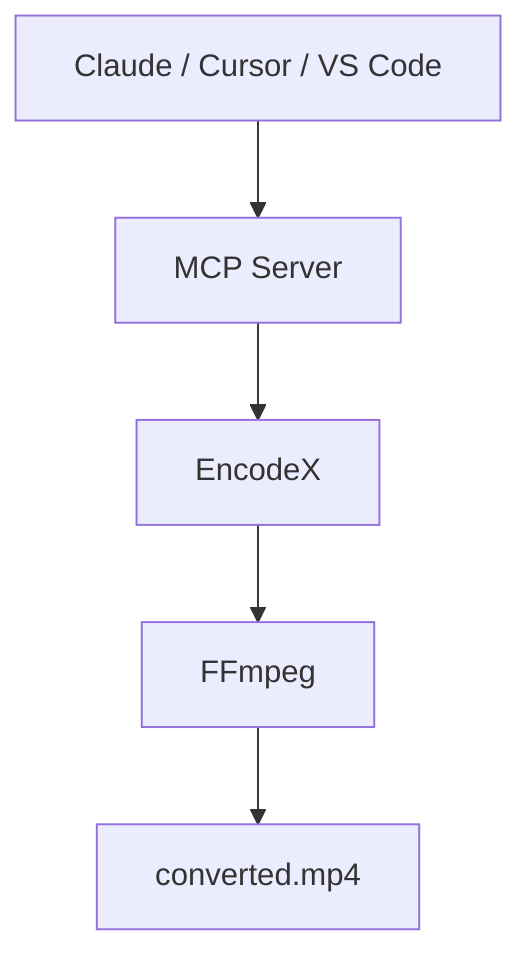

# Deja que la IA haga el trabajo pesado

Pídele a Claude, Cursor o a cualquier asistente compatible con MCP que convierta un video, extraiga el audio, reduzca una carpeta de fotos o revise un trabajo por lotes. El asistente controla **EncodeX** — el trabajo ocurre en tu computadora y tus archivos nunca salen de tu dispositivo.



## ¿Qué es el servidor MCP?

[MCP](https://modelcontextprotocol.io) — el Protocolo de Contexto de Modelo — es el estándar abierto que permite a los asistentes de IA usar tus aplicaciones. EncodeX incluye un **servidor MCP integrado**, así que herramientas como Claude Desktop, Claude Code, Cursor, VS Code o cualquier agente personalizado pueden convertir, comprimir, recortar, extraer y gestionar trabajos por lotes a través de EncodeX con una simple petición en lenguaje natural.

Tú permaneces en tu app de IA favorita. EncodeX hace el trabajo pesado en segundo plano.

## ¿Qué puede hacer un asistente mediante MCP?

El servidor MCP expone **19 herramientas, 3 recursos y 4 prompts**:

- **Convertir** video y audio entre formatos
- **Extraer** audio de archivos de video
- **Comprimir** videos e imágenes a tamaños menores
- **Recortar** y cortar clips
- **Ejecutar y supervisar trabajos por lotes asíncronos** — encolar trabajo, consultar el estado, obtener resultados

El catálogo completo de herramientas está en la [referencia de funciones](/docs/features-reference#mcp-server).

## Dos formas de conectarse

### 1. Servidor independiente (`encodex --mcp`)

Ejecuta EncodeX como un proceso MCP sin interfaz — lo que las apps de IA de escritorio usan cuando lanzan un servidor bajo demanda:

```bash
encodex --mcp
```

stdout transporta el protocolo MCP; todos los registros van a stderr, así que nada corrompe la conversación entre tu asistente y EncodeX.

### 2. Servidor integrado (Configuración → Servidor MCP)

¿Ya tienes EncodeX abierto? Activa **Configuración → Servidor MCP** y apunta tu cliente a:

```
http://127.0.0.1:8765/mcp
```

Este modo añade herramientas de **cola**, **vista previa**, **línea de tiempo**, **sistema** y **actualizaciones** en vivo sobre el mismo núcleo.

## Privado por diseño

- **Todo el procesamiento es local** — los archivos nunca se suben y nada se envía a la nube
- **Solo bucle local** — el servidor integrado se vincula a `127.0.0.1` y valida la cabecera `Origin`
- **Token de acceso opcional** — protege el endpoint con un token de tipo bearer (comparado en tiempo constante)
- **Sin cuenta necesaria** — MCP funciona totalmente sin conexión

## Cómo empezar

1. Descarga e instala [EncodeX](/es/download) (Windows, macOS o Linux).
2. Ejecuta `encodex --mcp`, o activa **Configuración → Servidor MCP** en la app.
3. Conecta tu asistente de IA a EncodeX y pide en lenguaje natural: *"Convierte este MKV a MP4 para mi teléfono."*

La referencia completa — cada herramienta, recurso, prompt, configuración de cliente y el modelo de seguridad — está en la [documentación del servidor MCP](/es/docs/cli#mcp-server-mode).

## Preguntas frecuentes

### ¿El servidor MCP de EncodeX es gratuito?

Sí. El servidor MCP está integrado en la app EncodeX, gratuita y de código abierto (MIT) — sin licencia ni suscripción extra.

### ¿Usar MCP sube mis archivos?

No. EncodeX funciona totalmente sin conexión. El servidor MCP controla el mismo motor FFmpeg local, así que tu contenido nunca sale de tu computadora.

### ¿Qué asistentes de IA pueden conectarse?

Cualquier cliente compatible con MCP: Claude Desktop, Claude Code, Cursor, VS Code y agentes personalizados. El servidor stdio es un proceso JSON-RPC estándar, así que cualquier cosa que pueda ejecutar un comando y hablar MCP puede conectarse.

### ¿Necesito tener la interfaz abierta?

No. Con `encodex --mcp` la app funciona sin interfaz (headless). El servidor HTTP integrado es opcional y corre dentro de la GUI para las herramientas de cola y vista previa en vivo.

### ¿El servidor integrado es seguro?

Sí. Se vincula solo al bucle local, valida la cabecera `Origin`, admite un token bearer opcional y solo acepta `GET`, `POST` y `DELETE` en `/mcp`.

## Aprende más

- [Documentación del servidor MCP](/es/docs/cli#mcp-server-mode)
- [Referencia de funciones: MCP](/es/docs/features-reference#mcp-server)
- [Anuncio del lanzamiento de MCP](/es/blog/releases/mcp-server-support)
- [Descargar EncodeX](/es/download)