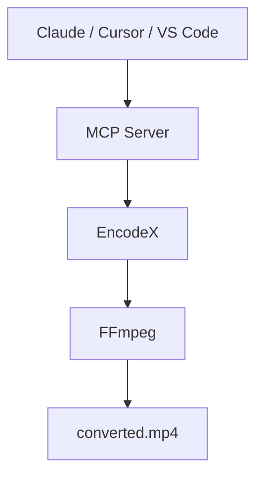

# Laissez l'IA faire le gros du travail

Demandez à Claude, Cursor ou à tout assistant compatible MCP de convertir une vidéo, d'extraire le son, de réduire un dossier de photos ou de vérifier une tâche en lot. L'assistant pilote **EncodeX** — le travail se fait sur votre ordinateur et vos fichiers ne quittent jamais votre appareil.

<McpDemo />

Essayez par exemple :

- *« Convertis `vacation.mp4` en un MP4 plus léger adapté à WhatsApp. »*
- *« Extrais l'audio de `lecture.mov` en MP3. »*
- *« Réduis les photos de `~/Pics` et place les résultats dans `~/Output`. »*
- *« Convertis tous les MKV de `~/Downloads` en MP4. »*

EncodeX est un **serveur MCP FFmpeg** gratuit et open source avec une app de bureau autour — un serveur MCP local pour l'automatisation média par IA. Pas de cloud, pas de téléversement, pas de compte.



## Qu'est-ce que le serveur MCP ?

[MCP](https://modelcontextprotocol.io) — le Model Context Protocol — est la norme ouverte qui permet aux assistants IA d'utiliser vos applications. EncodeX inclut un **serveur MCP intégré**, de sorte que des outils comme Claude Desktop, Claude Code, Cursor, VS Code ou tout agent personnalisé peuvent convertir, compresser, découper, extraire et gérer des travaux par lots via EncodeX avec une simple demande en langage courant.

Vous restez dans votre application IA préférée. EncodeX fait le gros du travail en coulisses.

## Que peut faire un assistant via MCP ?

Le serveur MCP expose **19 outils, 3 ressources et 4 prompts** :

- **Convertir** vidéo et audio entre les formats
- **Extraire** l'audio des fichiers vidéo
- **Compresser** vidéos et images vers des tailles inférieures
- **Découper** et couper des clips
- **Exécuter et suivre des travaux par lots asynchrones** — mettre en file, vérifier l'état, obtenir les résultats

Le catalogue complet d'outils est dans la [référence des fonctionnalités](/docs/features-reference#mcp-server).

## Deux façons de se connecter

### 1. Serveur autonome (`encodex --mcp`)

Lancez EncodeX comme processus MCP sans interface — ce que les applications IA de bureau utilisent pour démarrer un serveur à la demande :

```bash
encodex --mcp
```

stdout transporte le protocole MCP ; tous les journaux vont vers stderr, donc rien ne corrompt la conversation entre votre assistant et EncodeX.

### 2. Serveur intégré (Réglages → Serveur MCP)

EncodeX déjà ouvert ? Activez **Réglages → Serveur MCP** et pointez votre client vers :

```
http://127.0.0.1:8765/mcp
```

Ce mode ajoute des outils de **file d'attente**, **aperçu**, **timeline**, **système** et **mises à jour** en direct par-dessus le même cœur.

## Connectez-vous en un collage

Copiez la configuration de votre client et collez-la — EncodeX fait le reste. Vérifiez que `encodex` est dans votre `PATH` (l'installation d'EncodeX l'y place).

<McpConfig />

## Privé par conception

- **Tout le traitement est local** — les fichiers ne sont jamais téléversés et rien ne part vers le cloud
- **Boucle locale uniquement** — le serveur intégré se lie à `127.0.0.1` et valide l'en-tête `Origin`
- **Jeton d'accès optionnel** — protégez le point d'accès avec un jeton bearer (comparé en temps constant)
- **Aucun compte requis** — MCP fonctionne entièrement hors ligne

## Commencer

1. Téléchargez et installez [EncodeX](/fr/download) (Windows, macOS ou Linux).
2. Exécutez `encodex --mcp`, ou activez **Réglages → Serveur MCP** dans l'application.
3. Connectez votre assistant IA à EncodeX et demandez en langage courant : *« Convertis ce MKV en MP4 pour mon téléphone. »*

La référence complète — chaque outil, ressource, prompt, configuration de client et le modèle de sécurité — se trouve dans la [documentation du serveur MCP](/fr/docs/cli#mcp-server-mode).

## Questions fréquentes

### Le serveur MCP d'EncodeX est-il gratuit ?

Oui. Le serveur MCP est intégré à l'application EncodeX, gratuite et open source (MIT) — sans licence ni abonnement supplémentaire.

### Est-ce que MCP téléverse mes fichiers ?

Non. EncodeX fonctionne entièrement hors ligne. Le serveur MCP pilote le même moteur FFmpeg local, vos médias ne quittent donc jamais votre ordinateur.

### Quels assistants IA peuvent se connecter ?

Tout client compatible MCP : Claude Desktop, Claude Code, Cursor, VS Code et les agents personnalisés. Le serveur stdio est un processus JSON-RPC standard, donc tout ce qui peut lancer une commande et parler MCP peut se connecter.

### Faut-il garder l'interface graphique ouverte ?

Non. Avec `encodex --mcp`, l'application tourne sans interface (headless). Le serveur HTTP intégré est optionnel et s'exécute dans la GUI pour les outils de file d'attente et d'aperçu en direct.

### Le serveur intégré est-il sécurisé ?

Oui. Il ne se lie qu'à la boucle locale, valide l'en-tête `Origin`, supporte un jeton bearer optionnel et n'accepte que `GET`, `POST` et `DELETE` sur `/mcp`.

## En savoir plus

- [Documentation du serveur MCP](/fr/docs/cli#mcp-server-mode)
- [Référence des fonctionnalités : MCP](/fr/docs/features-reference#mcp-server)
- [Annonce du lancement de MCP](/fr/blog/releases/mcp-server-support)
- [Télécharger EncodeX](/fr/download)

<div class="cta-card">
  <h2>Prêt à confier vos tâches média à un assistant IA ?</h2>
  <p>Téléchargez EncodeX pour Windows, macOS ou Linux — le serveur MCP est intégré. Gratuit et open source, sans compte requis.</p>
  <p><a class="cta-link-primary" href="/fr/download">Télécharger EncodeX — Gratuit et open source</a></p>
  <p>Windows · macOS · Linux · Aucun compte requis</p>
</div>