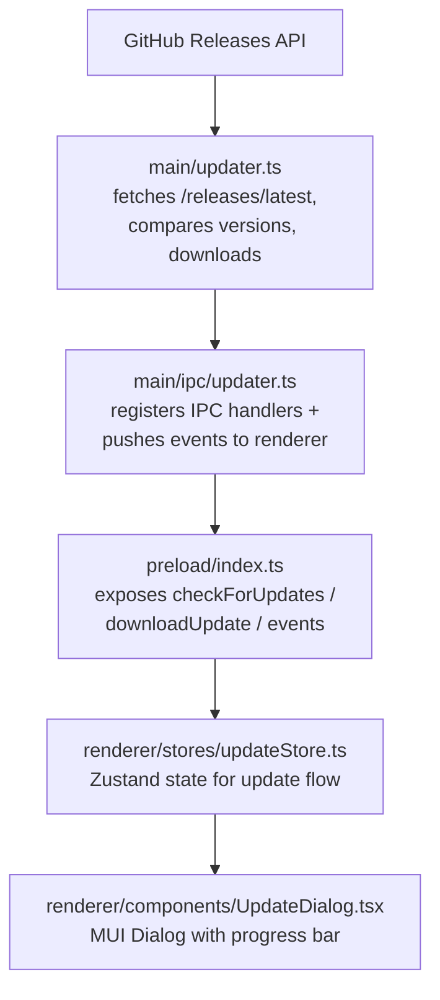

# अपडेट मैनेजर

## अवलोकन

एक कस्टम इन-ऐप अपडेट मैनेजर (विकल्प C) लागू करें जो नई रिलीज़ के लिए GitHub Releases की जाँच करता है, उपयोगकर्ता को सूचित करता है, प्रगति रिपोर्टिंग के साथ प्लेटफ़ॉर्म-विशिष्ट इंस्टॉलर को ऐप के अंदर ही डाउनलोड करता है, और पूरा होने पर इंस्टॉलर को लॉन्च करता है।

## आर्किटेक्चर

## बनाने योग्य फ़ाइलें

| फ़ाइल                                        | उद्देश्य                                                                                              |
| -------------------------------------------- | ----------------------------------------------------------------------------------------------------- |
| `src/main/updater.ts`                        | मुख्य अपडेट लॉजिक: वर्ज़न तुलना, रिलीज़ प्राप्त करना, एसेट चयन, प्रगति के साथ डाउनलोड, इंस्टॉलर लॉन्च |
| `src/main/ipc/updater.ts`                    | अपडेट चैनलों के लिए IPC हैंडलर पंजीकरण                                                                |
| `src/renderer/stores/updateStore.ts`         | अपडेट अवस्था के लिए Zustand store (checking, available, downloading, progress, downloaded, error)     |
| `src/renderer/components/UpdateDialog.tsx`   | मॉडल डायलॉग जो अपडेट स्थिति, डाउनलोड प्रगति और इंस्टॉल बटन दिखाता है                                  |
| `src/renderer/styles/UpdateDialog.styles.ts` | अपडेट डायलॉग के लिए स्टाइल किए गए कंपोनेंट                                                            |

## संशोधित करने योग्य फ़ाइलें

| फ़ाइल                            | बदलाव                                                         |
| -------------------------------- | ------------------------------------------------------------- |
| `src/shared/types.ts`            | `UpdateInfo`, `UpdateAsset`, `UpdateProgress` इंटरफ़ेस जोड़ें |
| `src/shared/ipc-channels.ts`     | अपडेट IPC चैनल कॉन्स्टेंट जोड़ें                              |
| `src/shared/log-constants.ts`    | अपडेट लॉग मैसेज कॉन्स्टेंट जोड़ें                             |
| `src/main/ipc/handlers.ts`       | अपडेटर हैंडलर पंजीकृत करें                                    |
| `src/preload/index.ts`           | अपडेट ब्रिज विधियाँ और इवेंट सब्सक्रिप्शन खोलें               |
| `src/renderer/electron-api.d.ts` | `ElectronAPI` पर अपडेट API प्रकार घोषित करें                  |
| `src/renderer/pages/About.tsx`   | \"अपडेट जाँचें\" बटन जोड़ें                                   |
| `src/renderer/App.tsx`           | `UpdateDialog` को वैश्विक रूप से माउंट करें                   |
| `src/test-setup.ts`              | वैश्विक electronAPI स्टब में अपडेट API मॉक जोड़ें             |
| `e2e/mocks/preload.js`           | मॉक preload में अपडेट API विधियाँ जोड़ें                      |
| `e2e/mocks/main-store.js`        | कोई बदलाव आवश्यक नहीं (अपडेट अवस्था क्षणिक है)                |

## IPC चैनल

| चैनल                   | दिशा             | उद्देश्य                               |
| ---------------------- | ---------------- | -------------------------------------- |
| `check-for-updates`    | renderer -> main | अपडेट जाँच ट्रिगर करें                 |
| `download-update`      | renderer -> main | मिलान किए गए एसेट का डाउनलोड शुरू करें |
| `install-update`       | renderer -> main | डाउनलोड किया गया इंस्टॉलर लॉन्च करें   |
| `cancel-download`      | renderer -> main | चल रहे डाउनलोड को रद्द करें            |
| `open-release-notes`   | renderer -> main | ब्राउज़र में रिलीज़ पेज खोलें          |
| `update-available`     | main -> renderer | सूचित करें कि नया वर्ज़न उपलब्ध है     |
| `update-not-available` | main -> renderer | सूचित करें कि ऐप अप-टू-डेट है          |
| `update-progress`      | main -> renderer | डाउनलोड प्रगति भेजें                   |
| `update-downloaded`    | main -> renderer | सूचित करें कि डाउनलोड पूरा हो गया      |
| `update-error`         | main -> renderer | अपडेट त्रुटि भेजें                     |

## वर्ज़न तुलना

- सरल semver तुलना: `.` पर विभाजित करें, संख्यात्मक रूप से तुलना करें।
- तुलना के लिए pre-release सफ़िक्स (जैसे `-beta.0`) हटाएँ।
- यदि रिमोट वर्ज़न स्थानीय से सख्ती से बड़ा है तो true लौटाता है।

## एसेट चयन लॉजिक

1. प्लेटफ़ॉर्म एक्सटेंशन के अनुसार रिलीज़ एसेट फ़िल्टर करें:
   - `win32` -> `.exe`
   - `darwin` -> `.dmg`
   - `linux` -> `.AppImage`
2. प्लेटफ़ॉर्म के भीतर आर्किटेक्चर मिलान करें:
   - `x64` -> फ़ाइलनाम में `x64` हो
   - `arm64` -> फ़ाइलनाम में `arm64` हो
   - `ia32` -> फ़ाइलनाम में `ia32` हो
3. यदि आर्क मिलान विफल हो तो पहले प्लेटफ़ॉर्म-मिलान वाले एसेट पर फ़ॉलबैक करें।

## डाउनलोड प्रवाह

1. Renderer `download-update` IPC कॉल करता है।
2. मुख्य प्रक्रिया `app.getPath('temp')/EncodeX-updater/` में डाउनलोड करती है।
3. प्रगति हर ~300ms पर `update-progress` के माध्यम से भेजी जाती है।
4. पूरा होने पर `update-downloaded` इंस्टॉलर पथ के साथ भेजा जाता है।
5. Renderer \"इंस्टॉल और पुनःप्रारंभ\" बटन दिखाता है।
6. क्लिक पर मुख्य प्रक्रिया `shell.openPath()` + `app.quit()` के माध्यम से इंस्टॉलर लॉन्च करती है।

## UI अवस्थाएँ

| अवस्था          | डायलॉग दिखाता है                                                 |
| --------------- | ---------------------------------------------------------------- |
| `idle`          | (डायलॉग छिपा हुआ)                                                |
| `checking`      | स्पिनर + \"अपडेट जाँची जा रही हैं...\"                           |
| `available`     | वर्ज़न जानकारी, रिलीज़ नोट्स लिंक, डाउनलोड बटन                   |
| `not-available` | \"आप अप-टू-डेट हैं\" संदेश, बंद बटन                              |
| `downloading`   | प्रतिशत और गति के साथ प्रगति पट्टी                               |
| `downloaded`    | \"अपडेट इंस्टॉल करने के लिए तैयार\" + इंस्टॉल और पुनःप्रारंभ बटन |
| `error`         | त्रुटि संदेश + पुनः प्रयास / बंद बटन                             |

## परीक्षण रणनीति

- यूनिट: वर्ज़न तुलना फ़ंक्शन, एसेट चयन फ़ंक्शन।
- मैनुअल: `1.0.0-beta.0` से ऊपर एक परीक्षण टैग/रिलीज़ प्रकाशित करें और लक्षित प्लेटफ़ॉर्म पर पूर्ण जाँच -> डाउनलोड -> इंस्टॉल प्रवाह सत्यापित करें।
