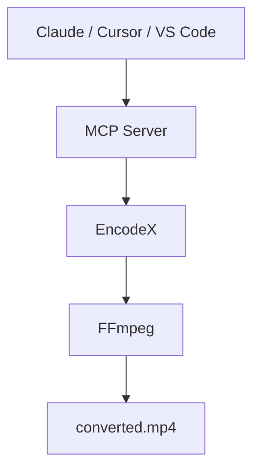

# AI से भारी काम करवाएँ

Claude, Cursor या किसी भी MCP-कंपैटिबल असिस्टेंट से कहें कि वीडियो कन्वर्ट करे, ऑडियो निकाले, फ़ोटो का फ़ोल्डर छोटा करे या बैच जॉब की स्थिति देखे। असिस्टेंट **EncodeX** को चलाता है — काम आपके कंप्यूटर पर होता है और आपकी फ़ाइलें कभी आपके डिवाइस से बाहर नहीं जातीं।

<McpDemo />

ऐसा करने की कोशिश करें:

- *"`vacation.mp4` को WhatsApp के लिए छोटे MP4 में बदलो।"*
- *"`lecture.mov` का ऑडियो MP3 के रूप में निकालो।"*
- *"`~/Pics` की फ़ोटो कंप्रेस करो और नतीजे `~/Output` में रखो।"*
- *"`~/Downloads` के सारे MKV को MP4 में बदलो।"*

EncodeX एक मुफ़्त, ओपन-सोर्स **FFmpeg MCP सर्वर** है जिसके चारों ओर एक डेस्कटॉप ऐप है — AI मीडिया ऑटोमेशन के लिए एक लोकल MCP सर्वर। कोई क्लाउड नहीं, कोई अपलोड नहीं, कोई खाता नहीं।



## MCP सर्वर क्या है?

[MCP](https://modelcontextprotocol.io) — Model Context Protocol — वह ओपन स्टैंडर्ड है जो AI असिस्टेंट को आपके ऐप इस्तेमाल करने देता है। EncodeX में **बिल्ट-इन MCP सर्वर** शामिल है, ताकि Claude Desktop, Claude Code, Cursor, VS Code या कोई भी कस्टम एजेंट सादी भाषा की एक रिक्वेस्ट से EncodeX के ज़रिए कन्वर्ट, कंप्रेस, ट्रिम, एक्सट्रैक्ट और बैच जॉब मैनेज कर सके।

आप अपने पसंदीदा AI ऐप में बने रहते हैं। भारी काम EncodeX पर्दे के पीछे करता है।

## असिस्टेंट MCP से क्या कर सकता है?

MCP सर्वर **19 टूल, 3 रिसोर्स और 4 प्रॉम्प्ट** उपलब्ध कराता है:

- फ़ॉर्मैटों के बीच वीडियो और ऑडियो **कन्वर्ट** करना
- वीडियो फ़ाइलों से ऑडियो **एक्सट्रैक्ट** करना
- वीडियो और इमेज को छोटे साइज़ में **कंप्रेस** करना
- क्लिप्स **ट्रिम** और कट करना
- **एसिंक्रोनस बैच जॉब चलाना और ट्रैक करना** — काम कतार में लगाना, स्थिति देखना, नतीजे पाना

पूरा टूल कैटलॉग [फ़ीचर रेफ़रेंस](/docs/features-reference#mcp-server) में है।

## कनेक्ट करने के दो तरीके

### 1. स्टैंडअलोन सर्वर (`encodex --mcp`)

EncodeX को बिना GUI के MCP प्रोसेस के रूप में चलाएँ — ऐसा ही डेस्कटॉप AI ऐप्स तब करते हैं जब वे ऑन-डिमांड सर्वर शुरू करते हैं:

```bash
encodex --mcp
```

stdout पर MCP प्रोटोकॉल आता है; सारे लॉग stderr पर जाते हैं, इसलिए असिस्टेंट और EncodeX के बीच की बातचीत कभी खराब नहीं होती।

### 2. एम्बेडेड सर्वर (सेटिंग्स → MCP सर्वर)

EncodeX पहले से खुला है? **सेटिंग्स → MCP सर्वर** चालू करें और अपने क्लाइंट को यहाँ पॉइंट करें:

```
http://127.0.0.1:8765/mcp
```

इस मोड में उसी कोर के ऊपर लाइव **क्यू**, **प्रीव्यू**, **टाइमलाइन**, **सिस्टम** और **अपडेट** टूल जुड़ जाते हैं।

## एक पेस्ट में कनेक्ट करें

अपने क्लाइंट की कॉन्फ़िगरेशन कॉपी करके पेस्ट करें — बाकी EncodeX संभाल लेता है। सुनिश्चित करें कि `encodex` आपके `PATH` में है (EncodeX इंस्टॉल करने पर वहाँ जुड़ जाता है)।

<McpConfig />

## डिज़ाइन से ही प्राइवेट

- **सारी प्रोसेसिंग लोकल है** — फ़ाइलें कभी अपलोड नहीं होतीं, कुछ भी क्लाउड पर नहीं जाता
- **सिर्फ़ लूपबैक** — एम्बेडेड सर्वर `127.0.0.1` से बाइंड होता है और `Origin` हेडर वैलिडेट करता है
- **ऑप्शनल एक्सेस टोकन** — Bearer टोकन से एंडपॉइंट सुरक्षित करें (कॉन्स्टेंट-टाइम तुलना)
- **कोई खाता नहीं चाहिए** — MCP पूरी तरह ऑफ़लाइन काम करता है

## शुरू करें

1. [EncodeX](/hi/download) डाउनलोड और इंस्टॉल करें (Windows, macOS या Linux)।
2. `encodex --mcp` चलाएँ, या ऐप में **सेटिंग्स → MCP सर्वर** चालू करें।
3. अपने AI असिस्टेंट को EncodeX से कनेक्ट करें और सादी भाषा में कहें: *"इस MKV को मेरे फ़ोन के लिए MP4 में बदल दो।"*

पूरा रेफ़रेंस — हर टूल, रिसोर्स, प्रॉम्प्ट, क्लाइंट कॉन्फ़िगरेशन और सुरक्षा मॉडल — [MCP सर्वर डॉक्यूमेंटेशन](/hi/docs/cli#mcp-server-mode) में है।

## अक्सर पूछे जाने वाले सवाल

### क्या EncodeX का MCP सर्वर मुफ़्त है?

हाँ। MCP सर्वर मुफ़्त, ओपन-सोर्स (MIT) EncodeX ऐप में बिल्ट-इन है — कोई अतिरिक्त लाइसेंस या सब्सक्रिप्शन नहीं।

### क्या MCP इस्तेमाल करने से मेरी फ़ाइलें अपलोड होती हैं?

नहीं। EncodeX पूरी तरह ऑफ़लाइन चलता है। MCP सर्वर वही लोकल FFmpeg इंजन चलाता है, इसलिए आपका मीडिया कभी आपके कंप्यूटर से बाहर नहीं जाता।

### कौन से AI असिस्टेंट कनेक्ट हो सकते हैं?

कोई भी MCP-कंपैटिबल क्लाइंट: Claude Desktop, Claude Code, Cursor, VS Code और कस्टम एजेंट। stdio सर्वर एक मानक JSON-RPC प्रोसेस है, इसलिए जो भी कमांड चला सकता है और MCP बोल सकता है, वह कनेक्ट हो सकता है।

### क्या GUI खुली रखना ज़रूरी है?

नहीं। `encodex --mcp` से ऐप बिना GUI (headless) चलता है। एम्बेडेड HTTP सर्वर ऑप्शनल है और लाइव क्यू व प्रीव्यू टूल के लिए GUI के अंदर चलता है।

### क्या एम्बेडेड सर्वर सुरक्षित है?

हाँ। यह सिर्फ़ लूपबैक से बाइंड होता है, `Origin` हेडर वैलिडेट करता है, ऑप्शनल Bearer टोकन सपोर्ट करता है और `/mcp` पर सिर्फ़ `GET`, `POST` और `DELETE` स्वीकार करता है।

## और जानें

- [MCP सर्वर डॉक्यूमेंटेशन](/hi/docs/cli#mcp-server-mode)
- [फ़ीचर रेफ़रेंस: MCP](/hi/docs/features-reference#mcp-server)
- [MCP लॉन्च घोषणा](/hi/blog/releases/mcp-server-support)
- [EncodeX डाउनलोड करें](/hi/download)

<div class="cta-card">
  <h2>मीडिया का काम AI असिस्टेंट को सौंपने के लिए तैयार?</h2>
  <p>EncodeX डाउनलोड करें — Windows, macOS या Linux, MCP सर्वर बिल्ट-इन है। मुफ़्त और ओपन-सोर्स, कोई खाता नहीं चाहिए।</p>
  <p><a class="cta-link-primary" href="/hi/download">EncodeX डाउनलोड करें — मुफ़्त और ओपन-सोर्स</a></p>
  <p>Windows · macOS · Linux · कोई खाता नहीं चाहिए</p>
</div>