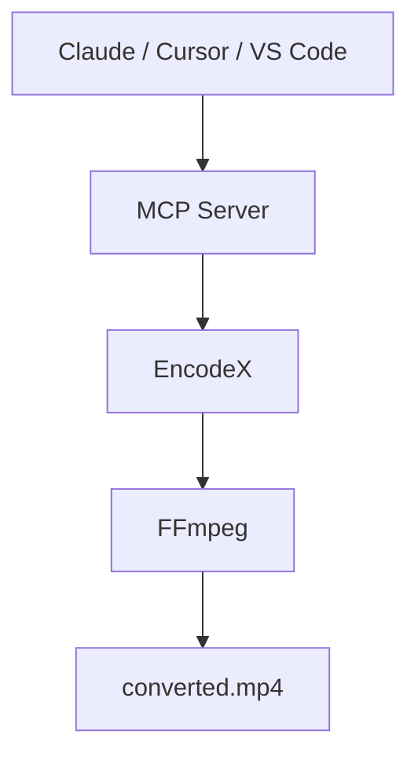

# Deixe a IA fazer o trabalho pesado

Peça ao Claude, ao Cursor ou a qualquer assistente compatível com MCP que converta um vídeo, extraia o áudio, reduza uma pasta de fotos ou acompanhe um trabalho em lote. O assistente conduz o **EncodeX** — o trabalho acontece no seu computador e seus arquivos nunca saem do seu dispositivo.

<McpDemo />

Tente dizer:

- *"Converta `vacation.mp4` para um MP4 menor, adequado ao WhatsApp."*
- *"Extraia o áudio de `lecture.mov` como MP3."*
- *"Reduza as fotos de `~/Pics` e coloque os resultados em `~/Output`."*
- *"Converta todos os MKV em `~/Downloads` para MP4."*

O EncodeX é um **servidor MCP FFmpeg** gratuito e open source com um app de desktop ao redor — um servidor MCP local para automação de mídia com IA. Sem nuvem, sem uploads, sem conta.



## O que é o servidor MCP?

[MCP](https://modelcontextprotocol.io) — o Model Context Protocol — é o padrão aberto que permite que assistentes de IA usem seus aplicativos. O EncodeX inclui um **servidor MCP integrado**, para que ferramentas como Claude Desktop, Claude Code, Cursor, VS Code ou qualquer agente personalizado possam converter, comprimir, cortar, extrair e gerenciar trabalhos em lote através do EncodeX com um simples pedido em linguagem simples.

Você permanece no seu app de IA favorito. O EncodeX faz o trabalho pesado em segundo plano.

## O que um assistente pode fazer via MCP?

O servidor MCP expõe **19 ferramentas, 3 recursos e 4 prompts**:

- **Converter** vídeo e áudio entre formatos
- **Extrair** áudio de arquivos de vídeo
- **Comprimir** vídeos e imagens para tamanhos menores
- **Cortar** e aparar clipes
- **Executar e acompanhar trabalhos em lote assíncronos** — enfileirar, verificar status, obter resultados

O catálogo completo de ferramentas está na [referência de recursos](/docs/features-reference#mcp-server).

## Duas formas de conectar

### 1. Servidor autônomo (`encodex --mcp`)

Execute o EncodeX como um processo MCP sem interface — o que os apps de IA de desktop usam ao iniciar um servidor sob demanda:

```bash
encodex --mcp
```

O stdout transporta o protocolo MCP; todos os logs vão para o stderr, então nada corrompe a conversa entre seu assistente e o EncodeX.

### 2. Servidor integrado (Configurações → Servidor MCP)

Já tem o EncodeX aberto? Ative **Configurações → Servidor MCP** e aponte seu cliente para:

```
http://127.0.0.1:8765/mcp
```

Esse modo adiciona ferramentas de **fila**, **pré-visualização**, **linha do tempo**, **sistema** e **atualizações** ao vivo, sobre o mesmo núcleo.

## Conecte com um único colar

Copie a configuração do seu cliente e cole — o EncodeX faz o resto. Garanta que `encodex` esteja no seu `PATH` (instalar o EncodeX o adiciona).

<McpConfig />

## Privado por design

- **Todo o processamento é local** — os arquivos nunca são enviados e nada vai para a nuvem
- **Somente loopback** — o servidor integrado vincula a `127.0.0.1` e valida o cabeçalho `Origin`
- **Token de acesso opcional** — proteja o endpoint com um token bearer (comparado em tempo constante)
- **Sem conta necessária** — o MCP funciona totalmente offline

## Comece agora

1. Baixe e instale o [EncodeX](/pt/download) (Windows, macOS ou Linux).
2. Execute `encodex --mcp`, ou ative **Configurações → Servidor MCP** no app.
3. Conecte seu assistente de IA ao EncodeX e peça em linguagem simples: *"Converta este MKV para MP4 para o meu celular."*

A referência completa — cada ferramenta, recurso, prompt, configuração de cliente e o modelo de segurança — está na [documentação do servidor MCP](/pt/docs/cli#mcp-server-mode).

## Perguntas frequentes

### O servidor MCP do EncodeX é gratuito?

Sim. O servidor MCP está integrado ao app EncodeX, gratuito e open source (MIT) — sem licença ou assinatura extra.

### Usar MCP envia meus arquivos?

Não. O EncodeX funciona totalmente offline. O servidor MCP conduz o mesmo motor FFmpeg local, então sua mídia nunca sai do seu computador.

### Quais assistentes de IA podem se conectar?

Qualquer cliente compatível com MCP: Claude Desktop, Claude Code, Cursor, VS Code e agentes personalizados. O servidor stdio é um processo JSON-RPC padrão, então qualquer coisa que consiga rodar um comando e falar MCP pode se conectar.

### Preciso manter a interface aberta?

Não. Com `encodex --mcp`, o app roda sem interface (headless). O servidor HTTP integrado é opcional e roda dentro da GUI para ferramentas de fila e pré-visualização ao vivo.

### O servidor integrado é seguro?

Sim. Ele vincula apenas ao loopback, valida o cabeçalho `Origin`, suporta um token bearer opcional e aceita apenas `GET`, `POST` e `DELETE` em `/mcp`.

## Saiba mais

- [Documentação do servidor MCP](/pt/docs/cli#mcp-server-mode)
- [Referência de recursos: MCP](/pt/docs/features-reference#mcp-server)
- [Anúncio do MCP](/pt/blog/releases/mcp-server-support)
- [Baixar o EncodeX](/pt/download)

<div class="cta-card">
  <h2>Pronto para entregar suas tarefas de mídia a um assistente de IA?</h2>
  <p>Baixe o EncodeX para Windows, macOS ou Linux — o servidor MCP é integrado. Grátis e open source, sem precisar de conta.</p>
  <p><a class="cta-link-primary" href="/pt/download">Baixar EncodeX — Grátis e de código aberto</a></p>
  <p>Windows · macOS · Linux · Sem conta necessária</p>
</div>