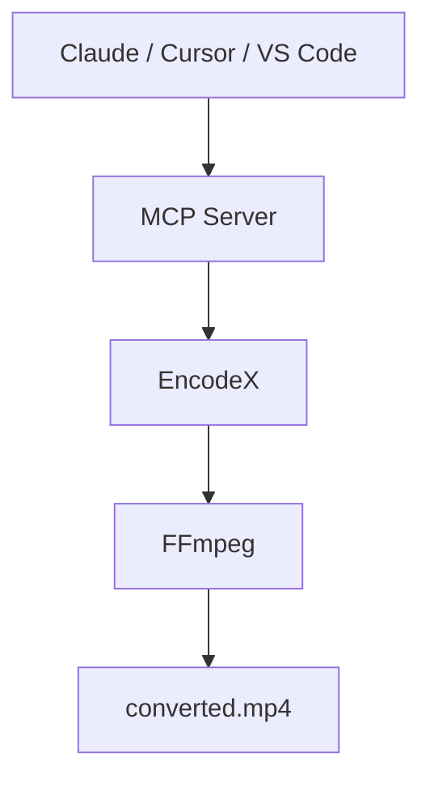

# 让 AI 完成繁重的工作

让 Claude、Cursor 或任何兼容 MCP 的助手转换视频、提取音频、压缩照片文件夹，或查看批量任务进度。助手直接驱动 **EncodeX**——处理都在你的电脑上进行，文件绝不会离开设备。



## 什么是 MCP 服务器？

[MCP](https://modelcontextprotocol.io)（模型上下文协议）是让 AI 助手使用你的应用的开源标准。EncodeX **开箱即内置 MCP 服务器**，因此 Claude Desktop、Claude Code、Cursor、VS Code 或任何自定义代理，都可以只凭一句自然语言请求，通过 EncodeX 完成转换、压缩、剪辑、提取和管理批量任务。

你留在最喜欢的 AI 应用里，EncodeX 在后台完成繁重工作。

## 助手通过 MCP 能做什么？

MCP 服务器提供 **19 个工具、3 个资源和 4 个提示（prompts）**：

- 在不同格式间**转换**视频与音频
- 从视频中**提取**音频
- 将视频和图片**压缩**到更小体积
- **剪辑**和裁剪片段
- **运行并跟踪异步批量任务**——排队、查看状态、获取结果

完整工具清单见[功能参考](/docs/features-reference#mcp-server)。

## 两种连接方式

### 1. 独立服务器（`encodex --mcp`）

将 EncodeX 作为无界面的 MCP 进程运行——这也是桌面 AI 应用按需启动服务器的方式：

```bash
encodex --mcp
```

stdout 承载 MCP 协议；所有日志输出到 stderr，因此不会污染助手与 EncodeX 之间的通信。

### 2. 内置服务器（设置 → MCP 服务器）

EncodeX 已打开？在 **设置 → MCP 服务器** 中开启，然后将客户端指向：

```
http://127.0.0.1:8765/mcp
```

该模式在相同核心之上额外提供**队列**、**预览**、**时间线**、**系统**和**更新**工具。

## 天然注重隐私

- **所有处理都在本地**——文件永不上传，数据绝不上云
- **仅回环地址**——内置服务器只绑定 `127.0.0.1` 并校验 `Origin` 头
- **可选访问令牌**——可用 Bearer 令牌保护端点（常数时间比较）
- **无需账号**——MCP 完全离线可用

## 快速开始

1. 下载并安装 [EncodeX](/zh/download)（Windows、macOS 或 Linux）。
2. 运行 `encodex --mcp`，或在应用里开启 **设置 → MCP 服务器**。
3. 将你的 AI 助手连接到 EncodeX，用自然语言提出请求："把这段 MKV 转成适合我手机的 MP4。"

完整参考——每个工具、资源、提示、客户端配置以及安全模型——见 [MCP 服务器文档](/zh/docs/cli#mcp-server-mode)。

## 常见问题

### EncodeX 的 MCP 服务器免费吗？

是的。MCP 服务器内置在免费、开源（MIT）的 EncodeX 应用中，无需额外许可或订阅。

### 使用 MCP 会上传我的文件吗？

不会。EncodeX 完全离线运行。MCP 服务器驱动的是同一套本地 FFmpeg 引擎，你的媒体文件永远不会离开电脑。

### 哪些 AI 助手可以连接？

任何兼容 MCP 的客户端：Claude Desktop、Claude Code、Cursor、VS Code 和自定义代理。stdio 服务器是标准的 JSON-RPC 进程，任何能启动命令并支持 MCP 的工具都可以连接。

### 需要保持界面打开吗？

不需要。`encodex --mcp` 让应用无界面（headless）运行。内置 HTTP 服务器是可选项，运行在 GUI 内以提供实时队列和预览工具。

### 内置服务器安全吗？

安全。它只绑定回环地址，校验 `Origin` 头，支持可选 Bearer 令牌，且在 `/mcp` 上仅接受 `GET`、`POST` 和 `DELETE`。

## 了解更多

- [MCP 服务器文档](/zh/docs/cli#mcp-server-mode)
- [功能参考：MCP](/zh/docs/features-reference#mcp-server)
- [MCP 发布公告](/zh/blog/releases/mcp-server-support)
- [下载 EncodeX](/zh/download)