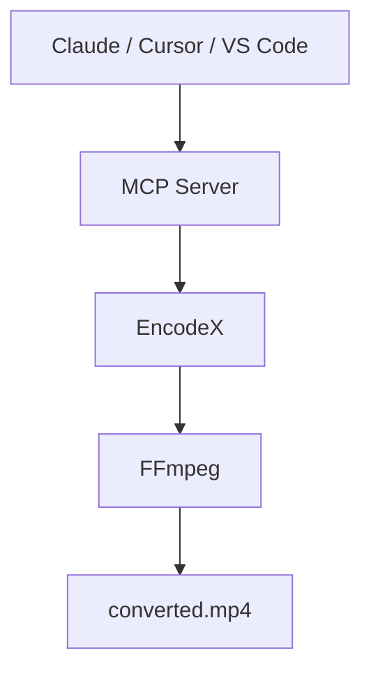

# Let AI Do the Heavy Lifting

Ask Claude, Cursor, or any MCP-compatible assistant to convert a video, pull out the audio, shrink a folder of photos, or check on a batch job. The assistant drives **EncodeX** — the work happens on your computer, and your files never leave your device.

<McpDemo />

Try saying:

- *"Convert `vacation.mp4` to a smaller MP4 suitable for WhatsApp."*
- *"Pull the audio out of `lecture.mov` as an MP3."*
- *"Shrink the photos in `~/Pics` and put the results in `~/Output`."*
- *"Convert all MKV files in `~/Downloads` to MP4."*

EncodeX is a free, open-source **FFmpeg MCP server** with a desktop app around it — a local MCP server for AI media automation. No cloud, no uploads, no account.



## What Is the MCP Server?

[MCP](https://modelcontextprotocol.io) — the Model Context Protocol — is the open standard that lets AI assistants use your apps. EncodeX includes an **MCP server out of the box**, so tools like Claude Desktop, Claude Code, Cursor, VS Code, or any custom agent can convert, compress, trim, extract, and manage batch jobs through EncodeX using a plain-language request.

You stay in your favorite AI app. EncodeX does the heavy lifting in the background.

## What Can an Assistant Do Through MCP?

The MCP server exposes **19 tools, 3 resources, and 4 prompts**:

- **Convert** videos and audio between formats
- **Extract** audio from video files
- **Compress** videos and images to smaller sizes
- **Trim** and cut clips
- **Run and track async batch jobs** — queue work, check status, get results

The full tool catalogue is in the [feature reference](/docs/features-reference#mcp-server).

## Two Ways to Connect

### 1. Standalone server (`encodex --mcp`)

Run EncodeX as a headless MCP process — what desktop AI apps use when they launch a server on demand:

```bash
encodex --mcp
```

Stdout carries the MCP protocol; all logs go to stderr, so nothing corrupts the conversation between your assistant and EncodeX.

### 2. Embedded server (Settings → MCP Server)

Already have EncodeX open? Turn on **Settings → MCP Server** and point your client at:

```
http://127.0.0.1:8765/mcp
```

This mode adds live **queue**, **preview**, **timeline**, **system**, and **update** tools on top of the same core.

## Connect in One Paste

Copy the configuration for your client and paste it in — EncodeX does the rest. Make sure `encodex` is on your `PATH` (installing EncodeX puts it there).

<McpConfig />

## Private by Design

- **All processing is local** — files are never uploaded, and nothing is sent to the cloud
- **Loopback only** — the embedded server binds to `127.0.0.1` and validates the `Origin` header
- **Optional access token** — protect the endpoint with a bearer token (compared in constant time)
- **No account required** — MCP works fully offline

## Get Started

1. Download and install [EncodeX](/download) (Windows, macOS, or Linux).
2. Run `encodex --mcp`, or enable **Settings → MCP Server** in the app.
3. Point your AI assistant at EncodeX and ask in plain language: *"Convert this MKV to MP4 for my phone."*

Full reference — every tool, resource, prompt, client configuration, and the security model — lives in the [MCP server documentation](/docs/cli#mcp-server-mode).

## Frequently Asked Questions

### Is the EncodeX MCP server free?

Yes. The MCP server is built into the free, open-source (MIT) EncodeX app — no extra license or subscription.

### Does using MCP upload my files?

No. EncodeX runs entirely offline. The MCP server drives the same local FFmpeg engine, so your media never leaves your computer.

### Which AI assistants can connect?

Any MCP-compatible client: Claude Desktop, Claude Code, Cursor, VS Code, and custom agents. The stdio server is a standard JSON-RPC process, so anything that can spawn a command and speak MCP can connect.

### Do I need the GUI open?

No. With `encodex --mcp` the app runs headless with no GUI. The embedded HTTP server is opt-in and runs inside the GUI for live queue and preview tools.

### Is the embedded server secured?

Yes. It binds only to loopback, validates the `Origin` header, supports an optional bearer token, and accepts only `GET`, `POST`, and `DELETE` on `/mcp`.

## Learn More

- [MCP server documentation](/docs/cli#mcp-server-mode)
- [Feature reference: MCP](/docs/features-reference#mcp-server)
- [MCP announcement post](/blog/releases/mcp-server-support)
- [Download EncodeX](/download)

<div class="cta-card">
  <h2>Ready to hand your media chores to an AI assistant?</h2>
  <p>Download EncodeX for Windows, macOS, or Linux — the MCP server is built in. Free and open source, no account required.</p>
  <p><a class="cta-link-primary" href="/download">Download EncodeX — Free &amp; Open Source</a></p>
  <p>Windows · macOS · Linux · No account required</p>
</div>